# 投放转化助攻任务

## 背景信息

华为应用市场全新推出<strong>转化助攻</strong>能力，通过[打开提醒](#section1350485613513)、[择时提醒](#section11531183812911)和[留存增强](#section7449104619355)新功能，帮助提升应用的激活及留存效果。

## 打开提醒

### 功能介绍

针对应用市场安装后未打开应用的用户，打开提醒功能支持内外弹窗，用户安装后，即可点击提醒，直达应用，满足开发者对提升激活量的考核诉求。

 

打开提醒功能需联系运营，申请使用权限。

### 操作指引

1. 登录[华为应用市场应用推广平台](https://developer.huawei.com/consumer/cn/service/apcs/app/home.html)，点击右上角“管理中心”，进入“管理中心”页面。
2. 点击“创建”应用市场推广计划，创建推广CPD/oCPD任务；或编辑原有CPD/oCPD任务，进入任务编辑页面。

   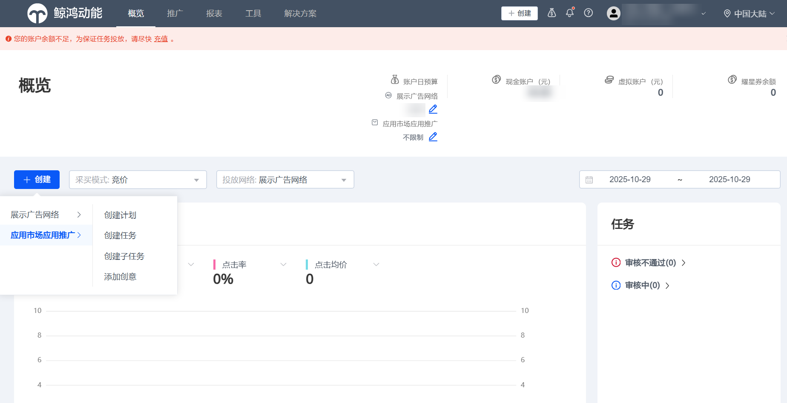

   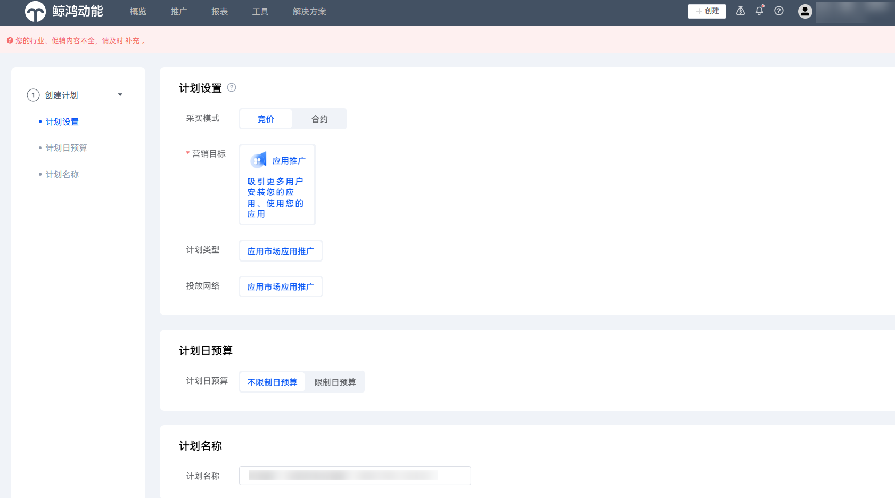

   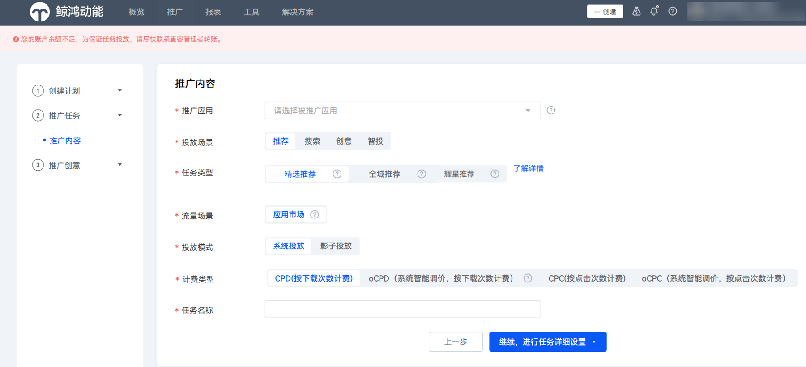
3. 完成应用推广任务配置后，默认勾选“设置辅助转化助攻”，并提交任务。

   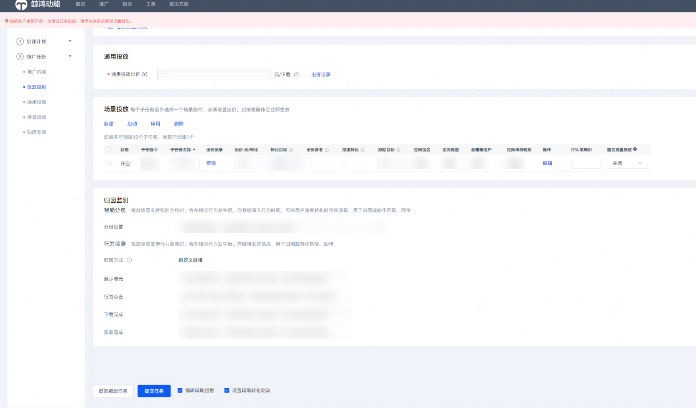
4. 进入“推广创意”模块，“应用一句话简介”默认使用应用上架时一句话简介，需要点击“保存创意”按钮；您也可以自定义一句话简介，点击“保存创意”按钮。

   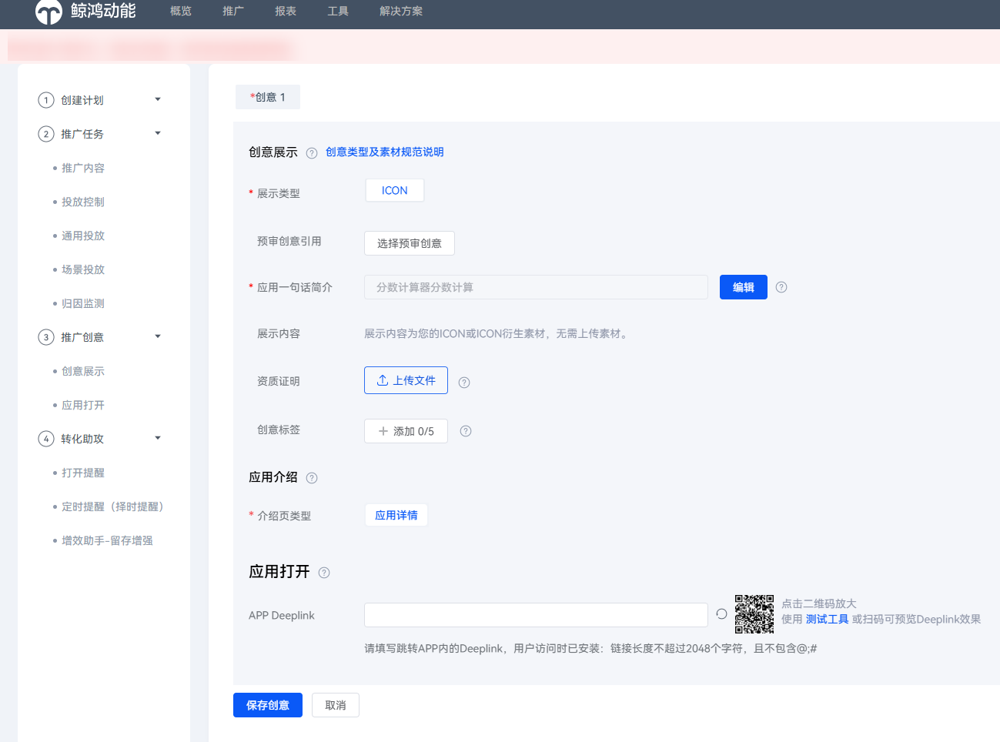
5. 在“助攻类型”设置模块，勾选“打开提醒”，设置预算比例0%或预算金额0元，配置相关任务设置项。

   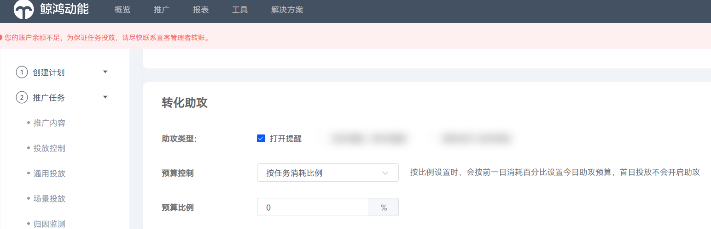

   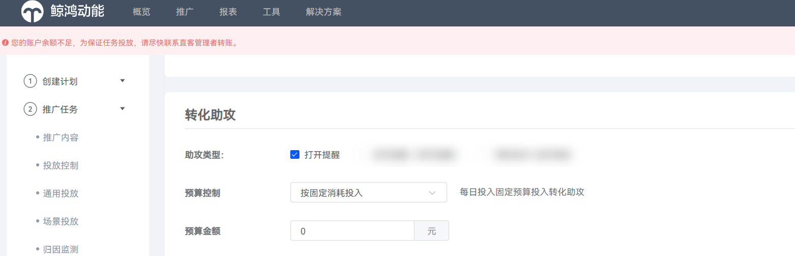
6. 设置文案及Deeplink：
   1. 文案内容：不超过12个字。
   2. APP Deeplink：如客户不设置Deeplink，则拉起应用首页；如客户设置延迟Deeplink，则到达应用指定落地页。
   3. 创意命名：应用名+择时提醒+文案创意+年月日。

       

      预算模块为必填项，若不填写，则会显示“内容未填写完整”，无法提交任务。

      

## 择时提醒

### 功能介绍

针对应用市场安装后，7天内未打开应用的用户，择时提醒功能支持端外下拉弹窗；用户点击弹窗，直达应用，满足开发者对提升激活量的考核诉求。

 

择时提醒功能需联系运营，申请使用权限。

### 操作指引

1. 基础任务创建流程同打开提醒，完成基础任务配置，设置归因后，进入“助攻类型”设置模块，配置相关任务设置项。
2. 在“助攻类型”设置模块，勾选“择时提醒”，设置预算比例0%或预算金额0元，配置相关任务设置项。

   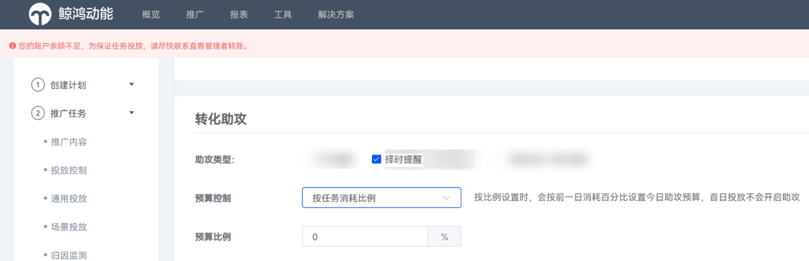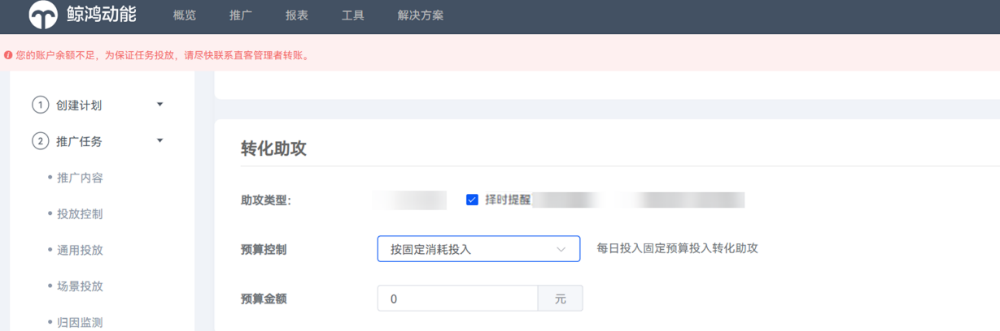
3. 择时提醒：安装后未打开应用的用户，会由系统选择最佳时间，如最佳时间与【最早发送时间】-【最晚发送时间】时间段匹配，则会向用户发送择时提醒消息，提示其打开应用。

   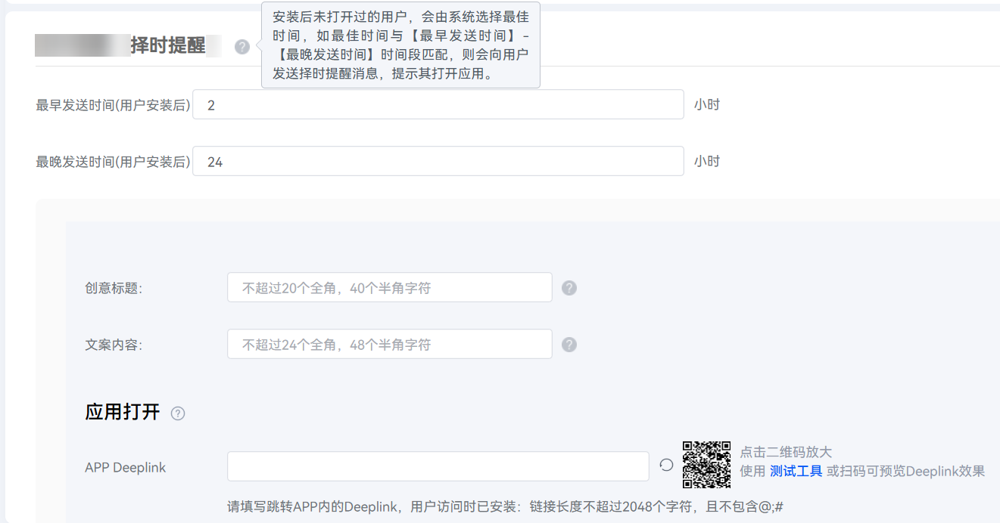
4. 设置文案及Deeplink：
   1. 创意标题：不超过20个字。
   2. 文案内容：不超过24个字。
   3. APP Deeplink: 如客户不设置Deeplink，则拉起应用首页；如客户设置延迟Deeplink，则到达应用指定落地页。
   4. 创意命名：应用名+择时提醒+文案创意+年月日。
5. 检查任务创意是否正确、且保存，点击【提交任务辅助信息】。

   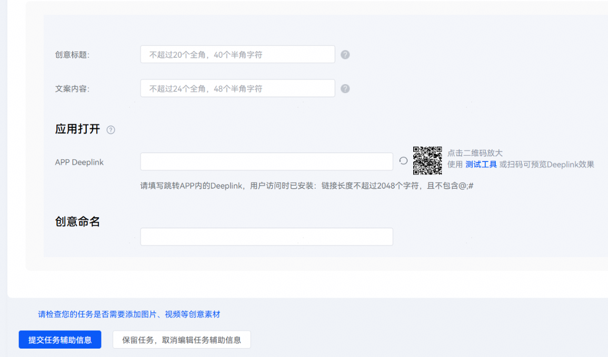

   <strong>预算模块为必填项，若不填写，则会显示“内容未填写完整”，无法提交任务</strong> <strong>。</strong>

   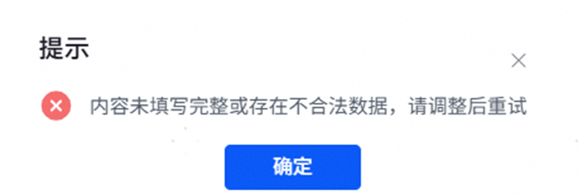

    

   打开提醒、择时提醒为非付费项目，留存增强功能为付费项目；当开发者同时具备打开提醒、择时提醒、留存增强功能时，预算消耗按实际情况配置，仅留存增强产生消耗。

## 查询打开及择时提醒数据报表

1. 登录[华为应用市场应用推广平台](https://developer.huawei.com/consumer/cn/service/apcs/app/home.html)，点击右上角“管理中心”，进入“管理中心”页面。
2. 点击“报表”，点击“转化助攻”页签。
3. 筛选时间段及数据展示方式（“合计”或者“分日”），筛选应用及任务，点击“查询”进行数据查询。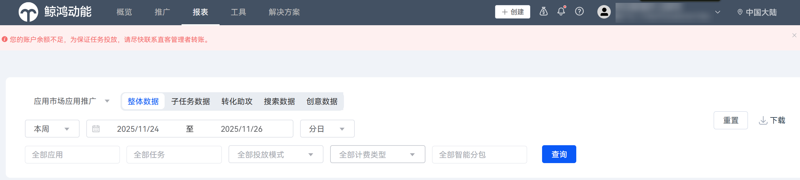
4. 下拉至报表明细，通过自定义列，勾选：任务类型、任务名称、 任务ID、展示量、点击量、点击率。点击右上角【下载】按钮，即可本地处理数据明细。

   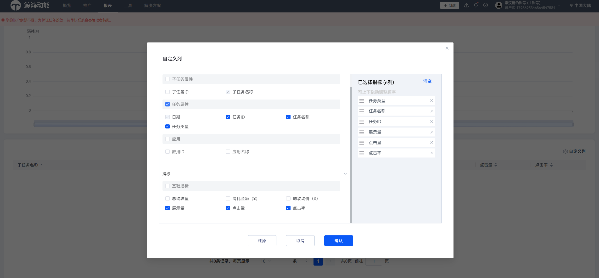

## 留存增强

### 功能介绍

留存增强功能支持选择多种留存转化目标，满足开发者对于不同周期的留存指标考核诉求。功能通过钻研留存转化算法，主动探索强留存潜力用户，实现任务浅层转化目标用户获取与留存用户挖掘双线并行，兼顾任务转化目标量级及留存转化效果，提升开发者应用推广价值。

<strong>留存助攻算法模型学习依赖开发者回传留存指标数据，开发者需及时回传所选助攻目标对应的数据字段。</strong>

### 操作指引

 

- 支持助攻任务类型：CPD、oCPD任务。
- 可选留存助攻目标：次日留存、3日留存、7日留存、14日留存。
- 开启留存助攻前准备：回传留存助攻目标所对应的数据字段。
- 预算设置建议：初始投放阶段，建议开发者从较小预算开始测试。

1. 登录[华为应用市场应用推广平台](https://developer.huawei.com/consumer/cn/service/apcs/app/home.html)，点击右上角“管理中心”，进入“管理中心”页面。
2. 点击“创建”或编辑原有CPD/oCPD任务，进入任务编辑页面。

   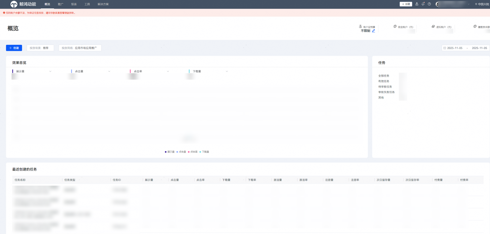
3. 完成应用推广任务配置后勾选“设置辅助转化助攻”，并提交任务。

   
4. 在“助攻类型”设置模块，配置相关任务设置项。

   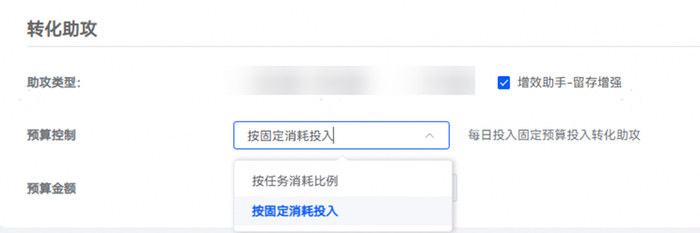

   |  |  |
   | --- | --- |
   | <strong>任务设置项</strong> | <strong>说明</strong> |
   | 助攻类型 | 选择是否开启“增效助手-留存增强”。 |
   | 预算控制 | 取值范围：  1.按固定消耗投入：填入固定预算金额后，每日助攻消耗不超过预算金额。  2.按任务消耗比例：按前一日任务消耗百分比设置今日助攻预算，填入预算比例后，每日助攻预算金额将根据前一日消耗波动。  <strong>选择按任务消耗比例投放后，首日投放不会开启助攻。</strong> |
5. 在“助攻目标”设置模块，配置相关任务设置项。

   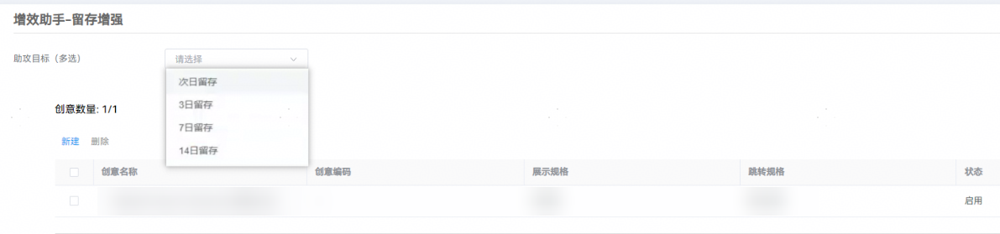

   |  |  |
   | --- | --- |
   | <strong>任务设置项</strong> | <strong>说明</strong> |
   | 助攻目标 | 按照开发者考核指标选择对应留存助攻目标。  取值范围：  次日留存：用户激活应用起的第2天启动应用。  3日留存：用户激活应用起的第4天启动应用。  7日留存：用户激活应用起的第8天启动应用。  14日留存：用户激活应用起的第15天启动应用。 |

## 查询转化助攻数据报表

1. 登录华为应用市场应用推广平台，点击右上角“管理中心”，进入“管理中心”页面。
2. 点击“报表”，点击“转化助攻”页签。
3. 筛选时间段及数据展示方式（“合计”或者“分日”），筛选应用及任务，点击“查询”进行数据查询。

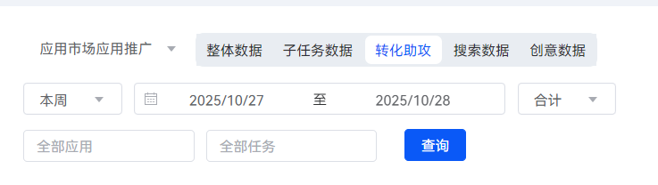
