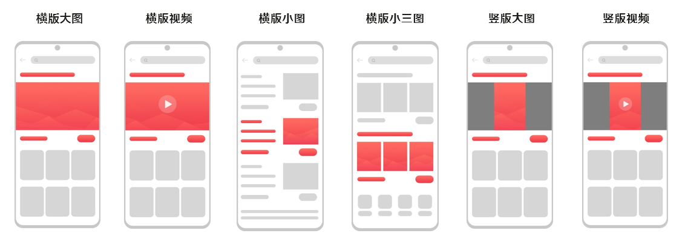
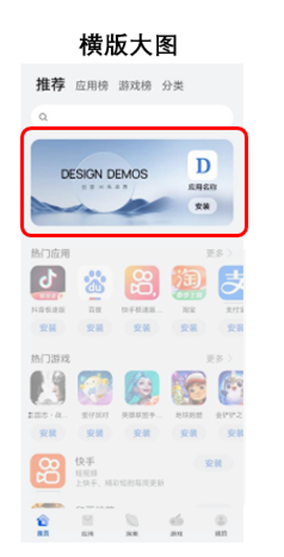
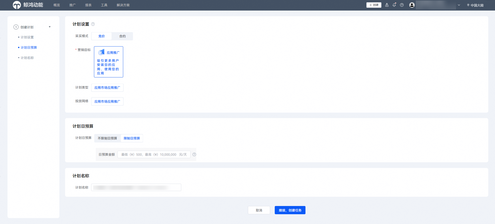
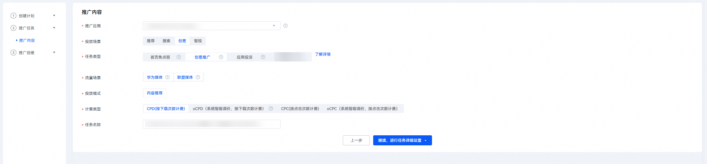
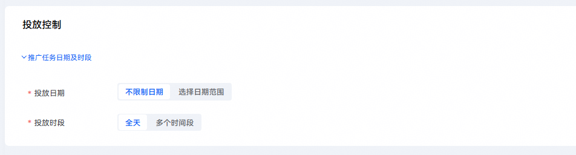
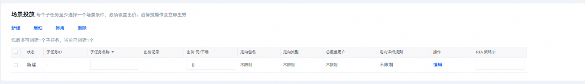
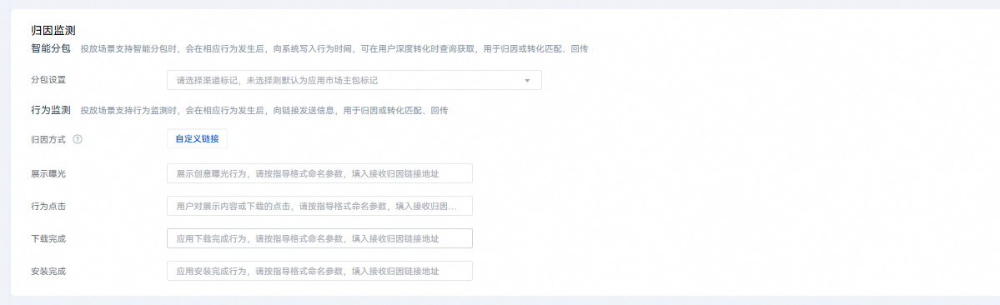
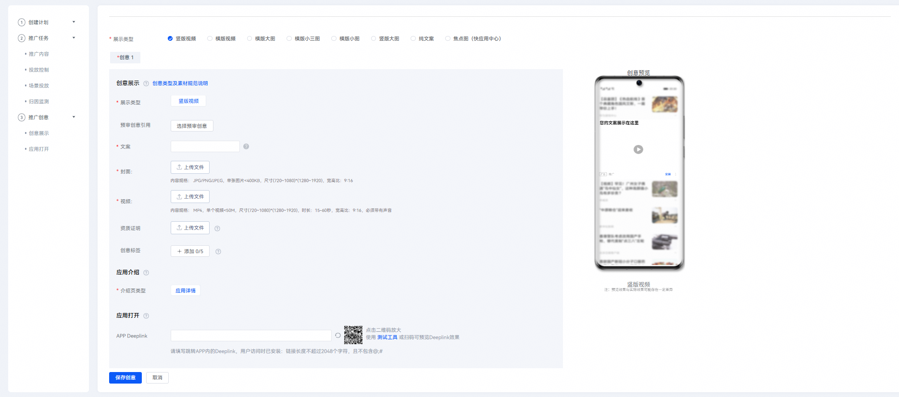

# 投放创意任务

## 背景信息

创意投放场景包括“创意推广”和“首页焦点图”两种任务类型。

创意投放场景是一种图文视频类推广，您可以根据自身推广的应用的需求或特点，制作上传图片或视频素材，从而帮助用户更直观地了解被推广应用，且图文视频类推广形式更自然，更易引起用户兴趣，提高转化率。

- “创意推广”投放资源位示例如下：

  

- “首页焦点图”投放资源位示例如下：

  

## 操作指南

1. 登录[华为应用市场应用推广平台](https://ads.huawei.com/cn/)，“应用市场应用推广”推广范围，点击“推广”—“创建计划”，进入任务创建页面。

   

   

   | 计划设置项 | 说明 |
   | --- | --- |
   | 采买模式 | 选择“竞价”。 |
   | 计划日预算 | 用于限制任务每日（自然日）整体消耗，计划内的所有任务总消耗超过此预算后，系统会自动限制该任务的推广，次日再恢复正常投放。由于预算达到限额后，您的应用可能会因为之前的推广曝光产生后续下载，已曝光的任务30天内产生的点击或下载行为等转化行为仍计费，故您的实际消耗有可能会超出设置的日预算。 |
   | 计划名称 | 命名格式建议：任务类型+应用名称+时间信息，长度不超过128字符。计划与任务层级一一对应，计划名称可与任务名称命名一致。 |
2. 在“推广内容”设置模块，配置相关任务设置项。

   

   | 任务设置项 | 说明 |
   | --- | --- |
   | 被推广应用 | 选择您需要推广的应用。 |
   | 投放场景 | 选择“创意”。 |
   | 任务类型 | 选择“创意推广”或“首页焦点图”。 |
   | 流量场景 | 说明：  在创意投放场景下仅任务类型为“创意推广”时可选择流量场景。  取值范围：  - 应用市场：投放到华为应用市场及精选流量。 - 联盟媒体：投放到非华为的其他三方合作媒体。 |
   | 投放模式 | 选择“系统投放”。 |
   | 计费类型 | 取值范围：  - CPD：按下载完成次数计费。 - oCPD：采用智能出价模式，按下载次数计费。 - CPC： 采用按点击量计费（这里仅支持创意推广任务）。 - oCPC：采用智能出价模式，按点击次数计费（这里仅支持创意推广任务）。 |
   | 任务名称 | 命名格式建议：任务类型+应用名称+时间信息，长度不超过50个字符。 |
3. 配置完成后，点击“继续，进行任务详细设置”。
4. 在“投放控制”设置模块，配置相关任务设置项。

   

   | 任务设置项 | 说明 |
   | --- | --- |
   | 投放日期 | 取值范围：  - 长期投放：该任务不限时间。 - 选定日期：设置任务执行的开始和结束时间。 |
   | 投放时段 | 取值范围：  - 不限时段：一周内每天全时段（7×24小时）任务都在投放。 - 选定时段：选定想要的时间段进行任务投放。 |
5. 在“场景投放”设置模块，点击“新建”，创建相关的子任务。

    

   不同类型的投放任务对应子任务数的上限是不同的。具体子任务数的上限，请查看“新建”下的界面提示。

   

   | 任务设置项 | 说明 |
   | --- | --- |
   | 子任务名称 | 关键词所在的子任务名称。同一任务内的子任务名称唯一、不能重复，命名格式建议：关键词+匹配方式。 |
   | 出价 | 不得低于该处显示的任务底价。 |
   | 操作 | 点击蓝色字段“编辑”，创建用户定向任务，详细请参见[新建人群定向任务](/docs/monetize/promotion/bp-functions-target-create-0000001337388933)。 |
   | RTA 策略ID | RTA ID由数字、字母组成，长度不超过32。请确保RTA ID正确填写，否则会导致RTA任务失效。 |
6. 在“归因监测”设置模块，配置相关任务设置项。具体任务设置项的配置请参见[智能分包](/docs/monetize/promotion/bp-functions-intelligent-subcontract-create-0000001337248557)、[监测链接](/docs/monetize/promotion/bp-functions-link-configure-0000001351658397)或[华为分析监测](/docs/monetize/promotion/bp-functions-ha-create-task-0000001348575585)。

   
7. 点击“提交并编辑创意”，进入“推广创意”设置模块。配置相关任务设置项，完成后点击“提交创意”。图片中以“横版大图”展示类型为例。

    

   推广创意素材规范说明，详细请参见[素材审核规范](https://developer.huawei.com/consumer/cn/doc/promotion/bp-appendix-material-rule-0000001311061150)。

   完成任务信息填写，点击【提交并编辑创意】后任务即创建完成，系统会以图标形式开启投放， 请尽快编辑创意以保障创意投放效果。

   

   - “创意展示”区域

     | 任务设置项 | 说明 |
     | --- | --- |
     | 展示类型 | 根据您的需求选择创意的展示类型，并根据页面提示的规格要求上传图片或视频。  说明：  当您展示类型选择为“横版大图”、“竖版大图”、“横版小图”、“横版小三图”时，您可以直接上传图片，也可以点击“[使用模板制图](/docs/monetize/promotion/bp-functions-draw-tools-introduction-0000001399522565)”快速生成创意素材或“[从素材库选择](/docs/monetize/promotion/bp-functions-material-library-introduction-0000001399645709)”复用之前保存的素材。 |
     | 创意标签 | 您可以选择添加创意标签，更好地提升推广效果。当前最多可添加5个标签。 |
   - “应用介绍”区域

     | 任务设置项 | 说明 |
     | --- | --- |
     | 介绍页类型 | 选择用户点击展示创意的方式。 |
   - “应用打开”区域

     | 任务设置项 | 说明 |
     | --- | --- |
     | APP Deeplink | 若用户已安装您的应用，点击打开或素材，将会直接访问您配置的Deeplink页面和内容。  具体调测方法请参见[普通Deeplink调测流程](/docs/monetize/promotion/bp-functions-commondeeplink-test-0000002039774721)。 |
   - “创意命名”区域

     | 任务设置项 | 说明 |
     | --- | --- |
     | 创意名称 | 输入展示的创意名称，要求不超过50个字符。 |
   - “创意展现模式”区域

     | 任务设置项 | 说明 |
     | --- | --- |
     | 创意展现模式 | 选择展示创意的模式。  - 优选模式：系统自动选择对该受众展示效果好的创意进行展示量倾斜。 - 轮播模式：系统将平分各创意展现机会，便于开发者比较各创意投放效果。 |
