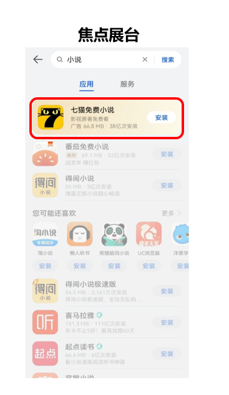
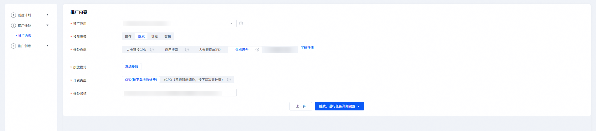
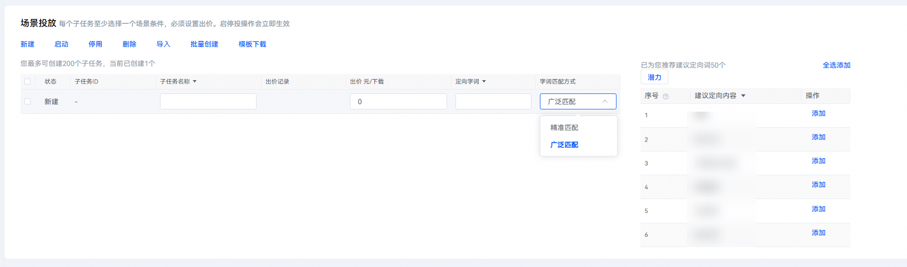
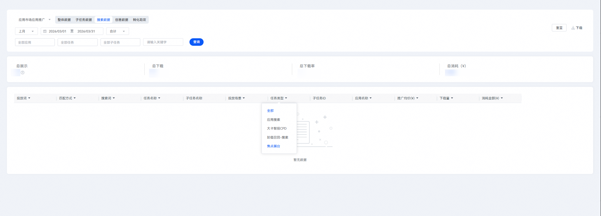

# 投放焦点展台任务

## 背景信息

焦点展台是华为应用市场应用推广平台在搜索场景的推广资源，展示于搜索结果顶部，区别于搜索结果的推广资源。

焦点展台推广资源位示例如下图所示。

焦点展台资源位亮点具体如下：

- 在用户主动参与搜索的流量场景下，焦点展台位于搜索结果页最顶部，以置顶优势区别于搜索结果页，并加之智能配色与搜索结果区分，汇聚亿级曝光。
- 独立任务投放，预算/出价灵活可控，支持归因和oCPD投放，让开发者的预算充分花在刀刃上。
- 支持分关键词投放，配合搜索场景的高效转化与置顶的曝光优势，开发者可轻松实现曝光提升与获量升级。

焦点展台选词技巧具体如下：

- 精选词：与您应用相近的其他App相关信息。
- 行业词：与您应用所包含的产品功能相关词。
- 相关词：在下载您的应用前后，用户可能会搜索的其他应用信息。
- 分词：您的应用名称进行字词的拆分和组合。
- 拼音词：您的应用名称“翻译”成拼音。
- 同音词：您的应用名称适当延伸，比如选取应用名称的同音词、谐音词。
- 精准词、行业词通常用于精准匹配+较高出价模式；相关词/分词/拼音词/同音词通常用于广泛匹配+次高出价模式。

## 操作步骤

1. 登录[华为应用市场应用推广平台](https://ads.huawei.com/cn/)，“应用市场应用推广”推广范围，点击“推广”—“创建计划”，进入任务创建页面。

   

   

   | 计划设置项 | 说明 |
   | --- | --- |
   | 采买模式 | 选择“竞价”。 |
   | 计划日预算 | 用于限制任务每日（自然日）整体消耗，计划内的所有任务总消耗超过此预算后，系统会自动限制该任务的推广，次日再恢复正常投放。由于预算达到限额后，您的应用可能会因为之前的推广曝光产生后续下载，已曝光的任务30天内产生的点击或下载行为等转化行为仍计费，故您的实际消耗有可能会超出设置的日预算。 |
   | 计划名称 | 命名格式建议：任务类型+应用名称+时间信息，长度不超过128字符。计划与任务层级一一对应，计划名称可与任务名称命名一致。 |
2. 在“推广内容”设置模块，配置相关任务设置项。

   

   | 任务设置项 | 说明 |
   | --- | --- |
   | 被推广应用 | 选择您需要推广的应用。 |
   | 投放场景 | 选择“搜索”。 |
   | 任务类型 | 选择“焦点展台”。 |
   | 投放模式 | 应用推广投放方式。  取值范围：  - 系统投放：应用推广主要投放方式，投放系统通过各类算法将应用推送至客户端展示。 |
   | 计费类型 | 取值范围：  - CPD：按下载完成次数计费。 - oCPD：采用oCPD智能出价模式。 |
   | 任务名称 | 命名格式建议：任务类型+应用名称+时间信息，长度不超过50个字符。 |
3. 配置完成后，点击“继续，进行任务详细设置”。
4. 在“投放控制”设置模块，配置相关任务设置项。

   
   - 否定关键词设置：

     通过设置否定关键词可以避免对应关键词在当前任务中的投放。输入想设置的否定关键词，如果想一次添加多个关键词，可以用逗号分隔，回车键一次批量提交。提交后的词出现在下方框中，可以点击删除否定关键词。

      

     为了方便开发者批量导入否定关键词，现新建搜索任务支持excel模板批量导入否定关键词信息。点击“模板下载”，下载模板后在模板中填入否定关键词及其匹配方式、出价等，再点击“导入”上传该Excel即可。

     | 任务设置项 | 说明 |
     | --- | --- |
     | 添加排除字词 | 输入想设置的否定关键词，如想一次添加多个关键词，用逗号分隔，回车键一次批量提交。 |
     | 已设排除字词 | 提交后的词出现在下方框中，可以点击删除按钮，删除否定关键词。 |
   - 推广任务日期及时段设置项说明如下：

     | 任务设置项 | 说明 |
     | --- | --- |
     | 投放日期 | 取值范围：  - 长期投放：该任务不限时间。 - 选定日期：设置任务执行的开始和结束时间。 |
     | 投放时段 | 取值范围：  - 不限时段：一周内每天全时段（7×24小时）任务都在投放。 - 选定时段：选定想要的时间段进行任务投放。 |
5. 在“通用投放”设置模块，配置相关任务设置项。

   

   | 任务设置项 | 说明 |
   | --- | --- |
   | 通用投放开关 | 选择是否开启“通用投放开关”。  开启即为开启自动匹配场景下单次下载的计费价格，您可选择关闭。 |
   | 通用投放出价 | 若开启“通用投放开关”，需填写通用投放出价，即自动匹配场景下单次下载的计费价格。  此出价用于针对非场景投放人群进行出价。 |
6. 在“场景投放”设置模块，点击“新建”，创建相关的子任务。

    

   不同类型的投放任务对应子任务数的上限是不同的。具体子任务数的上限，请查看“新建”下的界面提示。

   

   - 具体任务设置项具体说明如下：

     | 任务设置项 | 说明 |
     | --- | --- |
     | 子任务名称 | 关键词所在的子任务名称。同一任务内的子任务名称唯一、不能重复，命名格式建议：关键词+匹配方式。 |
     | 出价 | 可针对关键词的广泛匹配和精准匹配分别出价。系统将使用您设置的出价去进行竞价，每次下载会按照您设置的关键词出价进行扣费。 |
     | 定向字词 | 设置投放的关键词。 |
     | 匹配方式 | 匹配方式分为广泛匹配和精准匹配。  - 匹配方式为广泛匹配时，用户搜索词与您的投放关键词高度相关时，即使您并未提交这些词，您的推广应用也可能获得展现机会。可能触发的搜索词包括：同义词、包含投放关键词的搜索词、变体形式（如：加空格，错别字等）。 - 匹配方式为精确匹配时，用户搜索词必须与您的投放关键词一致，您的应用才有可能展现出来。添加关键词时，系统默认匹配方式为广泛匹配，您可以根据推广需求设置关键词的匹配方式。 |
     | 建议定向词 | 建议定向词即为推荐关键词，是系统匹配到的用户可能会在找您的产品或者服务时使用的搜索词，直接点击“添加”添加合适的关键词。 |
   - 此设置模块还支持如下操作类型：

     | 功能 | 说明 |
     | --- | --- |
     | 启动 | 用于修改搜索任务时，对任务内关键词投放的启动，合作伙伴可以在任务内启动关键词，来进行关键词测试。 |
     | 停用 | 用于修改搜索任务时，对任务内关键词投放的停用，合作伙伴可以在任务内停用关键词，来进行关键词测试 |
     | 删除 | 可以在任务内操作关键词的删除。 |
     | 导入 | 合作伙伴可以在下载的模板中填入关键词信息，点击“导入”，批量导入投放的关键词信息。  注意：  模板Excel中不可以使用公式。 |
     | 批量创建 | 点击“批量创建”，在输入框中输入多个关键词，用逗号隔开，点击“批量创建”按钮即可批量生成多条子任务。而后，填入关键词的出价及子任务名称。  说明：  - 为了方便开发者批量导入关键词，现新建搜索任务支持excel模板批量导入关键词信息。 - 点击“模板下载”，填入关键词及其匹配方式、出价等，再点击“导入”上传该Excel即可。否定关键词同样支持模板批量导入操作。 |
     | 模板下载 | 下载批量导入关键词的excel模板。 |

      

     可以将效果不好的词添加进否定关键词，避免在这些词下的展现和消耗。需要注意的是，否词为精准否定。例如，配置“车”一词为否词，则用户在搜索“车”的时候，应用不会在搜索结果呈现，但搜索“汽车”时，应用仍有可能在搜索结果呈现。
7. 以上设置模块均填写完毕后，点击“提交任务”，进入“推广创意”设置模块，配置相关任务设置项。

    

   ICON类任务如果您不需要任何创意，可以直接点击“提交创意”，并取消勾选“编辑辅助创意”提交，不会影响您的任务正常投放。

   

## 查询搜索数据报表

1. 登录[华为应用市场应用推广平台](https://ads.huawei.com/cn/)， 点击“报表”，点击“搜索数据”页签。
2. 在“任务类型”筛选内选择“焦点展台”，筛选应用及任务进行数据查询和下载。搜索数据报表可以查看投放词下分搜索词的下载、消耗数据。

   搜索数据报表可以查看投放词下分搜索词的下载、消耗数据。

    

   - 点击“下载”可以下载查询的数据。
   - 查询、下载：支持查询、下载导出一段时间内的关键词的推广统计数据，包含出价、下载次数、消耗金额、排名等信息。

   
