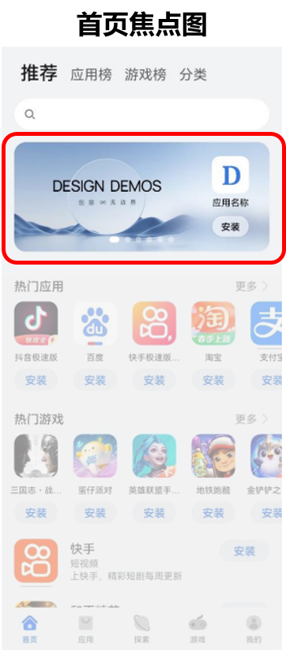
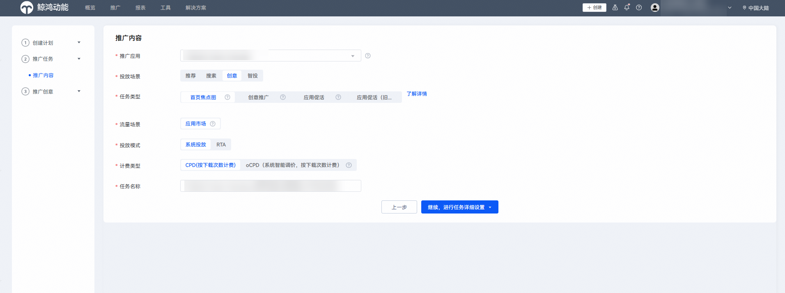
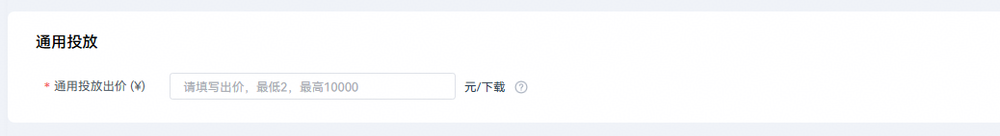
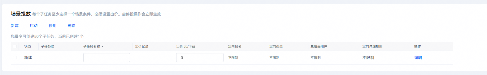
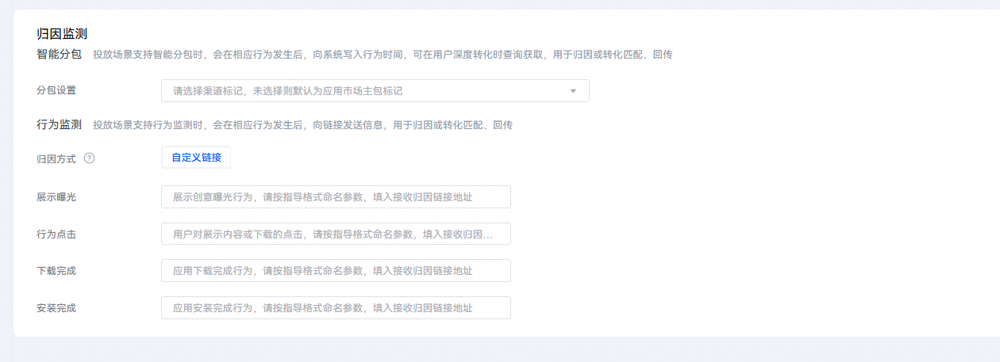
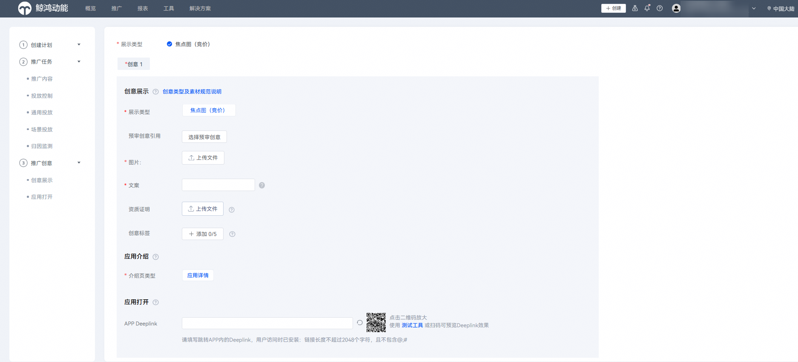
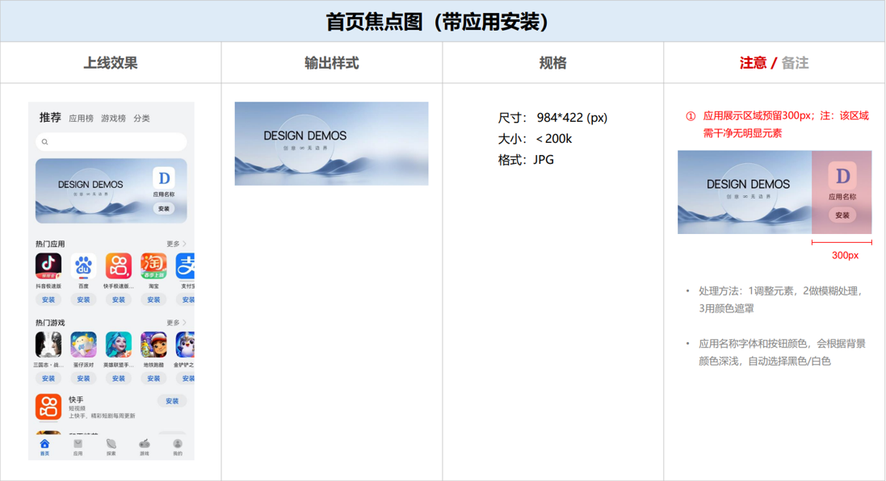

# 投放首页焦点图任务

## 背景信息

华为应用市场在丰富的榜单类和搜索类资源外，推出了首页焦点图的竞价投放资源，满足开发者应用下载和创意推广的投放需求，帮助提升应用的变现效率。

首页焦点图资源位示例如下图所示。

## 创建任务

1. 登录[华为应用市场应用推广平台](https://ads.huawei.com/cn/)，“应用市场应用推广”推广范围，点击“推广”—“创建计划”，进入任务创建页面。

   

   

   | 计划设置项 | 说明 |
   | --- | --- |
   | 采买模式 | 选择“竞价”。 |
   | 计划日预算 | 用于限制任务每日（自然日）整体消耗，计划内的所有任务总消耗超过此预算后，系统会自动限制该任务的推广，次日再恢复正常投放。由于预算达到限额后，您的应用可能会因为之前的推广曝光产生后续下载，已曝光的任务30天内产生的点击或下载行为等转化行为仍计费，故您的实际消耗有可能会超出设置的日预算。 |
   | 计划名称 | 命名格式建议：任务类型+应用名称+时间信息，长度不超过128字符。计划与任务层级一一对应，计划名称可与任务名称命名一致。 |
2. 在“推广内容”设置模块，配置相关任务设置项。

   

   | 任务设置项 | 说明 |
   | --- | --- |
   | 被推广应用 | 选择您需要推广的应用。 |
   | 投放场景 | 选择“创意”。 |
   | 任务类型 | 选择“首页焦点图”。 |
   | 投放模式 | 选择“系统投放”。 |
   | 计费类型 | 取值范围：  - CPD：按下载完成次数计费。 - oCPD：采用oCPD智能出价模式。 说明：  首页焦点图任务仅支持CPD和oCPD计费类型。 此处以CPD计费类型为例说明。 |
   | 任务名称 | 命名格式建议：任务类型+应用名称+时间信息。 |
3. 配置完成后，点击“继续，进行任务详细设置”。
4. 在“通用投放”设置模块，配置相关任务设置项。

   

   | 任务设置项 | 说明 |
   | --- | --- |
   | 通用投放出价 | 自动匹配场景下单次对应计费类型的计费价格。  此出价用于针对非场景投放人群进行出价。 |
5. 在“场景投放”设置模块，点击“新建”，创建相关的子任务。

    

   - 支持在场景投放模块设置[oCPD转化目标](/docs/monetize/promotion/bp-functions-ocpx-introduction-0000001282639525)，需要填写“子任务名称”和“出价”任务设置项。场景投放模块配置的“出价”即为针对这一条件子任务设置的单独出价，该子任务以此出价参与竞价及计费。
   - 不同类型的投放任务对应子任务数的上限是不同的。具体子任务数的上限，请查看“新建”下的界面提示。

   
6. 在“归因监测”设置模块，配置相关任务设置项。

    

   如果您有智能分包、物理分包或监测链接的权限，可以填写归因信息。

   

   具体任务设置项的配置请参见[智能分包](/docs/monetize/promotion/bp-functions-intelligent-subcontract-create-task-0000001284811940)或[监测链接](/docs/monetize/promotion/bp-functions-link-configure-0000001351658397)。
7. 在“推广创意”设置模块，配置相关任务设置项。

    

   - 如果图片中使用了肖像，请上传对应的证明资质。
   - 如果有多个材料，请打包上传。
   - 请在“创意展示”任务设置项处点击“创意类型及素材规范说明”查看并严格依照[素材审核规范](#section18226423152816)进行推广素材制作。

   
8. 填写完毕后，点击“提交创意”。

## 素材审核规范

素材准备与审核规范相关内容，请参见[视频课程](https://developer.huawei.com/consumer/cn/training/course/video/C101679626221829413)和[华为应用市场推广免责函模板](https://alliance-communityfile-drcn.dbankcdn.com/FileServer/getFile/cmtyPub/011/111/111/0000000000011111111.20260509093811.94624176019529029964761682953019:20260531101909:2800:129FC09EEB6C928E5013A1FD0698EC525E86611BEABD9936E701F903460AB356.docx?needInitFileName=true)。

