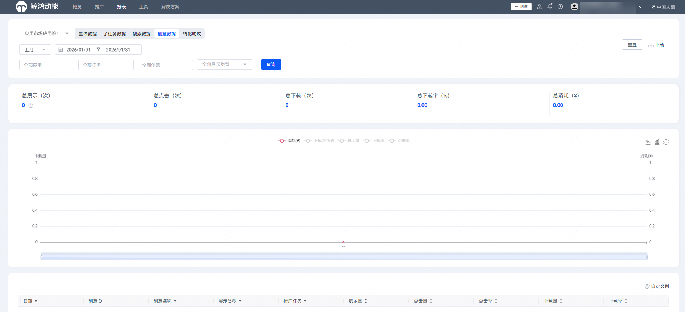

# 查询创意数据报表

1. 登录[华为应用市场应用推广平台](https://ads.huawei.com/cn/)，在顶部菜单栏点击【报表】页签，确认推广范围为“应用市场应用推广” ，选择“创意数据”页签。
2. 您可以筛选时间段，筛选应用及任务进行数据查询和下载。

 

具体报表指标含义请参见[报表指标说明](https://developer.huawei.com/consumer/cn/doc/promotion/bp-delivery-task-management-index-0000001293894160)。

