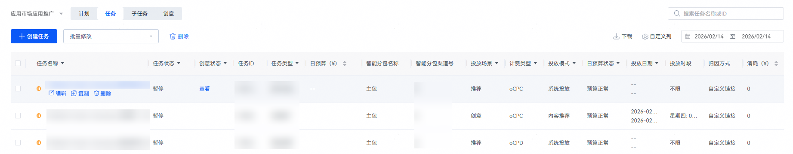

# 管理推广任务

## 前提条件

您已创建推广任务。

## 操作步骤

1. 登录[华为应用市场应用推广平台](https://ads.huawei.com/cn/)，在顶部菜单栏点击【推广】页签，确认推广范围为“应用市场应用推广”，然后点击【任务】。您可点击右侧“日期区间”筛选日期，查看所选时间范围内的投放数据累计值。右侧搜索框支持搜索任务信息、编辑自定义列查看数据，并导出所有任务的详细配置、消耗、出价信息。

   
2. 您可以在“操作”列中“修改”、“复制”、“删除”任务。

   

   | 任务设置项 | 说明 |
   | --- | --- |
   | 暂停任务 | 如您需要暂停该任务，请点击任务前方的“”按钮。 |
   | 重启任务 | 如您需要重启该任务，请点击任务前方的“”按钮。 |
   | 修改任务 | 您可以进入“推广任务”页面修改任务信息，通过修改任务投放时间来实现任务重新投放。 |
   | 复制任务 | 您可以进入“推广任务”页面修改任务信息，并生成新的推广任务。 |
   | 删除任务 | 除了“执行”状态的任务，以及合约任务不能删除，其他都可以删除。 |
3. 您可以点击“批量修改”下拉框，勾选多个同一任务类型的任务，批量修改任务状态、日预算、投放时段等。

   

 

- “消耗”、“展示量”、“点击量”、“点击率”、“下载量”、“下载率”等指标默认为投放至今的历史累计值。
- 推广均价=消耗/下载量（转化/展示量），其中有子任务的任务（如有人群包的推荐任务和有关键词的搜索任务）显示的推广均价为任务的总消耗/总下载量（转化/展示量），oCPD任务的推广均价=任务的总消耗/总下载量。
