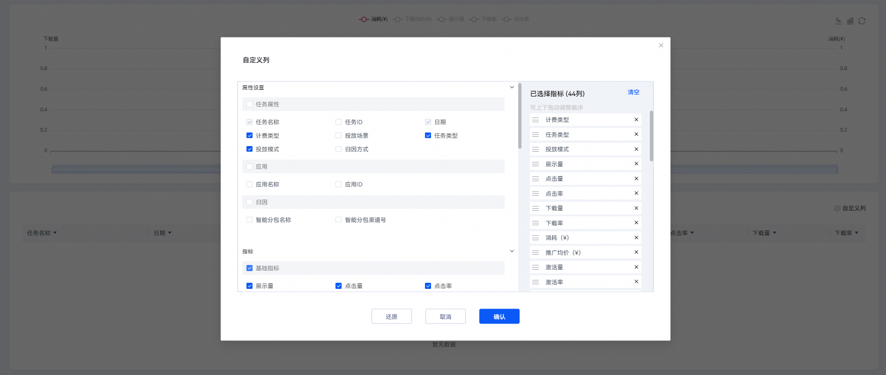

# 查询整体数据报表

## 操作步骤

1. 登录[华为应用市场应用推广平台](https://ads.huawei.com/cn/)， 在顶部菜单栏点击【报表】页签，确认推广范围为“应用市场应用推广”，选择“整体数据”页签。
2. 您可以筛选时间段及数据展示方式（“合计”或者“分日”），查看并下载所有历史任务的总展示、总点击、总下载、总消耗等数据。产生过消耗的任务均会在整体数据展示相应的数据。

    

   具体报表指标含义请参见[报表指标说明](https://developer.huawei.com/consumer/cn/doc/promotion/bp-delivery-task-management-index-0000001293894160)。

   
3. 您可以点击“自定义列”，自定义筛选字段。查询和导出的字段名保持一致。

   
