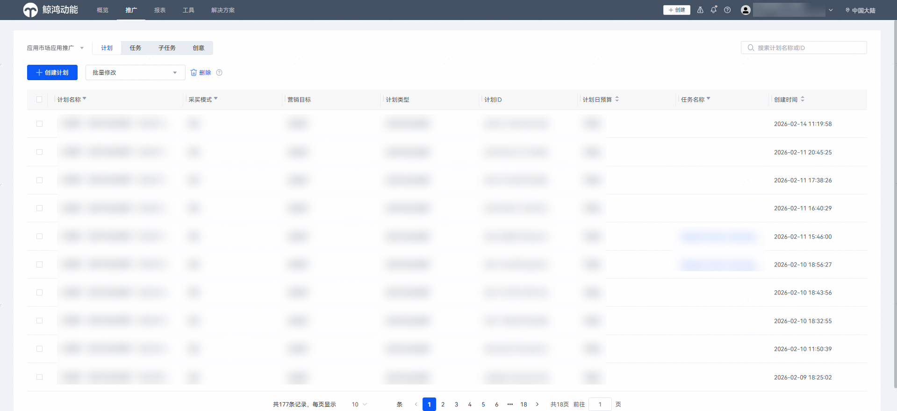
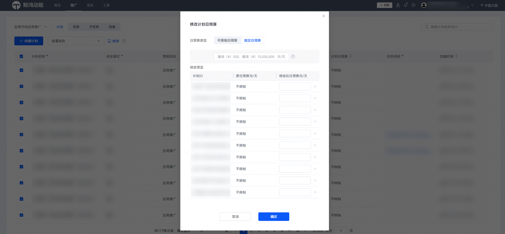
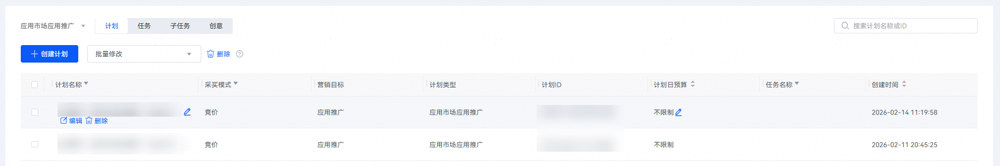

# 管理推广计划

## 前提条件

您已创建推广计划。

## 操作步骤

1. 登录[华为应用市场应用推广平台](https://ads.huawei.com/cn/)，在顶部菜单栏点击【推广】页签，确认推广范围为“应用市场应用推广”。
2. 批量修改计划日预算，支持统一修改为不限制或者指定日预算。也可以批量选中后，逐个编辑计划日预算。

   

   
3. 您可点击“编辑”进入计划详情页，修改计划名称与日预算；点击“删除”可删除该推广计划。删除后将同时移除该计划下的所有任务、子任务及全部创意，且该操作不可撤销，请谨慎操作。

   
