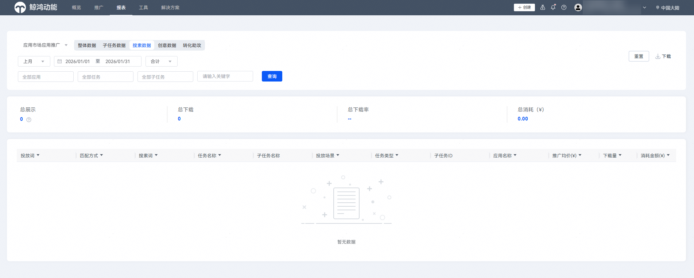

# 查询搜索数据报表

1. 登录[华为应用市场应用推广平台](https://ads.huawei.com/cn/)，在顶部菜单栏点击【报表】页签，确认推广范围为“应用市场应用推广” ，选择“搜索数据”页签。
2. 您可以筛选时间段及数据展示方式（“合计”或者“分日”），筛选应用及任务进行数据查询和下载。

 

- 搜索任务在子任务报表展示的最细颗粒度维度为子任务（投放词），在搜索报表中最细颗粒度为搜索词（每个投放词中通过哪些搜索词搜索下载的）。
- oCPD子任务和影子投放任务不涉及搜索词，因此不在搜索报表中体现。
- 因自动匹配任务数据量大，服务器承载过重，以及受用户隐私保护的限制，自动匹配任务关键词明细不在报表展示。
- 当数据展示方式选择为“分日”时，即可查看“搜索平均排名”字段；当数据展示方式选择为“合计”时，暂不支持查看“搜索平均排名”字段。
- 具体报表指标含义请参见[报表指标说明](/docs/monetize/promotion/bp-delivery-task-management-index-0000001293894160)。

