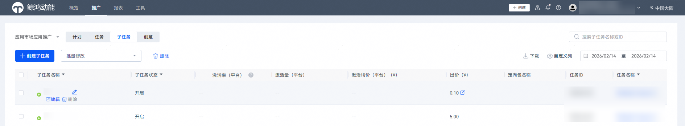
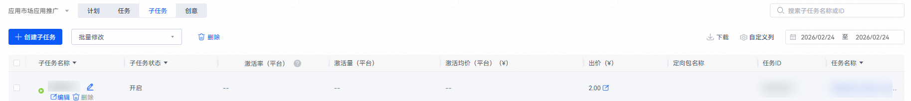
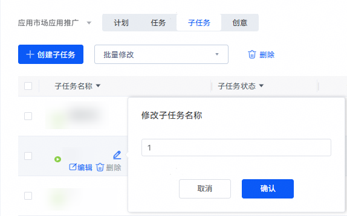
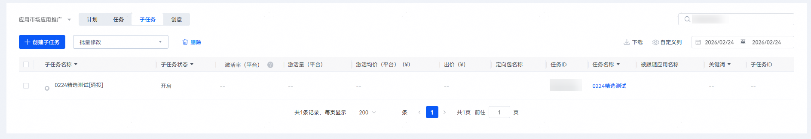
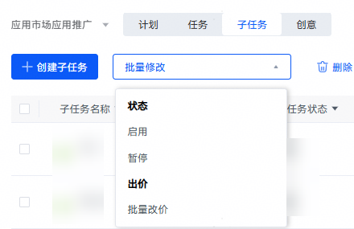

# 管理子任务

## 操作步骤

1. 登录[华为应用市场应用推广平台](https://ads.huawei.com/cn/)，在顶部菜单栏点击【推广】页签，确认推广范围为“应用市场应用推广”，然后点击【子任务】。在子任务列表中管理人群定向人群包、影子投放追随应用、oCPD目标应用、搜索关键词等子任务层级。

   

    

   搜索子任务仅在精准匹配下才展示“展示量”字段，广泛匹配、自动匹配不展示。
2. 您可以选中子任务名称 “修改子任务名称”、“编辑”、“删除”子任务。

   

   

   | 任务设置项 | 说明 |
   | --- | --- |
   | 修改子任务 | 进入所在任务的详情页，修改子任务相关信息。 |
   | 删除子任务 | 删除暂停状态的子任务。 |
3. 您可以在子任务列表中修改“定向包名称”、“出价”、“被跟随应用名称”、“关键词”。

    

   子任务列表、子任务报表中通投任务在“子任务名称”字段的命名：“任务名称+[通投]”，通投任务的子任务ID为空。

   

   | 任务设置项 | 说明 |
   | --- | --- |
   | 定向包名称、被跟随应用名称 | 点击对应列中的蓝色字段，在系统弹窗内修改。 |
   | 出价 | 可直接修改。 |
   | 关键词 | 可直接修改。要求关键词长度不超过60个字符，且不含特殊字符。 |
4. 您可以点击“批量操作”下拉框，批量启停、修改出价。

   

   | 任务设置项 | 说明 |
   | --- | --- |
   | 启用/暂停 | 勾选多个子任务，选择启用/暂停。 |
   | 批量改价 | 勾选多个子任务，可以设置统一的新出价，或统一按照百分比/绝对值提高或降低出价。 |
