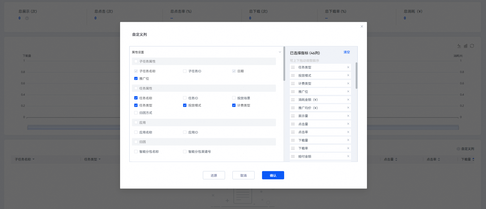

# 查询子任务数据报表

## 操作步骤

1. 登录[华为应用市场应用推广平台](https://ads.huawei.com/cn/)，在顶部菜单栏点击【报表】页签，确认推广范围为“应用市场应用推广” ，选择“子任务数据”页签。
2. 您可以筛选时间段及数据展示方式（“合计”或者“分日”），筛选应用、任务及子任务进行数据查询和下载。

    

   - 开通数据回传权限并回传数据的客户可以在“任务列表”、“整体数据”查看任务级的后端数据，在“子任务列表”、“子任务数据”查看子任务级的后端数据。
   - 具体报表指标含义请参见[报表指标说明](https://developer.huawei.com/consumer/cn/doc/promotion/bp-delivery-task-management-index-0000001293894160)。

   
3. 您可以点击“自定义列”，自定义筛选字段。查询和导出的字段名保持一致。

   
