# 投放推荐任务

## 背景信息

华为应用市场有大量个性化榜单，具有曝光量级大，千人千面，全品类竞争的特点。而开发者无需选择特定的榜单，系统会自动匹配曝光的资源位。

推荐投放场景有三个任务类型：

- 精选推荐
- 全域推荐
- 耀星推荐

 

如果您想了解推荐任务的优化思路，可以观看[视频课程](https://developer.huawei.com/consumer/cn/training/course/video/C101678670963668092)。

推荐投放资源位示例如下：

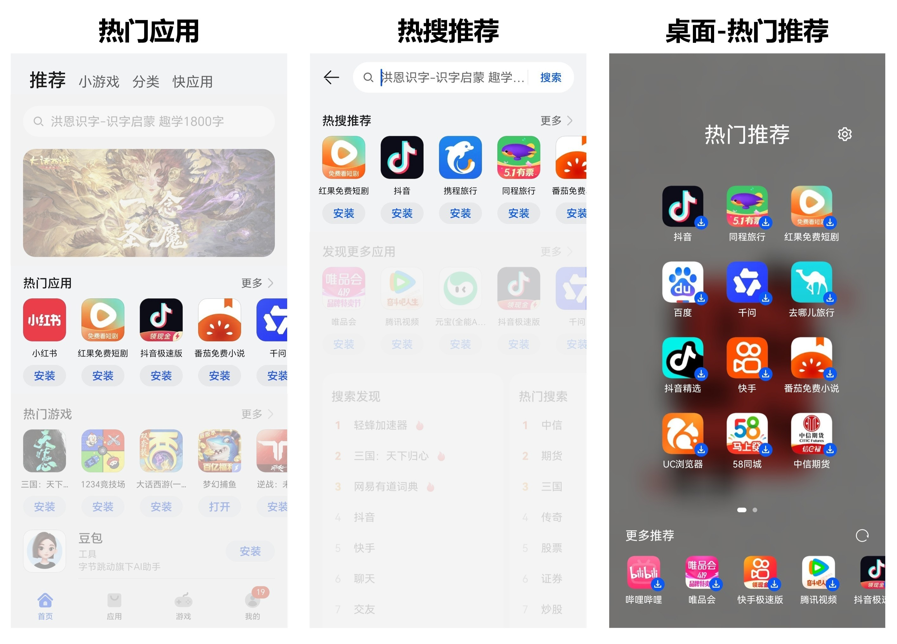

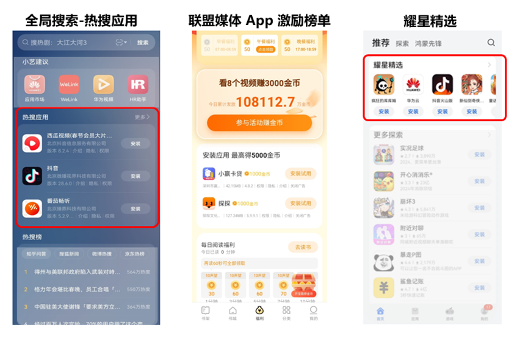

## 操作步骤

1. 登录[华为应用市场应用推广平台](https://ads.huawei.com/cn/)，“应用市场应用推广”推广范围，点击“推广”—“创建计划”，进入任务创建页面。

   

   

   | 计划设置项 | 说明 |
   | --- | --- |
   | 采买模式 | 选择“竞价”。 |
   | 计划日预算 | 用于限制任务每日（自然日）整体消耗，计划内的所有任务总消耗超过此预算后，系统会自动限制该任务的推广，次日再恢复正常投放。由于预算达到限额后，您的应用可能会因为之前的推广曝光产生后续下载，已曝光的任务30天内产生的点击或下载行为等转化行为仍计费，故您的实际消耗有可能会超出设置的日预算。 |
   | 计划名称 | 命名格式建议：任务类型+应用名称+时间信息，长度不超过128字符。计划与任务层级一一对应，计划名称可与任务名称命名一致。 |
2. 在“推广内容”设置模块，配置相关任务设置项。

   <strong>精选推荐示例：</strong>

   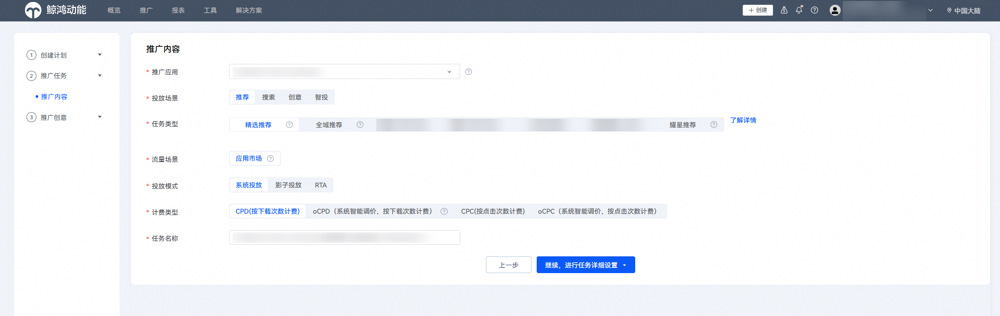

   <strong>全域推荐示例：</strong>

   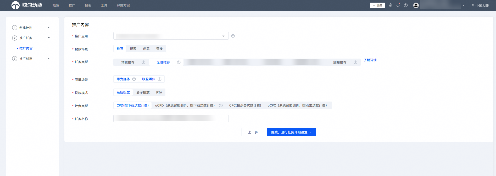

   | 任务设置项 | 说明 |
   | --- | --- |
   | 被推广应用 | 选择您需要推广的应用。 |
   | 投放场景 | 选择“推荐”。 |
   | 任务类型 | 选择您想要推广的任务类型。  取值范围：  - 精选推荐：可投放至应用市场以及其他精选流量资源，具有高转化、高质量的特点。 - 全域推荐：可投放至非应用市场的全域资源，具有覆盖面广、曝光量大、转化良好成本低的特点。 - 耀星推荐：耀星应用专属榜单，仅耀星应用使用耀星券才可以在耀星榜单中投放。 |
   | 流量场景 | 取值范围：  - 应用市场：投放到华为应用市场及精选流量。用于“精选推荐”的任务类型。 - 华为媒体：投放到除华为应用市场之外的其他华为媒体。 用于“全域推荐”的任务类型。 - 联盟媒体：投放到非华为的其他三方合作媒体。用于“全域推荐”的任务类型。 |
   | 投放模式 | 应用推广投放方式。  取值范围：  - 系统投放：应用推广主要投放方式，投放系统通过各类算法将应用推送至客户端展示。 - 影子投放：针对目标应用后一位流量，系统自动计算合适的价格并帮您投放到该位置。 |
   | 计费类型 | 取值范围：  - CPD：按下载完成次数计费。 - oCPD：采用oCPD智能出价模式。 - CPC：采用按点击量计费。 - oCPC：采用oCPC智能出价模式。 |
   | 任务名称 | 命名格式建议：任务类型+应用名称+时间信息，长度不超过50个字符。 |
3. 配置完成后，点击“继续，进行任务详细设置”。
4. 在“投放控制”设置模块，配置相关任务设置项。

   

   | 任务设置项 | 说明 |
   | --- | --- |
   | 投放日期 | 取值范围：  - 长期投放：该任务不限时间。 - 选定日期：设置任务执行的开始和结束时间。 |
   | 投放时段 | 取值范围：  - 不限时段：一周内每天全时段（7×24小时）任务都在投放。 - 选定时段：选定想要的时间段进行任务投放。 |
5. 在“通用投放”设置模块，配置相关任务设置项。

   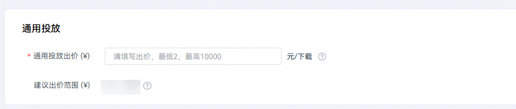

   | 任务设置项 | 说明 |
   | --- | --- |
   | 通用投放出价 | 自动匹配场景下单次对应计费类型的计费价格。  此出价用于针对非场景投放人群进行出价。 |
6. 在“场景投放”设置模块，点击“新建”，创建相关的子任务。

    

   - 支持在场景投放模块设置[用户定向任务](/docs/monetize/promotion/bp-functions-target-introduction-0000001285262204)/[影子投放目标应用](/docs/monetize/promotion/bp-functions-shadow-delivery-introduction-0000001284775684)/[oCPD转化目标](/docs/monetize/promotion/bp-functions-ocpx-introduction-0000001282639525)，需要填写“子任务名称”和“出价”任务设置项。场景投放模块配置的“出价”即为针对这一条件子任务设置的单独出价，该子任务以此出价参与竞价及计费。
   - 不同类型的投放任务对应子任务数的上限是不同的。具体子任务数的上限，请查看“新建”下的界面提示。

   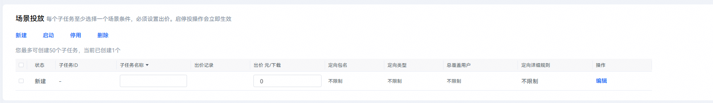
7. 在“归因监测”设置模块，配置相关任务设置项。

    

   如果您有智能分包、物理分包或监测链接的权限，可以填写归因信息。

   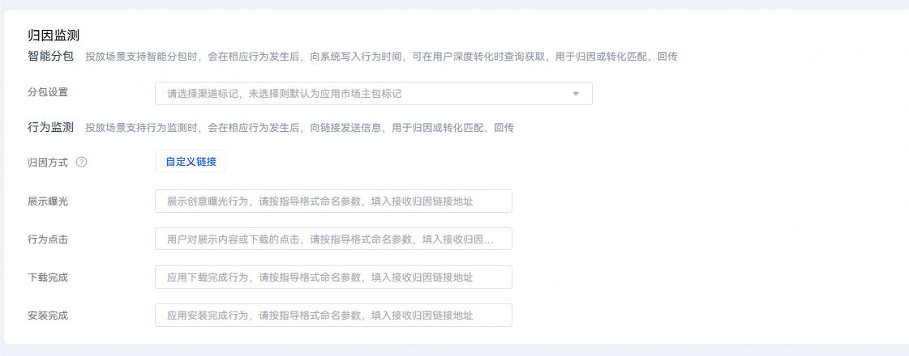

   具体任务设置项的配置请参见[智能分包](/docs/monetize/promotion/bp-functions-intelligent-subcontract-create-task-0000001284811940)或[监测链接](/docs/monetize/promotion/bp-functions-link-configure-0000001351658397)。
8. 以上设置模块均填写完毕后，点击“提交任务”，进入“推广创意”设置模块，配置相关任务设置项。

    

   ICON类任务如果您不需要任何创意，可以直接点击“提交任务”，并取消勾选“编辑辅助创意”提交，不会影响您的任务正常投放。

   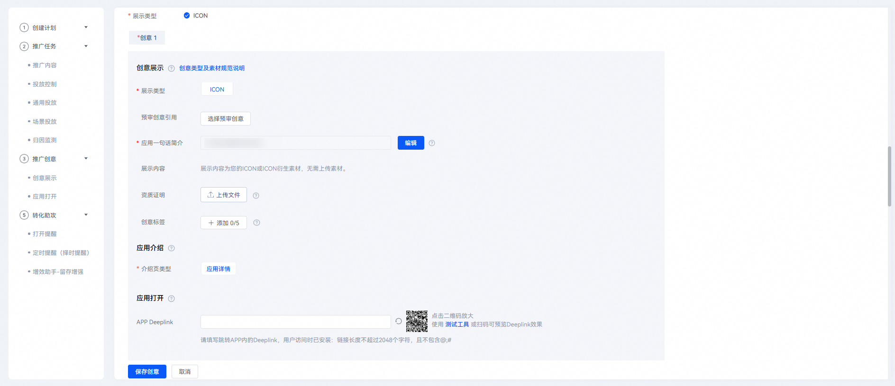

   具体配置说明如下：

   - 推荐投放场景中精选推荐和全域推荐任务可以配置“APP Deeplink”任务设置项。
   - 推荐任务的“展示类型”任务设置项为“ICON”。仅有一组创意时，“创意展现模式”任务设置项不生效。

    

   具体新建推广创意操作请参见[推广创意](https://developer.huawei.com/consumer/cn/doc/promotion/bp-function-creative-center-0000001349892530)。

## 成功案例

### 客户需求

新账户、新任务处于未起量状态，如果想突破冷启动状态，需要通过尝试摸索、获取系统转化量、扩大流量，来助力应用稳步增长度过学习期。

### 解决方案

推荐任务能够以较高的曝光、低于搜索的单价走向更深入的投放策略。

1. 设置日预算。

   开发者对新任务分配一笔预算，快速探索，获取转化量。

   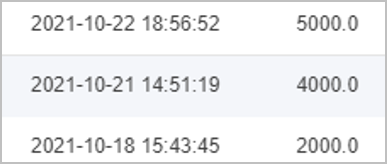
2. 分时段投放。

   可以拉回转化成本。

   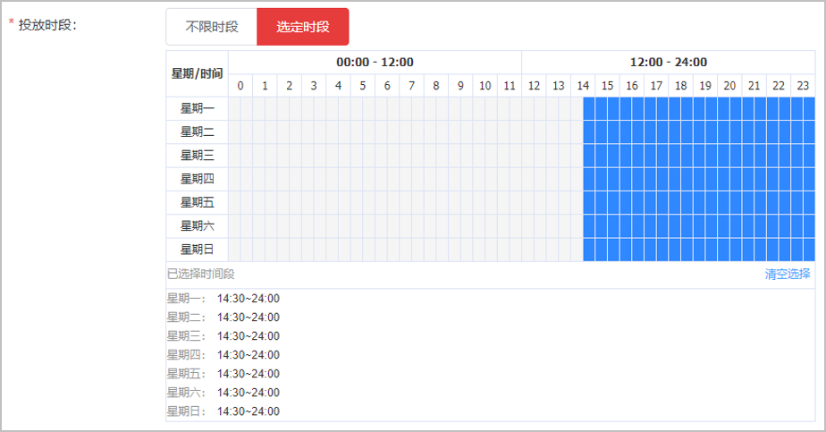
3. 影子投放快速度过冷启动。

   有效增加开发者应用曝光，提升推广等级和推广权重。
4. 最终以较低的价格，达成转化效果<strong>。</strong>

   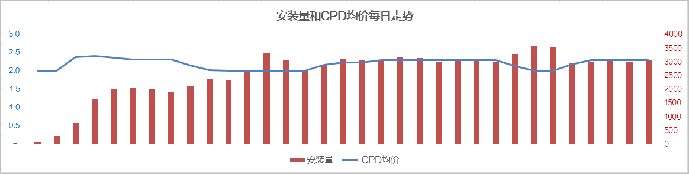
