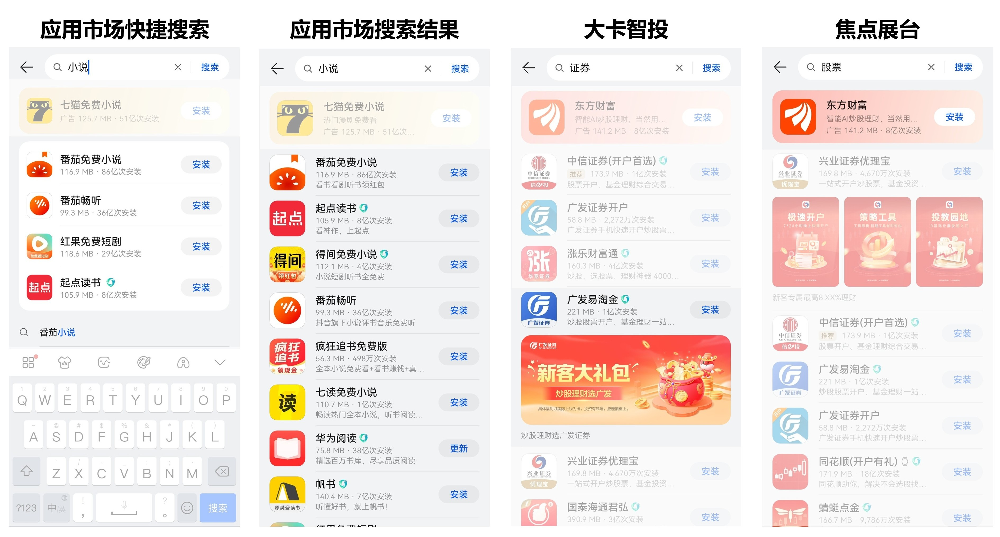
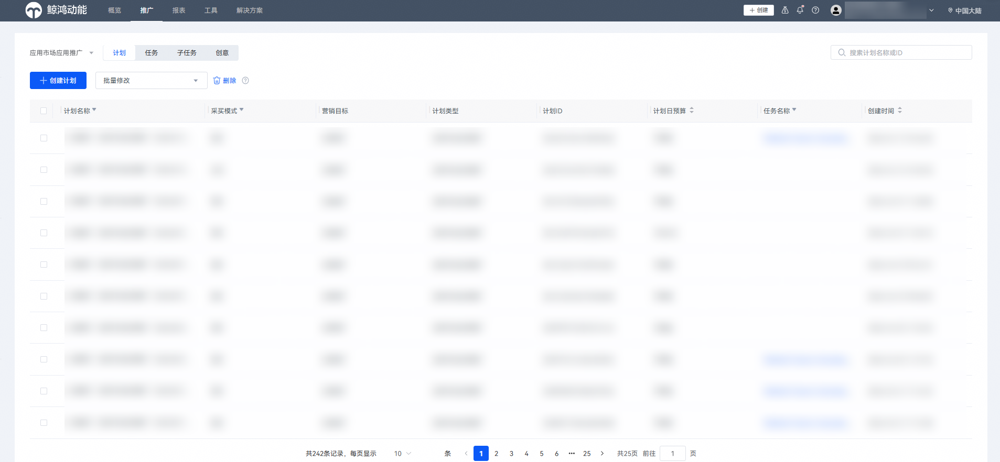
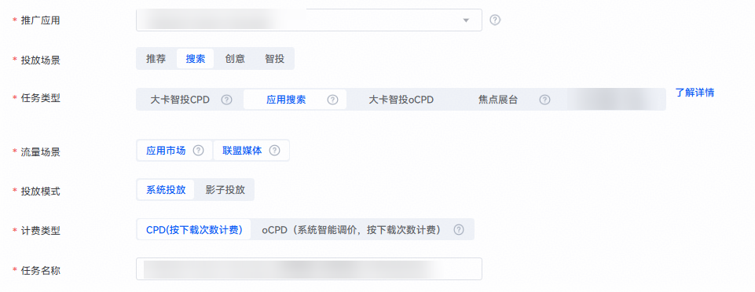
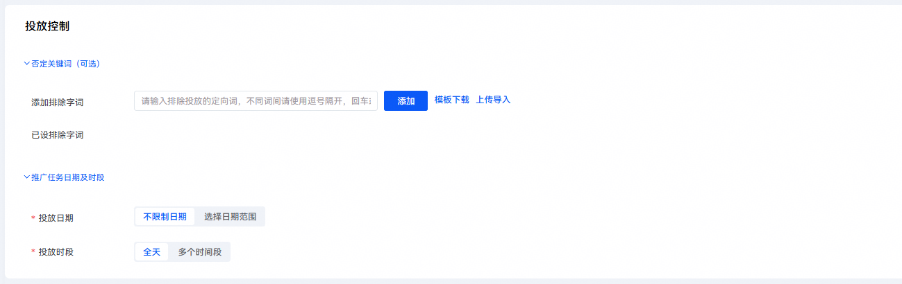
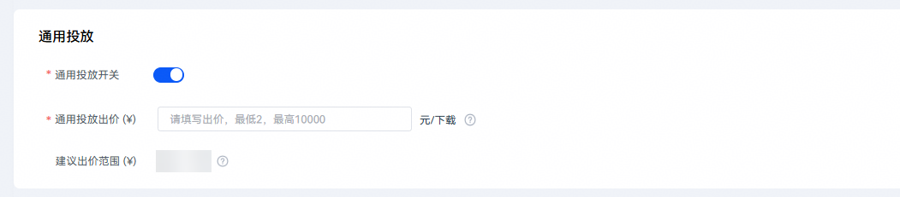
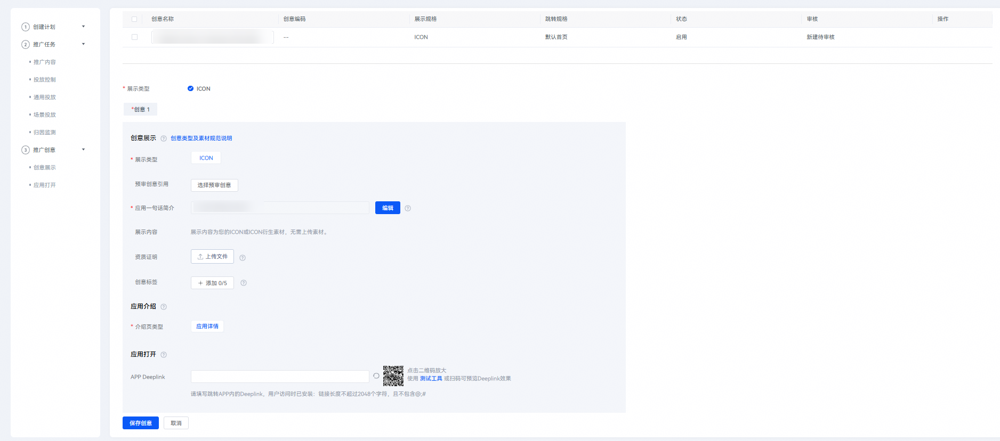
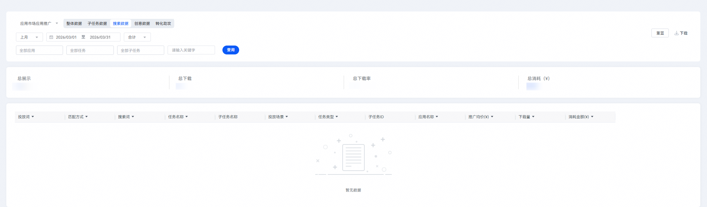
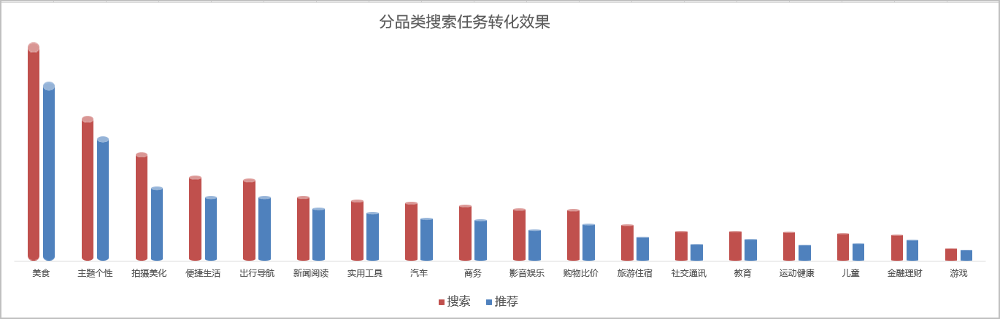

# 投放搜索任务

## 背景信息

搜索投放指的是用户在华为应用市场搜索框产生搜索行为产生的应用展示。该场景是一个用户主动有搜索关键词动作的展示，这时候用户已有较明确的应用找寻行为，将产生较高的转化。

搜索投放场景共有应用搜索和焦点展台两大任务类型。

- 应用搜索可以投放快捷搜索、搜索结果、大卡智投、焦点展台等搜索流量场景。
- 焦点展台可以投放至搜索结果顶部位置。

 

如果您想了解搜索任务的优化思路，可以观看[视频课程](https://developer.huawei.com/consumer/cn/training/course/video/C101678332309233896)。

搜索投放资源位示例如下：

## 操作流程

1. 登录[华为应用市场应用推广平台](https://ads.huawei.com/cn/)，“应用市场应用推广”推广范围，点击“推广”—“创建计划”，进入任务创建页面。

   

   

   | 计划设置项 | 说明 |
   | --- | --- |
   | 采买模式 | 选择“竞价”。 |
   | 计划日预算 | 用于限制任务每日（自然日）整体消耗，计划内的所有任务总消耗超过此预算后，系统会自动限制该任务的推广，次日再恢复正常投放。由于预算达到限额后，您的应用可能会因为之前的推广曝光产生后续下载，已曝光的任务30天内产生的点击或下载行为等转化行为仍计费，故您的实际消耗有可能会超出设置的日预算。 |
   | 计划名称 | 命名格式建议：任务类型+应用名称+时间信息，长度不超过128字符。计划与任务层级一一对应，计划名称可与任务名称命名一致。 |
2. 在“推广内容”设置模块，配置相关任务设置项。

   

   | 任务设置项 | 说明 |
   | --- | --- |
   | 被推广应用 | 选择您需要推广的应用。 |
   | 投放场景 | 选择“搜索”。 |
   | 任务类型 | 选择“应用搜索”。 |
   | 流量场景 | 取值范围：  - 应用市场：投放到华为应用市场及精选流量。 - 华为媒体：投放到除华为应用市场之外的其他华为媒体。 - 联盟媒体：投放到非华为的其他三方合作媒体。 |
   | 投放模式 | 应用推广投放方式。  取值范围：  - 系统投放：商业推广主要投放方式，投放系统通过各类算法将应用推送至客户端展示。 - 影子投放：针对目标应用后一位流量，系统自动计算合适的价格并帮您投放到该位置。 |
   | 计费类型 | 取值范围：  - CPD：按下载完成次数计费。 - oCPD：采用oCPD智能出价模式。 |
   | 任务名称 | 命名格式建议：任务类型+应用名称+时间信息，长度不超过50个字符。 |
3. 配置完成后，点击“继续，进行任务详细设置”。
4. 在“投放控制”设置模块，配置相关任务设置项。

   

   - 否定关键词设置：

     通过设置否定关键词可以避免对应关键词在当前任务中的投放。输入想设置的否定关键词，如果想一次添加多个关键词，可以用逗号分隔，回车键一次批量提交。提交后的词出现在下方框中，可以点击删除否定关键词。

      

     为了方便开发者批量导入否定关键词，现新建搜索任务支持excel模板批量导入否定关键词信息。点击“模板下载”，下载模板后在模板中填入否定关键词及其匹配方式、出价等，再点击“导入”上传该Excel即可。

     | 任务设置项 | 说明 |
     | --- | --- |
     | 添加排除字词 | 输入想设置的否定关键词，如想一次添加多个关键词，用逗号分隔，回车键一次批量提交。 |
     | 已设排除字词 | 提交后的词出现在下方框中，可以点击删除按钮，删除否定关键词。 |
   - 推广任务日期及时段设置项说明如下：

     | 任务设置项 | 说明 |
     | --- | --- |
     | 投放日期 | 取值范围：  - 长期投放：该任务不限时间。 - 选定日期：设置任务执行的开始和结束时间。 |
     | 投放时段 | 取值范围：  - 不限时段：一周内每天全时段（7×24小时）任务都在投放。 - 选定时段：选定想要的时间段进行任务投放。 |
5. 在“通用投放”设置模块，配置相关任务设置项。

   

   | 任务设置项 | 说明 |
   | --- | --- |
   | 通用投放开关 | 选择是否开启“通用投放开关”。  开启即为开启自动匹配场景下单次下载的计费价格，您可选择关闭。 |
   | 通用投放出价 | 若开启“通用投放开关”，需填写通用投放出价，即自动匹配场景下单次下载的计费价格。  此出价用于针对非场景投放人群进行出价。 |
6. 在“场景投放”设置模块，点击“新建”，创建相关的子任务。

    

   不同类型的投放任务对应子任务数的上限是不同的。具体子任务数的上限，请查看“新建”下的界面提示。

   

   - 具体任务设置项具体说明如下：

     | 任务设置项 | 说明 |
     | --- | --- |
     | 子任务名称 | 关键词所在的子任务名称。同一任务内的子任务名称唯一、不能重复，命名格式建议：关键词+匹配方式。 |
     | 出价 | 可针对关键词的广泛匹配和精准匹配分别出价。系统将使用您设置的出价去进行竞价，每次下载会按照您设置的关键词出价进行扣费。 |
     | 定向字词 | 设置投放的关键词。 |
     | 匹配方式 | 匹配方式分为广泛匹配和精准匹配。  - 匹配方式为广泛匹配时，用户搜索词与您的投放关键词高度相关时，即使您并未提交这些词，您的推广应用也可能获得展现机会。可能触发的搜索词包括：同义词、包含投放关键词的搜索词、变体形式（如：加空格，错别字等）。 - 匹配方式为精确匹配时，用户搜索词必须与您的投放关键词一致，您的应用才有可能展现出来。添加关键词时，系统默认匹配方式为广泛匹配，您可以根据推广需求设置关键词的匹配方式。 |
     | 建议定向词 | 建议定向词即为推荐关键词，是系统匹配到的用户可能会在找您的产品或者服务时使用的搜索词，直接点击“添加”添加合适的关键词。 |
   - 此设置模块还支持如下操作类型：

     | 功能 | 说明 |
     | --- | --- |
     | 启动 | 用于修改搜索任务时，对任务内关键词投放的启动，合作伙伴可以在任务内启动关键词，来进行关键词测试。 |
     | 停用 | 用于修改搜索任务时，对任务内关键词投放的停用，合作伙伴可以在任务内停用关键词，来进行关键词测试。 |
     | 删除 | 可以在任务内操作关键词的删除。 |
     | 导入 | 合作伙伴可以在下载的模板中填入关键词信息，点击“导入”，批量导入投放的关键词信息。  注意：  模板Excel中不可以使用公式。 |
     | 批量创建 | 点击“批量创建”，在输入框中输入多个关键词，用逗号隔开，点击“批量创建”按钮即可批量生成多条子任务。而后，填入关键词的出价及子任务名称。  说明：  - 为了方便开发者批量导入关键词，现新建搜索任务支持excel模板批量导入关键词信息。 - 点击“模板下载”，填入关键词及其匹配方式、出价等，再点击“导入”上传该Excel即可。否定关键词同样支持模板批量导入操作。 |
     | 模板下载 | 下载批量导入关键词的excel模板。 |
   - 创建子任务时，右侧会出现搜索投放建议词窗口，您可以在推荐列表添加建议词。

     搜索投放建议词功能，系统会根据应用属性、投放潜力、未来搜索量、转化数据等维度为您定制好搜索建议词列表，实现高效选词。提供搜索投放的新思路，找到更多适合投放的关键词，拉升搜索投放效果，帮助APP精细化运营。

      

     否词为精准否定。如，设置“车”一词为否词，则用户在搜索“车”的时候，应用当前推广任务不会投出；但搜索“汽车”时，应用则仍有可能投放出来。
7. 在“归因监测”设置模块，配置相关任务设置项。

   

   具体任务设置项的配置请参见[智能分包](https://developer.huawei.com/consumer/cn/doc/promotion/bp-functions-intelligent-subcontract-create-task-0000001284811940)、[监测链接](https://developer.huawei.com/consumer/cn/doc/promotion/bp-functions-link-configure-0000001351658397)或[华为分析监测](https://developer.huawei.com/consumer/cn/doc/promotion/bp-functions-ha-create-task-0000001348575585)。
8. 以上设置模块均填写完毕后，点击“提交并编辑创意”，进入“推广创意”设置模块，配置相关任务设置项。

    

   - 具体新建推广创意操作请参见[推广创意](https://developer.huawei.com/consumer/cn/doc/promotion/bp-function-creative-center-0000001349892530)。
   - ICON类任务如果您不需要任何创意，可以直接点击“提交任务”，并取消勾选“编辑辅助创意”提交，不会影响您的任务正常投放。

   

## 查询搜索数据报表

1. 登录[华为应用市场应用推广平台](https://ads.huawei.com/cn/)， 点击“报表”，点击“搜索数据”页签。
2. 筛选时间段及数据展示方式（“合计”或者“分日”），筛选应用及任务，点击“查询”进行数据查询。

   搜索数据报表可以查看投放词下分搜索词的下载、消耗数据。

    

   - 搜索任务在子任务报表展示的最细颗粒度维度为子任务（投放词），在搜索报表中最细颗粒度为搜索词（每个投放词中通过哪些搜索词搜索下载的）。
   - oCPD子任务和影子投放任务不涉及搜索词，因此不在搜索报表中体现。
   - 点击“下载”可以下载查询的数据。
   - 查询、下载：支持查询、下载导出一段时间内的关键词的推广统计数据，包含出价、下载次数、消耗金额、排名等信息。

   

## 成功案例

### 客户需求

在搜索场景，用户下载应用的意图更为明确。相比推荐任务，需要能产生更高的转化率。

### 解决方案

我们的搜索任务转化率是推荐的1~2倍，成本更易达标。

各个品类搜索任务的转化效果如下图所示。

