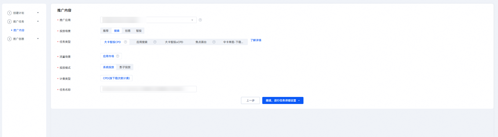
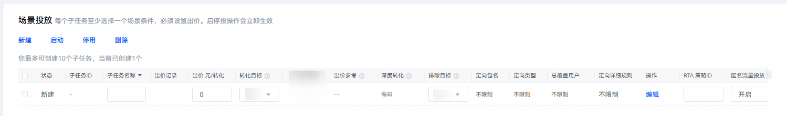
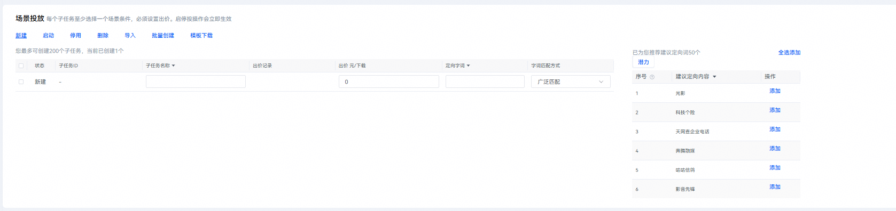
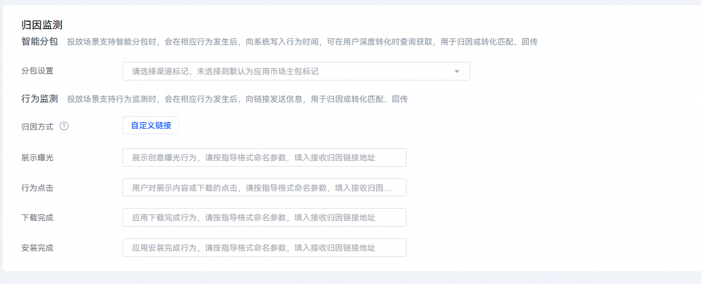
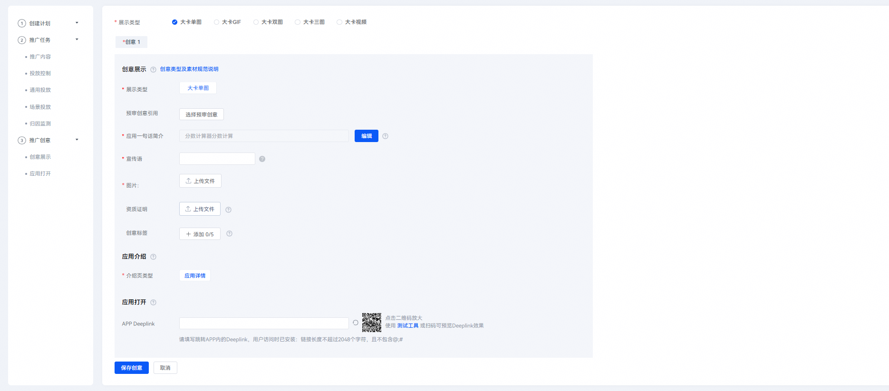
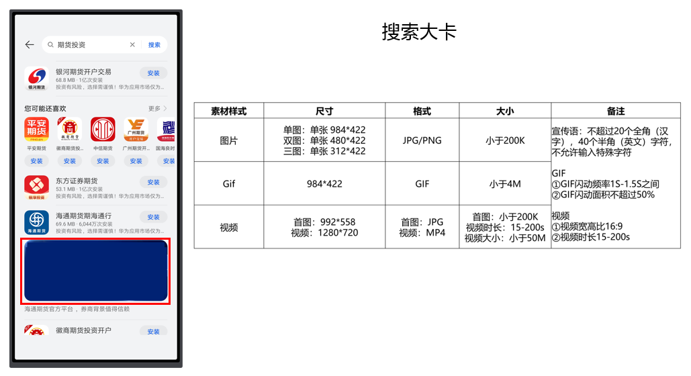

# 投放大卡智投任务

## 背景信息

大卡智投是华为应用市场应用推广平台重磅推出的搜索场景新资源——通过丰富多样的素材投放吸引用户注意力，显著提升推广转化效果。大卡智投支持oCPD多个转化目标投放、CPD关键词精准投放，开发者可上传大卡单图、大卡双图、大卡三图、GIF、视频五种样式，实现投放效果脱颖而出。

大卡智投资源位示例如下图所示：

## 操作流程

1. 登录[华为应用市场应用推广平台](https://ads.huawei.com/cn/)，“应用市场应用推广”推广范围，点击“推广”—“创建计划”，进入任务创建页面。

   

   

   | 计划设置项 | 说明 |
   | --- | --- |
   | 采买模式 | 选择“竞价”。 |
   | 计划日预算 | 用于限制任务每日（自然日）整体消耗，计划内的所有任务总消耗超过此预算后，系统会自动限制该任务的推广，次日再恢复正常投放。由于预算达到限额后，您的应用可能会因为之前的推广曝光产生后续下载，已曝光的任务30天内产生的点击或下载行为等转化行为仍计费，故您的实际消耗有可能会超出设置的日预算。 |
   | 计划名称 | 命名格式建议：任务类型+应用名称+时间信息，长度不超过128字符。计划与任务层级一一对应，计划名称可与任务名称命名一致。 |
2. 在“推广内容”设置模块，配置相关任务设置项。

   

   |  |  |
   | --- | --- |
   | <strong>任务设置项</strong> | <strong>说明</strong> |
   | 被推广应用 | 选择您需要的推广的应用。 |
   | 投放场景 | 选择“搜索”。 |
   | 任务类型 | 选择“大卡智投CPD”或“大卡智投oCPD”。 |
   | 投放模式 | 选择“系统投放”或“影子投放”。 |
   | 计费类型 | 选择“CPD”或“oCPD”。 |
   | 任务名称 | 命名格式建议：任务类型+应用名称+时间信息。 |
3. 配置完成后，点击“继续，进行任务详细设置”。
4. 在“投放控制”设置模块，配置相关任务设置项。

   

   | 任务设置项 | 说明 |
   | --- | --- |
   | 投放日期 | 取值范围：  - 长期投放：该任务不限时间。 - 选定日期：设置任务执行的开始和结束时间。 |
   | 投放时段 | 取值范围：  - 不限时段：一周内每天全时段（7×24小时）任务都在投放。 - 选定时段：选定想要的时间段进行任务投放。 |
5. 在“通用投放”设置模块，配置相关任务设置项。

   

   | 任务设置项 | 说明 |
   | --- | --- |
   | 通用投放开关 | 通用投放开关选择是否开启“通用投放开关”。  开启即为开启自动匹配场景下单次下载的计费价格，CPD计费模式下您可选择关闭。 |
   | 通用投放出价 | 若开启“通用投放开关”，需填写通用投放出价，即自动匹配场景下单次下载的计费价格。  此出价用于针对非场景投放人群进行出价。 |
6. 在“场景投放”设置模块，点击“新建”，创建相关的子任务。

    

   不同类型的投放任务对应子任务数的上限是不同的。具体子任务数的上限，请查看“新建”下的界面提示。

   1. oCPD创建如图。

      
   2. CPD创建如图。

      

   CPD精准投放任务具体设置项具体说明如下：

   | 任务设置项 | 说明 |
   | --- | --- |
   | 子任务名称 | 关键词所在的子任务名称。同一任务内的子任务名称唯一、不能重复，命名格式建议：关键词+匹配方式。 |
   | 出价 | 可针对关键词的广泛匹配和精准匹配分别出价。系统将使用您设置的出价去进行竞价，每次下载会按照您设置的关键词出价进行扣费。 |
   | 定向字词 | 设置投放的关键词。 |
   | 匹配方式 | 匹配方式分为广泛匹配和精准匹配。  - 匹配方式为广泛匹配时，用户搜索词与您的投放关键词高度相关时，即使您并未提交这些词，您的推广应用也可能获得展现机会。可能触发的搜索词包括：同义词、包含投放关键词的搜索词、变体形式（如：加空格，错别字等）。 - 匹配方式为精确匹配时，用户搜索词必须与您的投放关键词一致，您的应用才有可能展现出来。添加关键词时，系统默认匹配方式为广泛匹配，您可以根据推广需求设置关键词的匹配方式。 |
   | 建议定向内容 | 建议定向内容即为推荐关键词，是系统匹配到的用户可能会在找您的产品或者服务时使用的搜索词及其流行度，直接点击“添加”添加合适的关键词。同时可以在搜索框里搜索关键词，快速获取想投放的关键词是否在系统推荐的关键词内及其流行度。 |
   | 流行度 | 流行度反映关键词在应用市场的搜索次数，可根据流行度的数字大小判断该关键词的流行度。 |

   此设置模块还支持如下操作类型：

   | 功能 | 说明 |
   | --- | --- |
   | 启动 | 用于修改搜索任务时，对任务内关键词投放的启动，合作伙伴可以在任务内启动关键词，来进行关键词测试。 |
   | 停用 | 用于修改搜索任务时，对任务内关键词投放的停用，合作伙伴可以在任务内停用关键词，来进行关键词测试 |
   | 删除 | 可以在任务内操作关键词的删除。 |
   | 导入 | 合作伙伴可以在下载的模板中填入关键词信息，点击“导入”，批量导入投放的关键词信息。  注意：  模板Excel中不可以使用公式。 |
   | 批量创建 | 点击“批量创建”，在输入框中输入多个关键词，用逗号隔开，点击“批量创建”按钮即可批量生成多条子任务。而后，填入关键词的出价及子任务名称。  说明：  - 为了方便开发者批量导入关键词，现新建搜索任务支持excel模板批量导入关键词信息。 - 点击“模板下载”，填入关键词及其匹配方式、出价等，再点击“导入”上传该Excel即可。否定关键词同样支持模板批量导入操作。 |
   | 模板下载 | 下载批量导入关键词的excel模板。 |

   创建子任务时，右侧会出现搜索投放建议词窗口，从窗口中根据推荐理由和流行度添加建议词。
7. 在“归因监测”设置模块，配置相关任务设置项。

   
8. 以上设置模块均填写完毕后，点击“提交并编辑创意”，进入“推广创意”设置模块，选择 “展示类型”并上传对应规格素材。

   

## 查询报表

1. 登录华为应用市场应用推广平台，点击右上角“管理中心”，进入“管理中心”页面。点击“报表”，在“搜索数据”页签。
2. 在“任务类型”筛选内选择“大卡智投”，筛选应用及任务进行数据查询和下载。
3. 搜索数据报表可以查看投放词下分搜索词的下载、消耗数据。

## 素材制作说明

