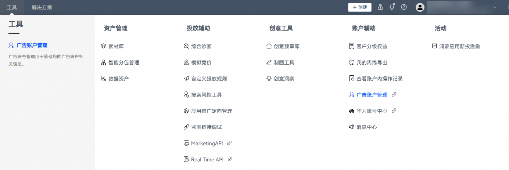
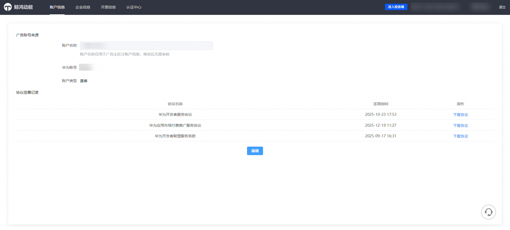
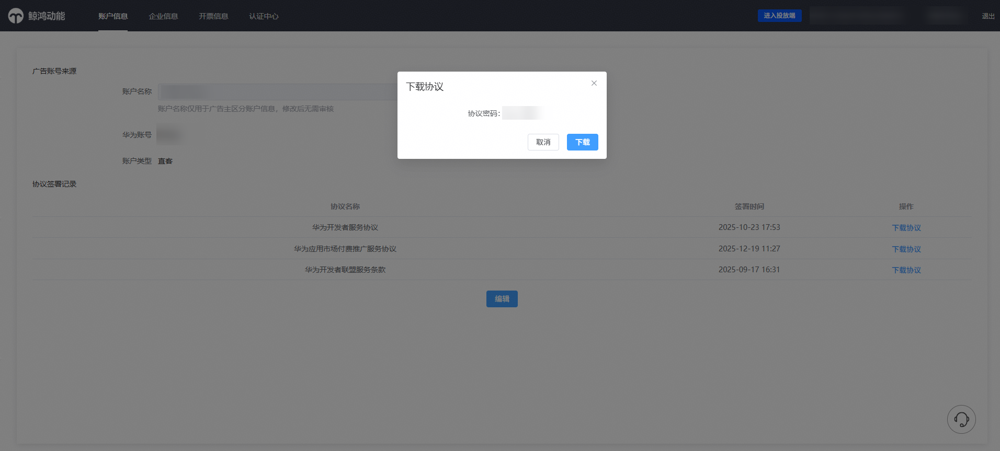
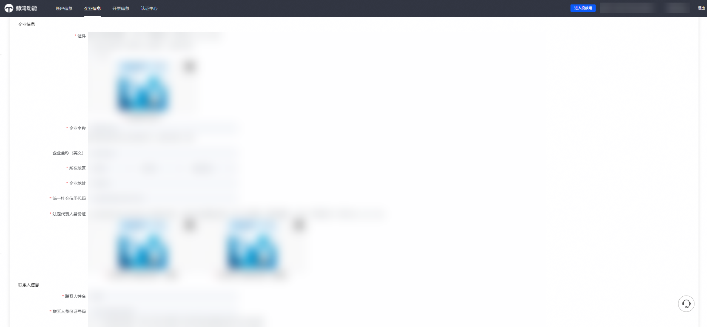
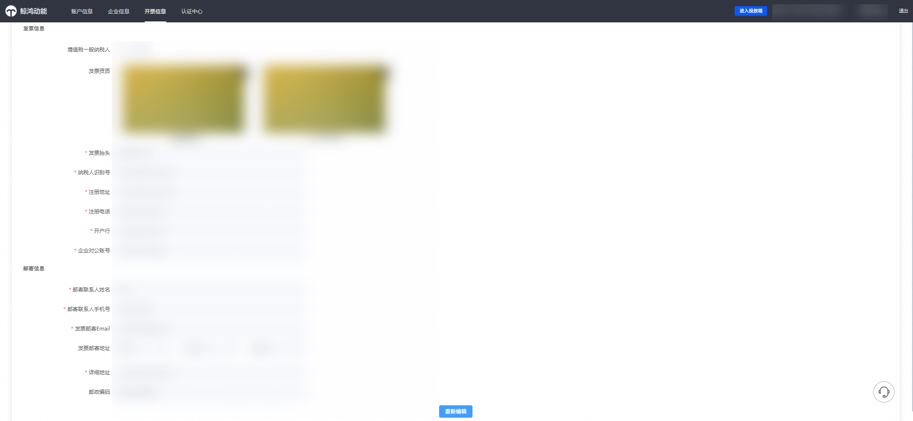
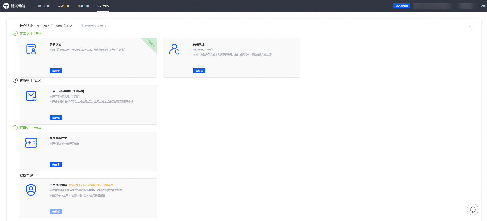

# 广告账户管理

登录[华为应用市场应用推广平台](https://ads.huawei.com/cn/)，在顶部菜单栏点击【工具】页签，确认推广范围为“应用市场应用推广”。选择“账户辅助”—— “广告账户管理”。

不同账户角色登录后，所看到的广告账户管理页面会有所不同，具体以您实际登录账户显示的页签为准。例如：

- 直客账户：可查看「账户信息」「企业信息」「开票信息」「认证中心」等页签。
- 直客管理者账户：可查看「企业信息」「经理账户信息」页签。
- 直客协作者账户：可查看「账户信息」「经理账户信息」页签。

请以当前登录账户实际展示的功能为准。

1. 【账户信息】页签可查看当前账户的账户名称、绑定的华为账号、账户类型，以及开户时已签署的相关协议记录。

    

   客户投放子账户（子客服务商）、投放操作账户（子客账户），其账户信息入口中的华为账号为账户持有人，支持更改。持有人信息更改，操作需由上一层管理账户进行修改（客户投放伙伴主账户/客户投放伙伴子账户），持有人绑定管理详见：[客户投放伙伴主账户（一级服务商）](/docs/monetize/promotion/bp-start-customer-partner-master-0000001293695534)、[客户投放伙伴子账户（子客服务商）](/docs/monetize/promotion/bp-start-customer-partner-sub-account-0000001346575385)。

   

   协议已加密，请您保存好页面弹出的协议密码，便于下载后续查看协议内容。

   
2. 【企业信息】页签可查看直客实名认证填写的相关企业信息和账户联系人信息。

   
3. 【开票信息】页签可查看直客账户开通付费服务时维护的发票信息，如：发票资质，发票抬头，纳税人识别号等，点击“重新编辑”后，跳转华为开发者联盟平台修改。

   
4. 【认证中心】页签可集中查看直客账户的认证与授权状态，包括是否已实名认证、是否已完成应用市场推广评测申请、是否已维护发票信息，以及应用是否已授权服务商进行代理投放（可选）。

   
