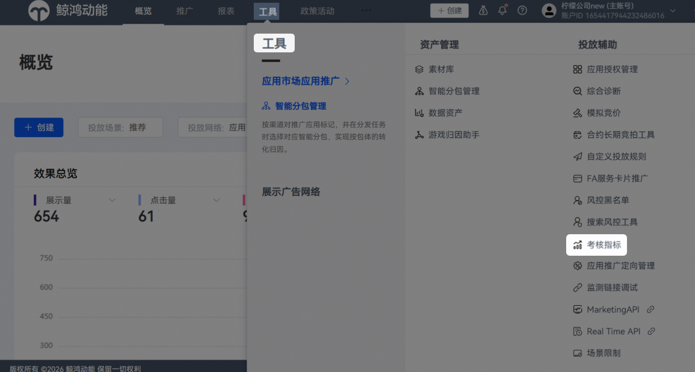
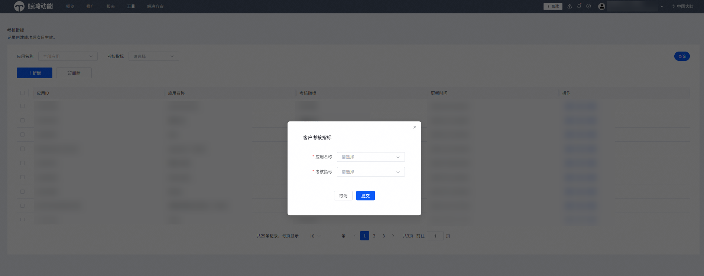

# 考核指标

## 功能介绍

您可以使用考核指标优化工具，配置应用的考核指标，算法会根据每个应用选择的考核指标进行对应的特征学习和投放优化，从而提升投放精准度，实现后端成本的优化。

## 操作步骤

1. 登录[华为应用市场应用推广平台](https://ads.huawei.com/cn/)，点击右上角“登录”，进入“账户登录”页面，选择已授权的推广账号。点击“进入系统”，进入“概览”页面。
2. 点击“工具”页签，在“投放辅助”中选择“考核指标”，进入“考核指标”页面。

   
3. 点击“新增”，选择对应的应用（支持搜索应用名称），并选择考核指标。

    

   - 一个应用仅支持配置一个考核指标，当前可选择的考核指标有：每次付费，首次付费，关键行为1，关键行为2，授信，次日留存，注册，激活应用，老客激活。
   - 支持新建、删除、或修改考核指标，支持批量删除考核指标。
   - 修改或删除之后，不会保留此前的操作记录。
   - 支持直客管理者账户、投放操作账户创建。

   

4. 配置完成后，点击“提交”，提交投放优化策略的配置，提交后会立即生成记录，但需注意是次日起生效。
5. 支持同时查看多个应用的考核指标。
