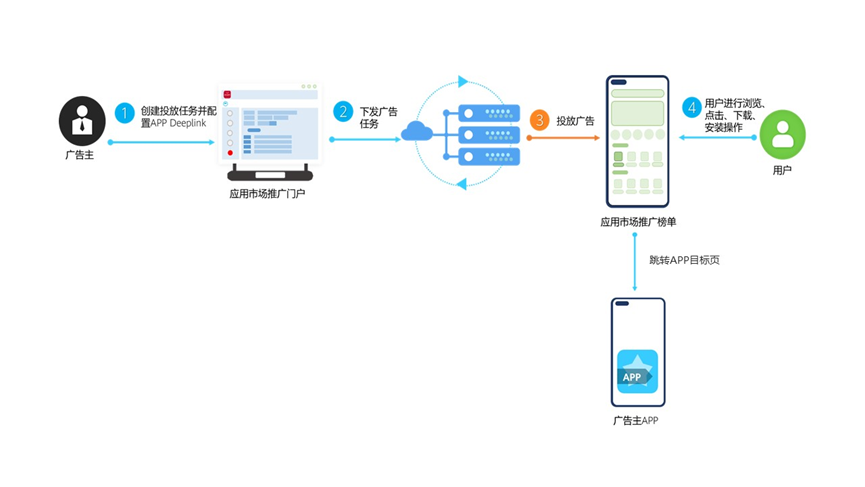

# 业务介绍

## 什么是Deeplink?

Deeplink又称为深度链接，是一项系统基础能力，用到的核心技术就是：URL Scheme。无论是Android还是iOS，都是通过URL Scheme来识别应用。开发者可以像定位一个网页一样，用一种特殊的URL来定位一个App甚至App里的某个页面。而定位指定的App，使用到的就是URL的Scheme部分。但是需要注意的是，App的URL Schemes并不唯一，也就是说每一个App可以配置多个Scheme。

- URL：即为一个普通的链接，例如：``https://developer.huawei.com``，就是一个URL。
- Scheme：表示一个URL中最初始的位置，即://之前的字符，例如：``https://developer.huawei.com``，该URL的Scheme就是https。

## 为什么要用Deeplink？

- 应用之间无需知道彼此界面的参数，只需根据标准URL Scheme格式即可实现在应用之间的跳转。
