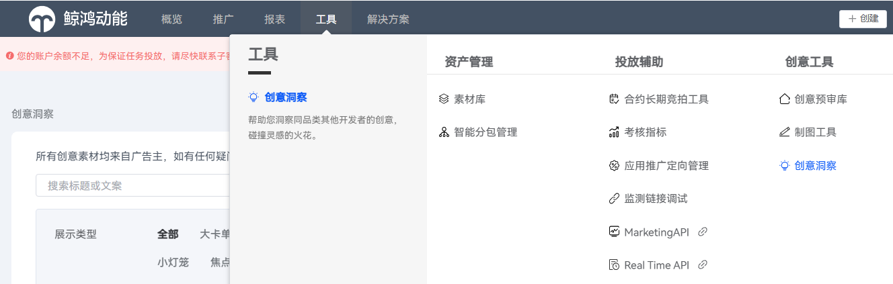
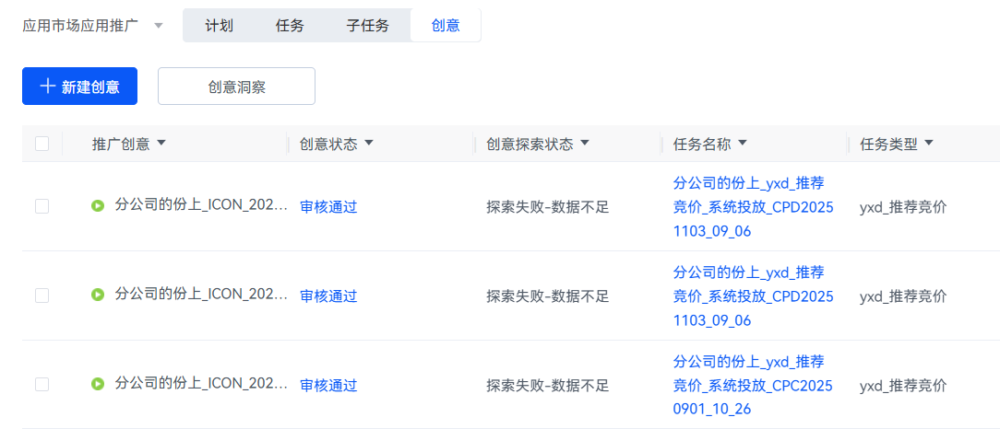
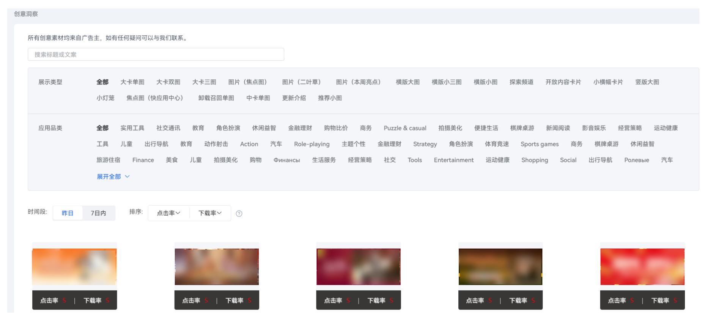
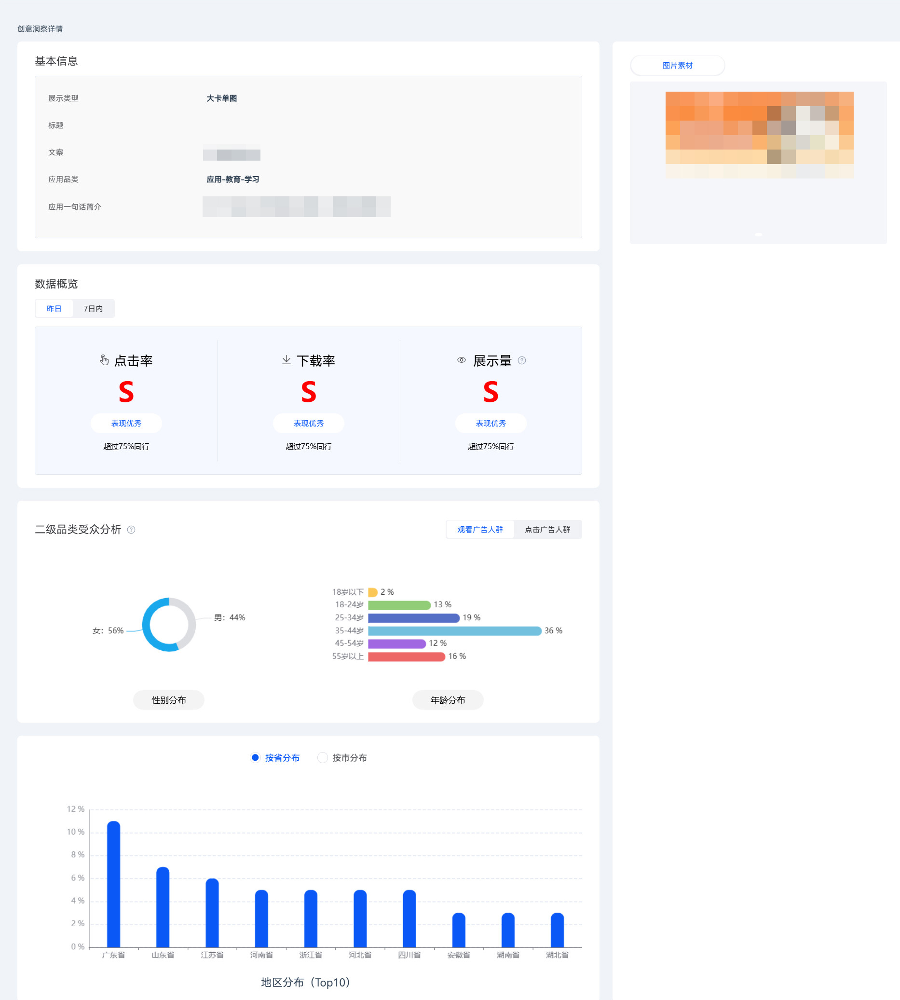

# 使用创意洞察功能

1. 登录[华为应用市场应用推广平台](https://ads.huawei.com/cn/)。
2. 点击“工具”页签，在“创意工具”中选择“创意洞察”。

   

   您也可以在“推广”页面的“创意”页签下，点击“创意洞察”。

   

3. 进入“创意洞察列表”页面，您可以在当前页面搜索、查看其它开发者的创意。

   

   您也可以点击您感兴趣的创意，查看该创意的详细评价。

   

   | 参数 | 说明 |
   | --- | --- |
   | 基本信息 | 您可以查看该创意的展示类型、应用一句话简介等内容。 |
   | 数据概览 | 您可以查看该创意昨日或七日内的点击率、下载率及展示量。  - S级：表现优秀，超过75%的同行 - A级：表现良好，超过50%的同行 - B级：表现一般，超过25%的同行 - C级：表现较差，低于75%的同行 |
   | 二级品类受众分析 | 您可以选择在“观看广告人群”或“点击广告人群”页签下，查看性别分布、年龄分布、地区分布的受众分析结果。 |
