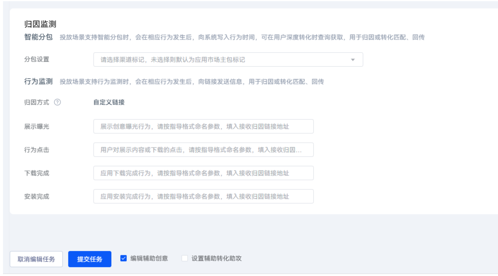
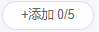
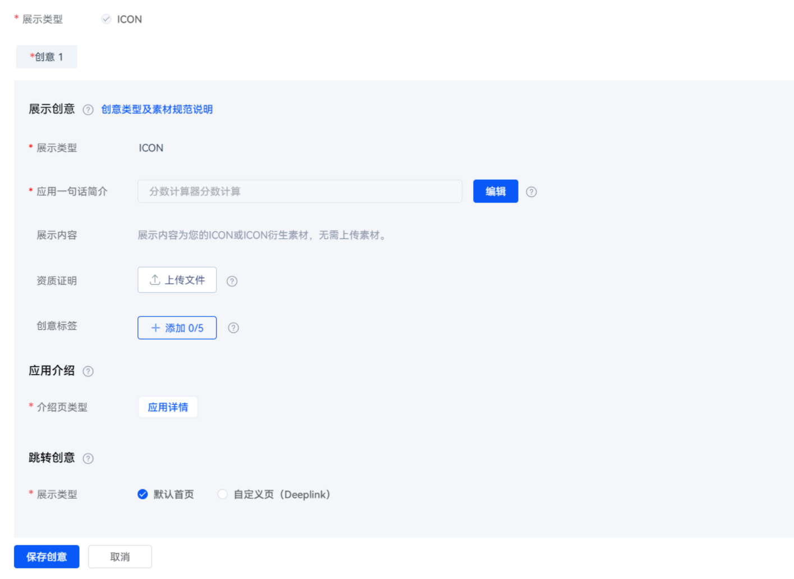
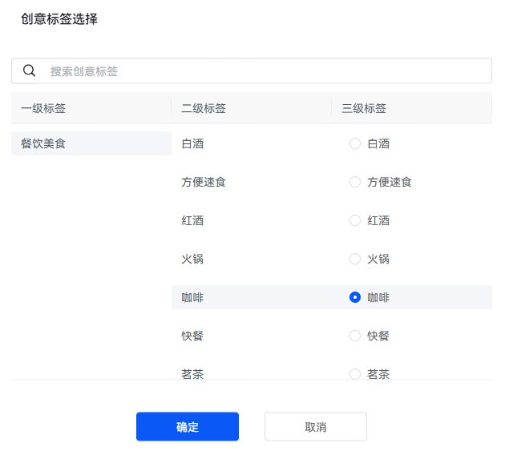

# 添加创意标签

1. 创建或修改推广任务时，若该任务支持推广创意功能，勾选“编辑辅助创意”。

   
2. 进入“推广创意”页面，在“创意展示”区域，点击。

    

   - 因创意标签较多，建议您根据创意内容按照关键词模糊搜索，高效勾选对应创意标签。
   - 当前最多可添加5个三级标签。

   
3. 在弹出的“创意标签选择”窗口输入创意相关的关键词或下拉选项，勾选三级创意标签，完成后点击“确定”。

   
