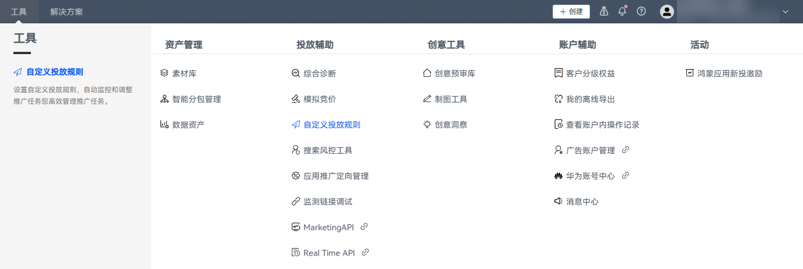
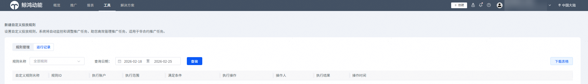

# 查看自定义投放规则的运行数据

1. 登录[华为应用市场应用推广平台](https://ads.huawei.com/cn/)，点击【工具】页签，投放辅助--点击“自定义投放规则”，进入“自定义投放规则”页面。
2. 点击“运行记录”页签，即可查看当前所有自定义投放规则的执行结果。

   

    

   - 支持基于“规则名称”和“查询日期”进行对应规则的查询。
   - 点击“下载表格”可以将当前查询结果导出为excel文件。
