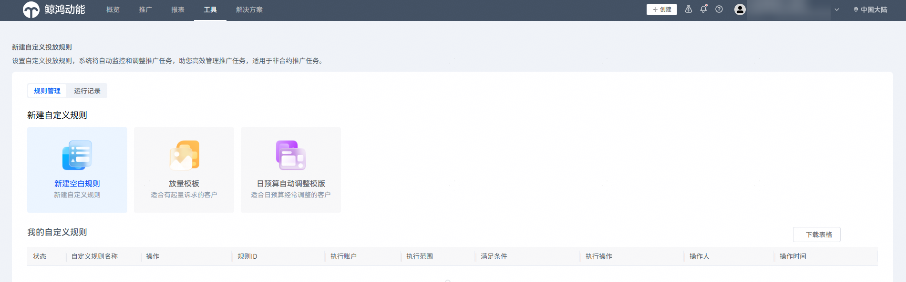
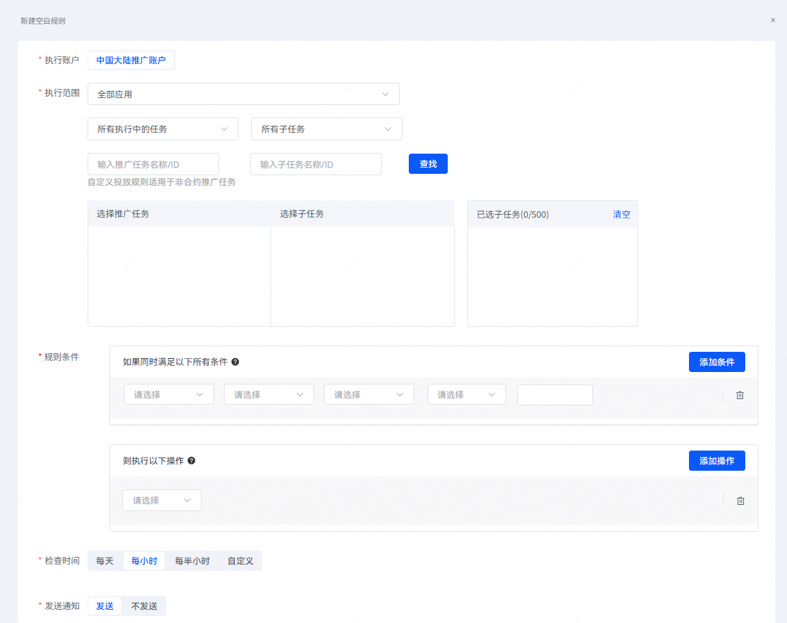

# 使用空白规则创建

## 前提条件

已完成投放任务的创建。

## 操作步骤

1. 登录[华为应用市场应用推广平台](https://ads.huawei.com/cn/)，点击【工具】页签，投放辅助--点击“自定义投放规则”，进入“自定义投放规则”页面。

   
2. 点击“新建空白规则”，页面右侧弹出“新建空白规则”页面。

   
3. 配置相关任务的投放规则。

    

   - 如果需要在指定日期进行自动放量调整，则请选择“放量模板”来创建自定义投放规则，具体请参见[使用放量模板创建](https://developer.huawei.com/consumer/cn/doc/promotion/bp-functions-customize-create-template-0000001309390054)。
   - 如果需要在指定日期进行自动调整日预算，则请选择“日预算自动调整模板”来创建自定义投放规则，具体请参见[使用日预算自动调整模板创建](https://developer.huawei.com/consumer/cn/doc/promotion/bp-functions-customize-create-daily-budget-0000001309230222)。

   

   具体规则设置项说明如下所示。

   | 规则设置项 | 说明 |
   | --- | --- |
   | 执行账户 | 根据实际情况选择“中国大陆推广账户”或“国际推广账户”。 |
   | 执行范围 | 此自定义投放规则所控制的投放任务范围。  1. 在应用选择栏中多选对应的应用。 2. 在任务类型栏中选择“所有执行中的任务”、“所有已暂停的任务”或“所有已完成的任务”，子任务类型栏选择“所有子任务”、“所有已开启的子任务”或“所有已暂停的任务”后，点击“查询”进行模糊查询投放任务。 3. 在任务名称栏或子任务名称栏中，输入对应推广任务的名称或ID，或子任务的名称或ID。 4. 点击“查询”进行精确查询投放任务。 |
   | 规则条件 | 自定义投放规则的触发条件和触发后执行的操作。  - 点击“添加条件”，配置触发条件。可以配置多个条件，即所有条件满足时，才触发执行对应的操作。 条件类型支持如下：    - 常用指标   - 归因指标   - 日预算不足 - 点击“添加操作”，配置待执行的操作。 操作类型支持如下：    - 任务日预算：按任务日调整预算。   - 出价：调整出价。对于OCPD的子任务，就是指调整开发者在任务详情页配置的出价。   - 状态开关：控制启停推广任务和子任务的开关。   - 仅发送通知：仅发送通知，不做其他自动调整的操作。   - 账户日预算：按账户日调整预算。 |
   | 检查时间 | 自定义投放规则的检查周期。  说明：  当“检查时间”设置项配置为“每天”，才会显示“检查时刻”。当“检查时间”设置项配置为“自定义”，才会显示“检查时段”。 |
   | 检查时刻/检查时段 |
   | 发送通知 | 系统识别满足自定义投放规则后，系统按照规则触发投放任务的变更，此时是否发送通知。  如果一天内多次触发不需要重复通知，则勾选“同一规则一天内多次触发执行，不重复通知”。 |
   | 规则名称 | 自定义投放规则的名称。  系统会自动预置规则名称。  请根据实际情况修改。 |
4. 配置完成后，点击“提交”。系统弹出提示窗口，进行二次确认，点击“确定”。
