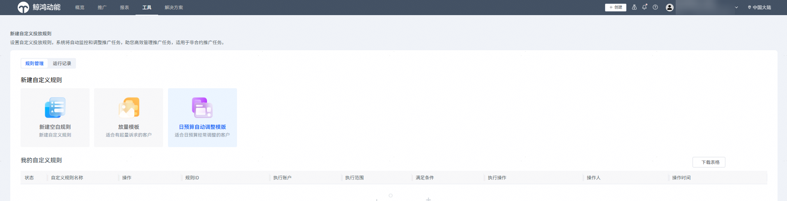
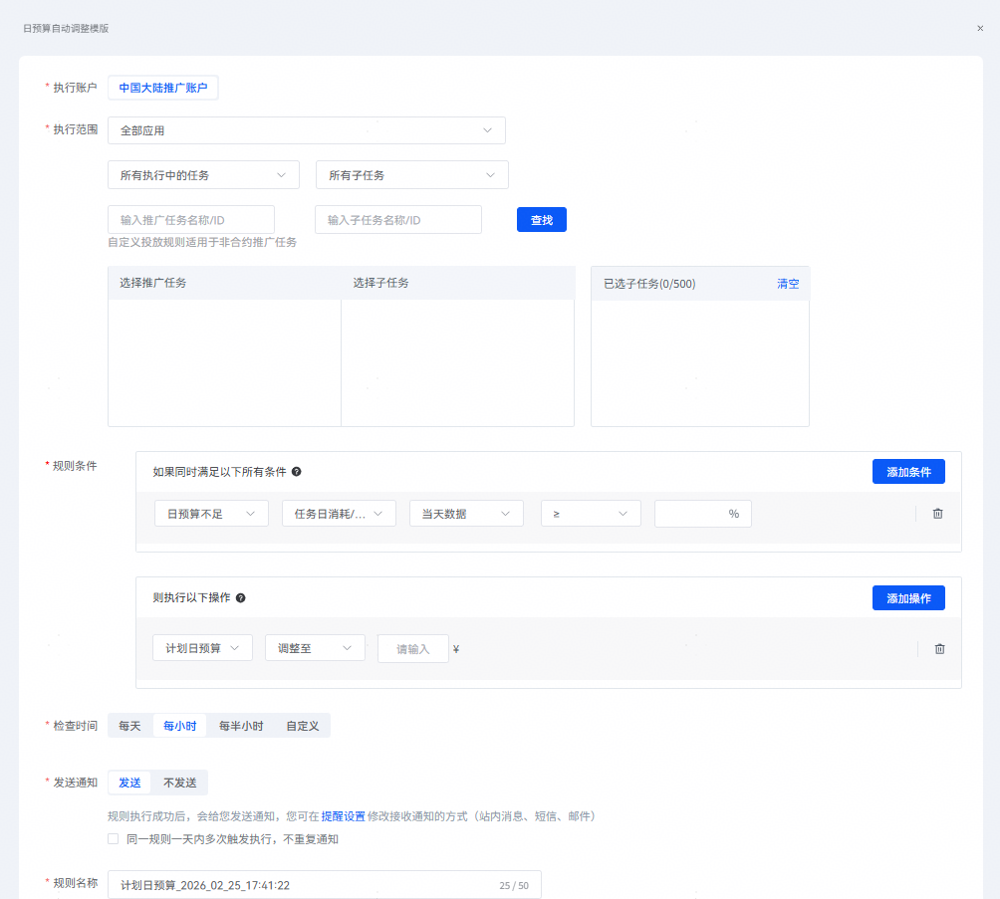

# 使用日预算自动调整模板创建

## 前提条件

已完成投放任务的创建。

## 操作步骤

1. 登录[华为应用市场应用推广平台](https://ads.huawei.com/cn/)，点击【工具】页签，投放辅助--点击“自定义投放规则”，进入“自定义投放规则”页面。

   
2. 点击“日预算自动调整模板”，配置相关任务的投放规则。

   

    

   日预算自动调整模板默认预置了当天任务日消耗超过阈值的条件，以及调整任务日预算的执行操作，即实现在指定的日期日预算不足时即调整任务日预算。

   

   具体规则设置项说明请参见[任务设置项说明](https://developer.huawei.com/consumer/cn/doc/promotion/bp-functions-customize-create-blank-0000001362109145#ZH-CN_TOPIC_0000001362109145__zh-cn_topic_0000001343075169_p17931549143111)。
3. 配置完成后，点击“提交”。系统弹出提示窗口，进行二次确认，点击“确定”。
