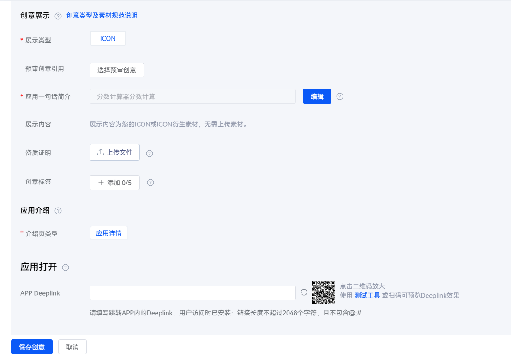

# 配置延迟Deeplink

## 操作步骤

在[华为应用市场应用推广平台](https://ads.huawei.com/cn/)，创建推广任务并在“推广创意”中填写“应用打开”后的APP Deeplink。

Deeplink填写完成后，您可以通过扫描二维码或使用[测试工具](https://a.vmall.com/uowap/apkPage/deepLink.html#/)预览Deeplink的效果。

 

建议使用华为浏览器，否则会因屏蔽站外链接情况导致扫描二维码后无法跳转。
