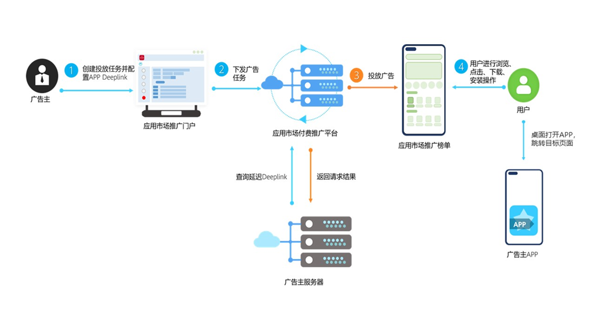

# 业务介绍

为了帮助开发者提升推广任务的转化效果，华为应用市场应用推广平台推出延迟Deeplink功能，精准定位推广内容。

## 普通Deeplink和延迟Deeplink的区别是什么

推广任务通过配置普通Deeplink，用户在完成APP下载安装后，从华为应用市场打开该APP时实现跳转指定目标页面。

延迟Deeplink功能依托于普通Deeplink（用户可通过跳转链接直达指定App内的目标页），推广任务通过配置延迟Deeplink，用户在完成APP下载安装后，退回至设备桌面，首次打开该App时实现跳转至指定目标页面，从而提升转化效果。

## 什么用户动作会触发延迟Deeplink下发？

用户下载时会触发延迟Deeplink下发。
