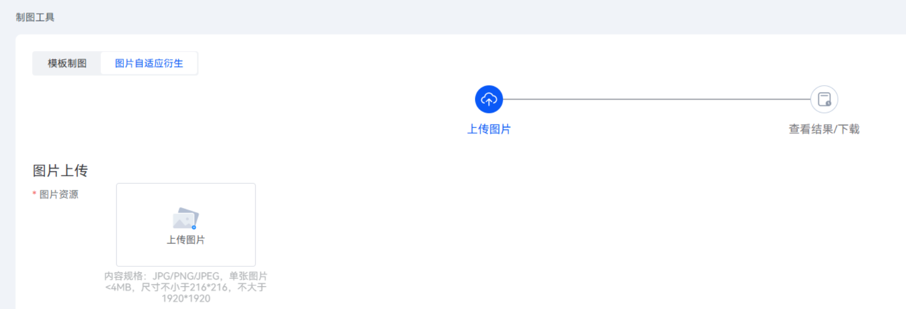
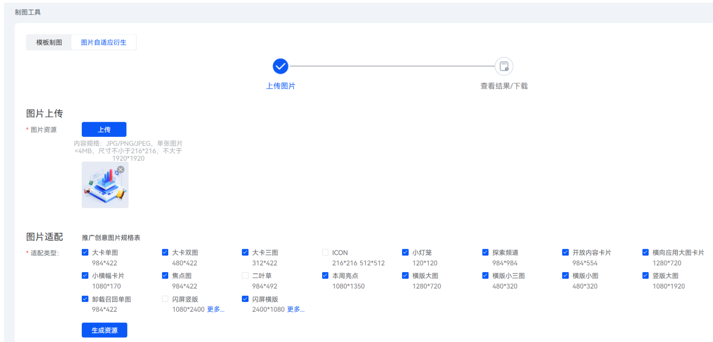

# 使用图片自适应衍生功能

1. 登录[华为应用市场应用推广平台](https://ads.huawei.com/cn/)。
2. 点击“工具”页签，在“创意工具”中选择“制图工具”。

   
3. 在“图片自适应衍生”页签下，点击“上传”并按照内容规格要求上传图片。

   
4. 在“图片适配”区域，选择“适配类型”并点击“生成资源”。完成后，您可以查看、下载或将其保存至[素材库](/docs/monetize/promotion/bp-functions-material-library-introduction-0000001399645709)。图片适配类型支持多选。

    

   ICON和二叶草规格仅支持PNG图片，若原图过大则无法压缩。

   

    

   - 图片自衍生工具支持的展示类型如下：横版大图、横版小三图、横版小图、竖版大图、卸载召回单图、大卡单图、大卡双图、大卡三图、探索频道、开放内容卡片、小横幅卡片、本周亮点、焦点图、二叶草、小灯笼、闪屏横版、闪屏竖版类型，可通过在创建推广创意时点击“上传图片”使用制作好的素材。
   - 横版大图、横版小三图、横版小图、竖版大图展示类型可通过 “从素材库选择”，来源处筛选“衍生工具”复用衍生图片。
   - 当推广创意下有多个创意，且存在已上传图片的创意，其它创意图片上会出现“复用图片”按钮，点击“复用图片”，在弹窗中选择其它创意图片，点击“确认”，自适应衍生工具会自动将其合成当前规格图片。
