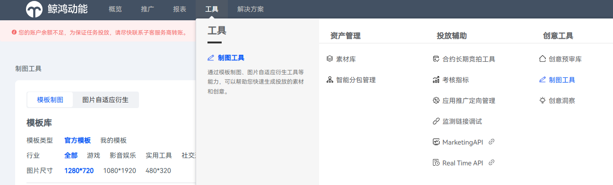
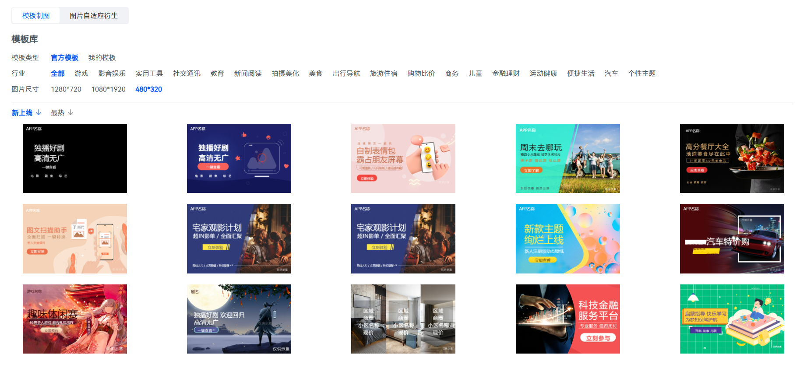
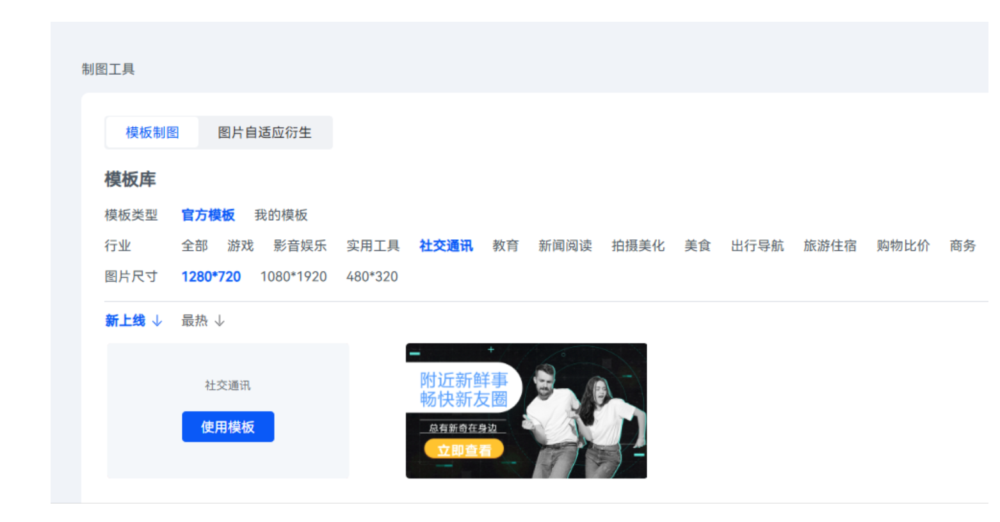
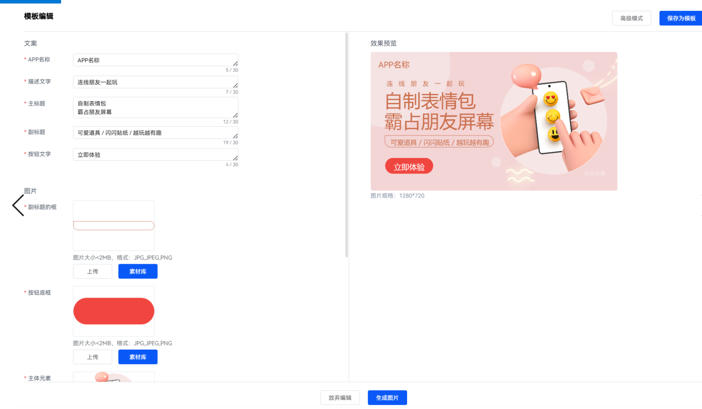
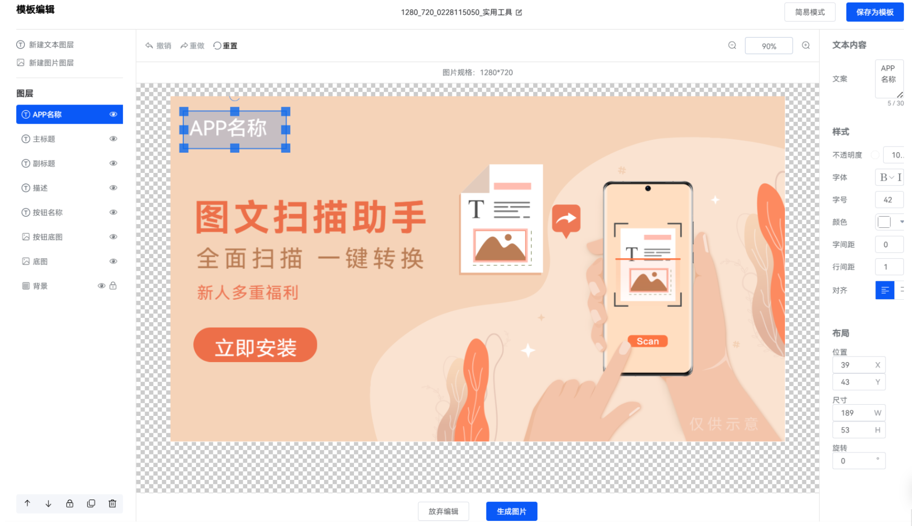

# 使用模板制图功能

1. 登录[华为应用市场应用推广平台](https://ads.huawei.com/cn/)。
2. 点击“工具”页签，在“创意工具”中选择“制图工具”。

   
3. 在“模板制图”页签下，您可以根据投放需求，选择“模板类型”、“行业”、“图片尺寸”类目，筛选出您需要的模板。

    

   模板制图的图片（背景图、主图）仅供参考，版权为华为所有。开发者需将其替换为自己的素材才可使用。

   
4. 选择您需要使用的模板，并点击“使用模板”。

   
5. 进入“模板编辑”页面，在简易模式下您可进行调整文案、替换图片等操作。
   - 文案：编辑主副标题、按钮部分、描述部分文案。
   - 图片：替换并编辑主图、背景图、文案底框、按钮底框等图片素材，您也可以点击“[素材库](/docs/monetize/promotion/bp-functions-material-library-introduction-0000001399645709)”选择您已上传的素材。
   - 点击“生成图片”，同时下载至本地并保存至素材库，您可在“工具 &gt; 资产管理 &gt; 素材库”中查看。
   - 点击“保存为模板”，您可在“模板库 &gt; 模板类型 &gt; 我的模板”中查看。

   
6. 您也可以点击右上角的“高级模式“进入到“模板编辑”页面进行更精细的素材编辑，当前页面保留您在简易模式下编辑的内容。
   - 左侧编辑区可对图层进行操作，包括新增、隐藏、调序、锁定、复制、删除。
   - 中间区域可进行撤销、重做、拖动、调节缩放等操作。
   - 右侧编辑区可对当前选中图层进行自定义修改，包括：
     - 修改文字：透明度、字体、字号、颜色、间距、位置、尺寸、旋转。
     - 调整图片：剪裁、替换、透明度、圆角、位置、尺寸、旋转。
   - 点击“生成图片”，同时下载至本地并保存至素材库，您可在“工具 &gt; 资产管理 &gt; 素材库”中查看。
   - 点击“保存为模板”，您可在“模板库 &gt; 模板类型 &gt; 我的模板”中查看。
   - 点击“放弃编辑”，返回模板制图页面。

   
