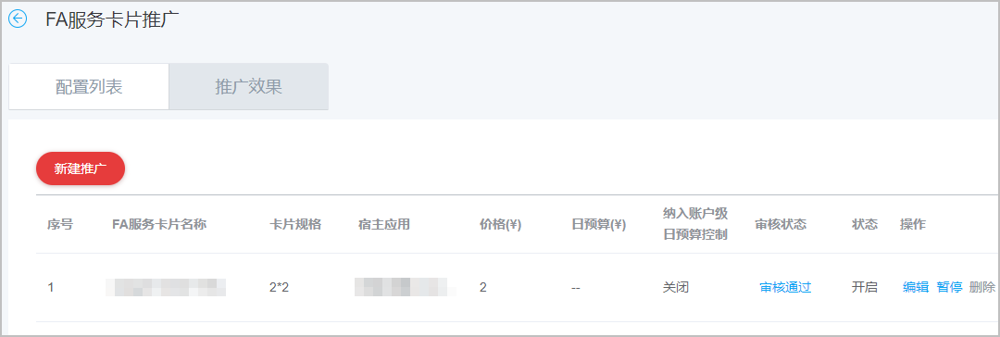

# 创建万能卡片推广任务

1. 登录[华为应用市场应用推广平台](https://developer.huawei.com/consumer/cn/service/apcs/app/home.html)，点击右上角“管理中心”，进入“管理中心”页面。
2. 点击“工具”页签，在“计划辅助”中选择“FA服务卡片推广”。

   
3. 进入“FA服务卡片推广”页面，在“配置列表”页签下，点击“新建推广”。

   
4. 在“新建FA服务卡片推广”页面，选择您需要推广的应用，并根据您的需求设置相关内容及按照要求上传图片。完成后，点击“提交”。

   

   | 任务设置项 | 说明 |
   | --- | --- |
   | 选择您的推广应用 | 在下拉框中选择您需要投放万能卡片任务的宿主应用。 |
   | 预览图 | 根据要求上传图片。  - 支持最多上传3张图片。 - 微卡片：要求宽\*高为570px\*204px，不超过50KB的JPG/JPEG/PNG图片。 - 小卡片：要求宽\*高为450px\*450px，不超过50KB的JPG/JPEG/PNG图片。 - 中卡片：要求宽\*高为936px\*444px，不超过50KB的JPG/JPEG/PNG图片。 - 大卡片：要求宽\*高为792px\*864px，不超过50KB的JPG/JPEG/PNG图片。 |
   | 卡片介绍 | 填写万能卡片的介绍。通常用于简要介绍万能卡片的优势和特点。 |
   | 引导文案 | 选择万能卡片的加桌引导文案，用于提升加桌的转化效果。  例如：添加至桌面 |
   | 转化出价 | 填写“转化出价”前请联系所属行业运营及商务人员。 |
   | 纳入账户级日预算控制 | 选择是否开启“纳入账户级日预算控制”。开启即为实际消耗金额达到您的账户预算金额时，系统会自动停止推广。 |
   | 日预算 | 推广任务每日（自然日）目标消耗的金额，每天的实际消耗接近本预算时，系统会自动限制推广，第二天再启动推广。由于到达预算限额后，您的应用可能会因为之前的推广曝光产生后续下载，这部分下载量仍计费，故您的实际消耗有可能会超出设置的日预算。 |
   | 桌面添加 | 填写归因监测链接。任务正常投放后推广系统将通过监测链接上报转化效果。 |
5. 投放后，您可以在配置列表的“操作”列中编辑、暂停、开启、删除已创建的任务。

   
