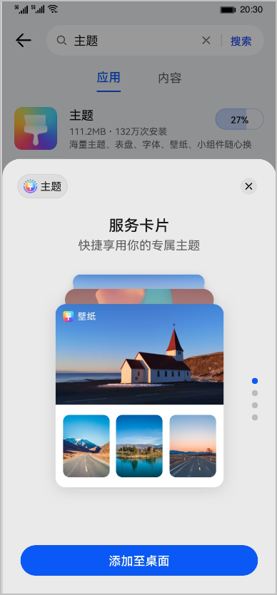
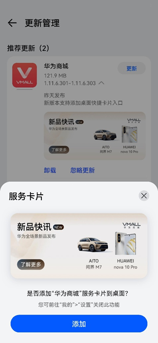
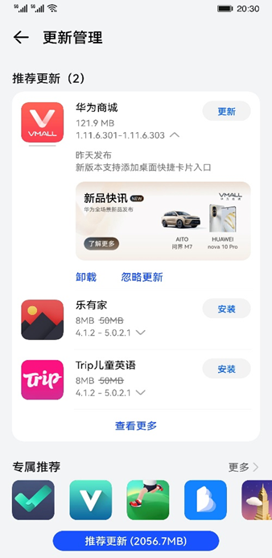

# 业务介绍

开发者在华为应用市场推广平台创建<strong>鸿蒙万能卡片（简称万能卡片）</strong>推广任务后，用户通过应用下载/更新等多种场景加桌，将万能卡片展示于用户手机桌面，提供一键直达应用核心内容/功能的便捷入口。

 

此功能现为允许清单邀请制，请联系华为相关行业运营或商务人员进行咨询与申请，请将申请邮件发送至[developer@huawei.com](mailto:developer@huawei.com)。

## 展示效果

投放场景效果示例：

- 下载场景

  
- 更新场景

  

## 优势

万能卡片功能具有如下亮点：

- 下载界面服务标识外显。
- 增加内容输出/曝光频次，更快速触达用户。
- 核心内容/功能直达桌面，更高效服务用户。
