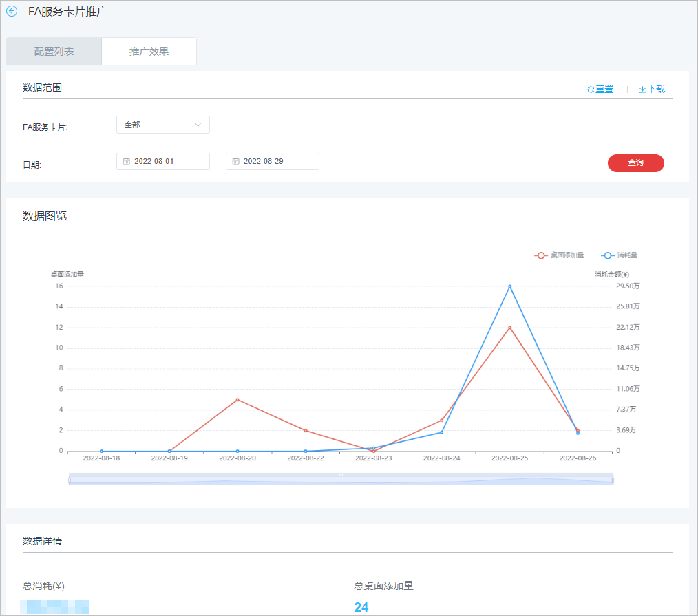

# 查看推广效果

1. 登录[华为应用市场应用推广平台](https://developer.huawei.com/consumer/cn/service/apcs/app/home.html)，点击右上角“管理中心”，进入“管理中心”页面。
2. 点击“工具”页签，在“计划辅助”中选择“FA服务卡片推广”。

   
3. 进入“FA服务卡片推广”页面，点击“推广效果”页签。
4. 下拉框选择“FA服务卡片”并自定义日期后，点击右侧“查询”，在“数据图览”、“数据详情”区域查看任务的数据内容。

   
