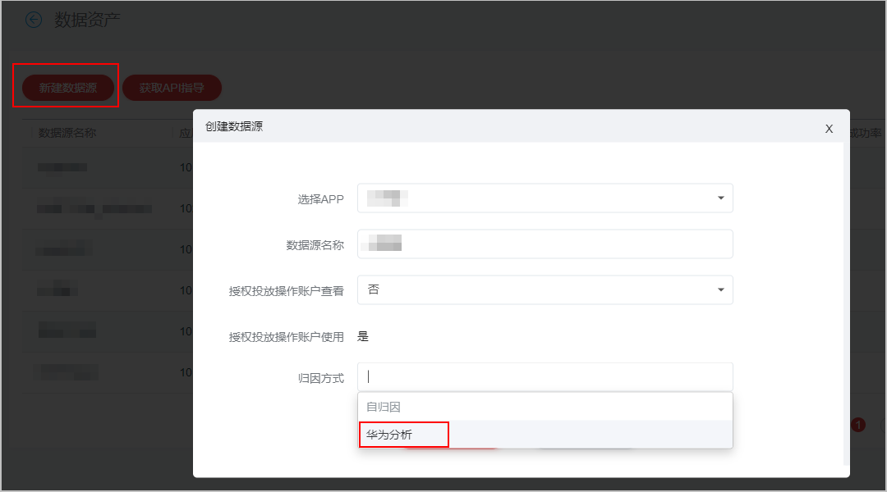
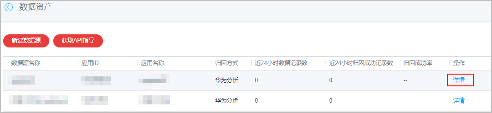
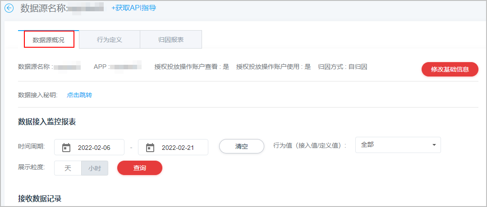
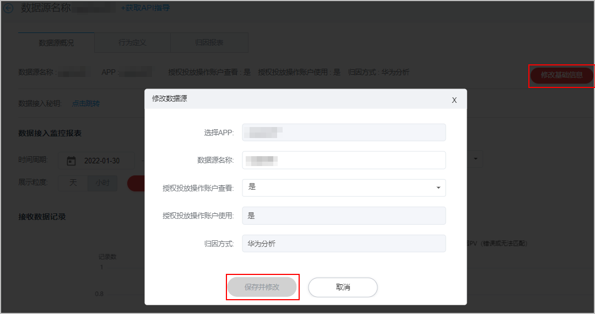

# 新建数据源

## 前提条件

- 已[申请推广评测](https://developer.huawei.com/consumer/cn/doc/promotion/bp-start-guest-apply-evaluation-0000001346654709)权限。因为在给应用创建数据源之前，此应用必须已经申请了推广评测权限。
- 已开通[华为分析服务](https://developer.huawei.com/consumer/cn/doc/development/HMSCore-Guides/service-enabling-0000001050745155)。
- 已集成[华为分析服务SDK](https://developer.huawei.com/consumer/cn/doc/development/HMSCore-Guides/quick-start-new-0000001126584779)。
- 在华为分析上报需要[回传转化事件](https://developer.huawei.com/consumer/cn/doc/development/HMSCore-Guides/conversion-events-for-appgallery-paid-0000001213284386#section134201541581)，如付费、注册、下单等。

## 新建数据源

 

先创建归因方式为“华为分析”的数据源，才可以在创建推广任务时归因方式选择“华为分析监测”。

1. 登录[华为应用市场应用推广平台](https://developer.huawei.com/consumer/cn/service/apcs/app/home.html)，点击右上角“管理中心”，进入“管理中心”页面。

2. 点击“工具”页签，在“资产管理”中选择“数据资产”，进入“数据资产”页面。

   
3. 在“数据资产”界面，点击“新建数据源”，配置数据源相关的设置项。

   

   具体任务设置项说明如下表所示。

   | 任务设置项 | 说明 |
   | --- | --- |
   | 选择APP | 选择您需要投放的APP，创建后无法修改。 |
   | 数据源名称 | 默认为APP名称，创建后支持修改。 |
   | 授权投放操作账户查看 | 若需要代理投放，请选择“是”，授权后客户投放伙伴也可以查看数据回传情况。创建后支持修改。 |
   | 授权投放操作账户使用 | 默认支持客户投放伙伴使用数据投放oCPD，创建后无法修改。 |
   | 归因方式 | 选择“华为分析”。  说明：  - 归因方式选择后无法修改。 - 同一个应用可选择不同的归因方式（自归因/华为分析）创建数据源。 |
4. 配置完成后，点击“提交”。

## 查询数据源详情

1. 新建数据源后，点击操作列中“详情”。

   
2. 进入详情页面，点击“数据源概况”页签，可查看已创建数据源信息。

   

## 修改数据源

选择需要修改的数据源，进入详情页面后，点击右侧“修改基础信息”，编辑完成后点击“保存并修改”。

