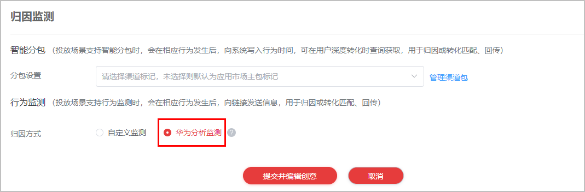

# 创建推广任务

在创建推广任务时归因方式选择“华为分析监测”，并使用HA数据回传。

## 前提条件

任务所属任务模型支持行为监测。

## 操作步骤

1. 登录[华为应用市场应用推广平台](https://developer.huawei.com/consumer/cn/service/apcs/app/home.html)，点击右上角“管理中心”，进入“管理中心”页面。
2. 点击“新建推广任务”，进入推广任务页面。

   
3. 设置推广任务相关设置项，具体请参见[投放推荐任务](https://developer.huawei.com/consumer/cn/doc/promotion/bp-delivery-task-recommend-0000001337110797)。

    

   推广任务创建后无法修改“归因方式”，如您想更换该任务的归因方式，请重建一条一模一样的推广任务并重新选择归因方式。

   
