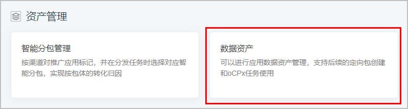
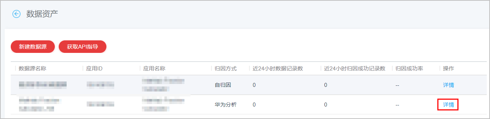
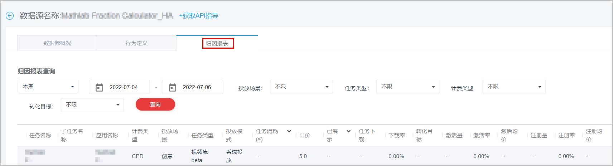

# 查询HA归因报表

当您选择HA归因方式时，HA会自动帮您回传数据用于提升推广效果。

1. 登录[华为应用市场应用推广平台](https://developer.huawei.com/consumer/cn/service/apcs/app/home.html)，点击右上角“管理中心”，进入“管理中心”页面。
2. 点击“工具”页签，在“资产管理”中选择“数据资产”，进入“数据资产”页面。

   
3. 在“数据资产”页面，在需要查看的数据源后，点击“详情”，进入详情页面。

   
4. 点击“归因报表”页签，查看回传数据信息。

   
