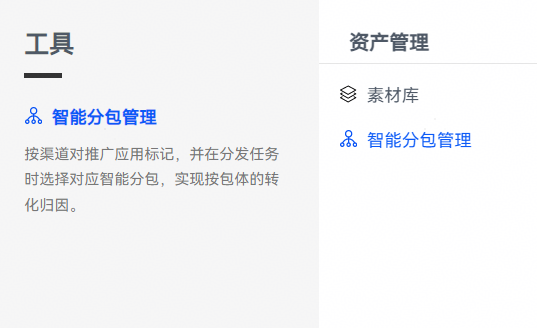
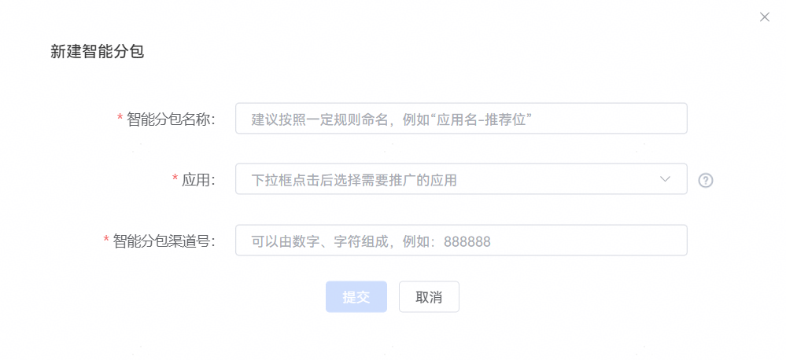
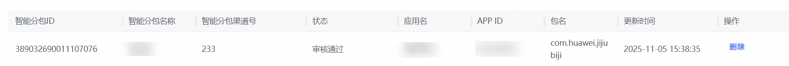

# 新建智能分包

## 操作步骤

1. 登录[华为应用市场应用推广平台](https://ads.huawei.com/cn/)，点击“工具”页签，在“资产管理”中选择“智能分包管理”，进入“智能分包管理”页面。

   
2. 点击“新建智能分包”，配置对应的智能分包设置项。

   

   | 任务设置项 | 说明 |
   | --- | --- |
   | 智能分包名称 | 为了方便您对智能分包进行管理，请按照规则命名。例如“应用名-推荐位”。 |
   | 应用 | 下拉框点击后选择需要推广的应用。 |
   | 智能分包渠道号 | 可以由数字、字符组成，例如：888888。 |
3. 填写完后请点击“提交”。

   新建成功后系统将提示“添加智能分包成功!”。

   如果需要删除已创建的智能分包，则在智能分包管理列表中用户可点击“删除”。删除时系统会提示跟该智能分包关联的推广任务，并且将这些任务使用的应用包切换为主包。

   
