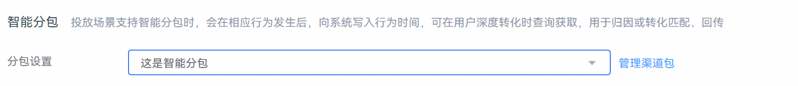

# 新建智能分包任务

1. 创建投放任务，并在任务中“归因监测”模块中将“智能分包”的“分包设置”任务设置项选择已创建的智能分包。

    

   - 具体创建推荐任务操作请参见[投放推荐任务](https://developer.huawei.com/consumer/cn/doc/promotion/bp-delivery-task-recommend-0000001337110797)。
   - 如果已开通智能分包功能，未开通监测链接功能，则创建投放任务是无法看到“归因方式”设置项的。

     
