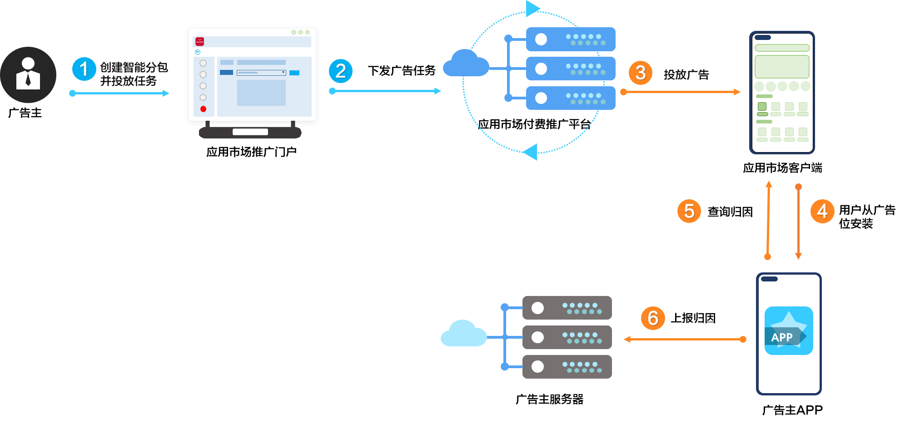

# 业务介绍

 

如您的产品使用信通院MSA SDK，请更新到1.0.26版本（2021年7月2日之后发布）及以上，以便能正常获取到Android版本用户设备的OAID。

具体信通院MSA SDK获取地址：``https://msa-alliance.cn/col.jsp?id=120``。

为了区分应用自然下载和应用推广效果，方便合作伙伴在公司内部进行用户归因，华为应用推广系统推出了智能分包（非物理包）方案。针对不同推广任务创建不同的分包，并提供基于客户端的智能分包渠道号查询接口。

 

- 该方案只适用于中国大陆。
- 如果您想快速了解智能分包，可以观看[短视频](https://www.bilibili.com/video/BV1br4y1r7mL?spm_id_from=333.999.0.0)。
- 智能分包更多介绍，可以参考学习[视频课程](https://developer.huawei.com/consumer/cn/training/course/video/C101678343664214250)。
- 智能分包通过华为提供的接口获取归因信息，其归因逻辑基于“主任务ID+子任务ID”，可精准追溯用户行为来源。在特定场景下，子任务ID可能为空，因此需结合两者进行归因。

具体流程如下图所示。

具体流程说明如下：

1. 开发者在华为应用市场应用推广门户新建智能分包，并在投放任务中选择已创建的智能分包，详情请参见[新建智能分包](https://developer.huawei.com/consumer/cn/doc/promotion/bp-functions-intelligent-subcontract-create-0000001337248557)。
2. 推广任务会同步到华为应用市场应用推广平台。
3. 开发者的任务竞价成功后在应用市场推广榜单（图中以应用市场客户端为例）完成推广。
4. 终端用户从推广位完成应用安装，对应的渠道号（channel）与任务ID（taskid）以及回传参数（callback）等会写入到应用市场客户端。
5. 开发者可以在APP中调用华为应用市场客户端提供的应用包名查询接口获取归因信息，详见[客户端归因查询](https://developer.huawei.com/consumer/cn/doc/promotion/bp-functions-intelligent-subcontract-attribution-0000001285288280)。
6. 将开发者App中获取的归因信息上报到您的服务端，在服务端进行解析处理。
