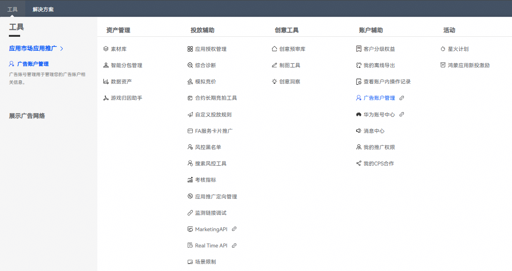
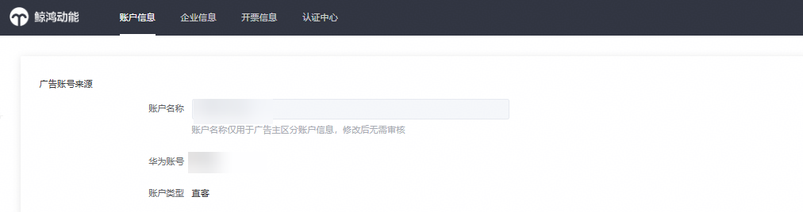

# 设置回传转化数据

1. 直客账户登录[AppGallery Connect网站](https://developer.huawei.com/consumer/cn/service/josp/agc/index.html)，选择“用户与访问”，创建API客户端，获取的“客户端ID”和“密钥”调用[获取Token](https://developer.huawei.com/consumer/cn/doc/promotion/bp-functions-ocpd-interface-token-0000001238324536)接口到华为AppGallery Connect平台进行鉴权，鉴权通过后将获得用于访问AppGallery Connect API的Access Token，此步骤如前期已操作可省略。
2. 开发者需要将自有归因系统匹配到的转化行为通过数据回传接口进行回传，通过已获取的Access Token作为请求参数，调用[回传用户行为数据接口](https://developer.huawei.com/consumer/cn/doc/promotion/bp-functions-ocpd-interface-return-0000001238484400)进行数据回传（如已有数据回传，则不需要此步骤）。

    

   账户有上架应用的开发者的账号，或登录应用推广后台，右上角账号信息上查看账号类型为直客的账号即为直客账号。

   

   
