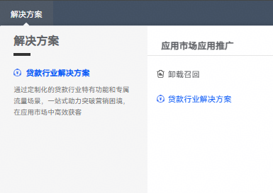
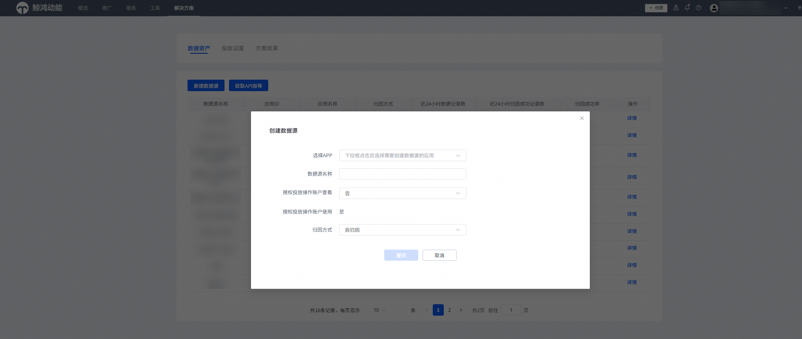

# 创建解决方案数据源

贷款行业解决方案的数据源与外部通用数据源隔离，需在【解决方案】-【贷款行业解决方案】完成数据源创建。

1. 直客账户登录[华为应用市场应用推广平台](https://ads.huawei.com/cn/)， 点击页面顶部“解决方案”页签，选择“贷款行业解决方案”。

   
2. 点击“数据资产”页签，选择“新建数据源”进行设置。

   
3. “创建数据源”区域填写说明

   | <strong>任务设置项</strong> | <strong>说明</strong> |
   | --- | --- |
   | 选择APP | 选择您需要投放的APP。 |
   | 数据源名称 | 默认为APP名称，创建后支持修改。 |
   | 授权投放操作账户查看 | 若需要代理投放，请选择“是”，授权后客户投放伙伴也可以查看数据回传情况。创建后支持修改。 |
   | 归因方式 | 可根据您已对接的归因方案自行选择。 |
