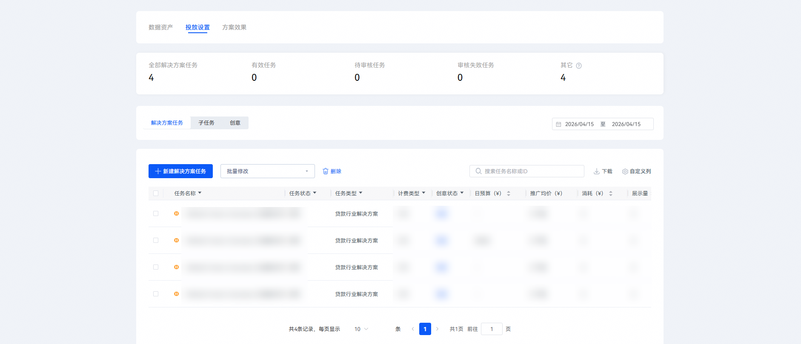
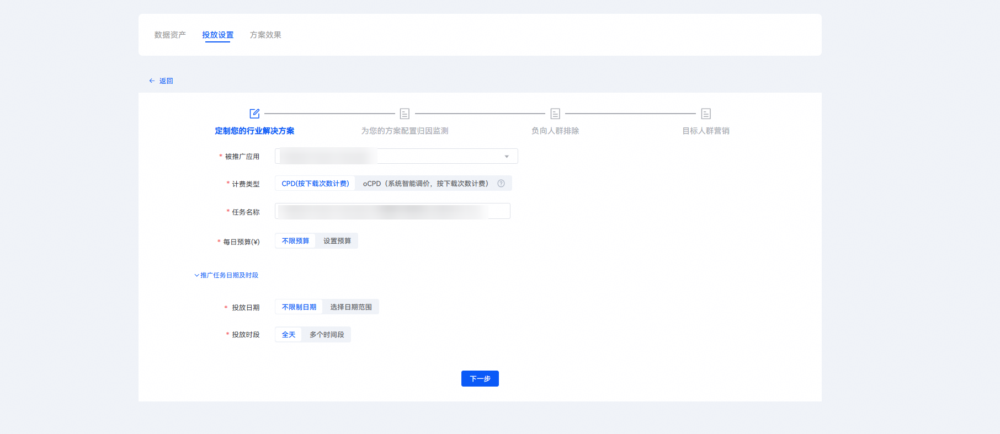
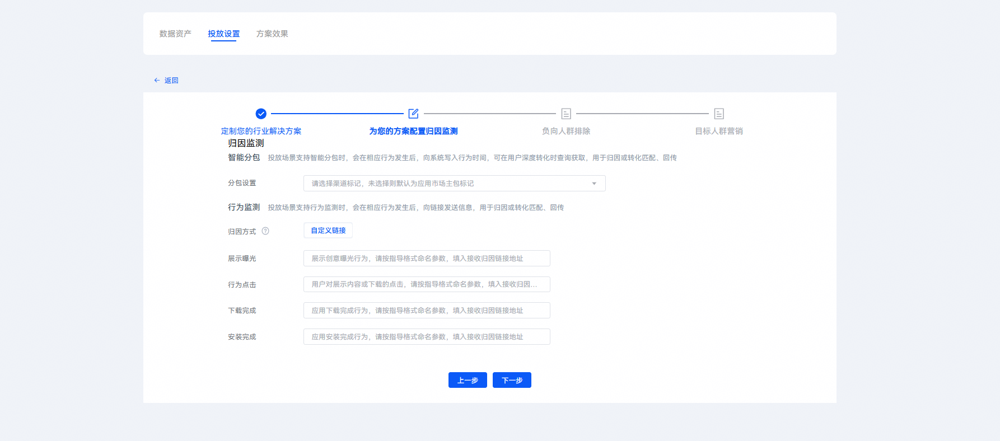
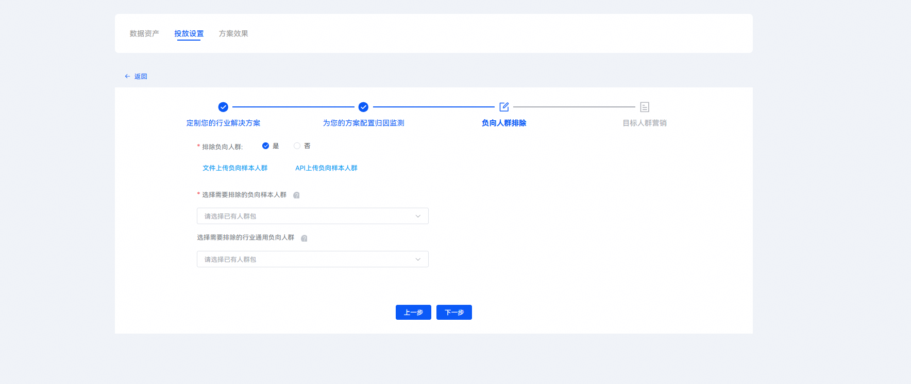
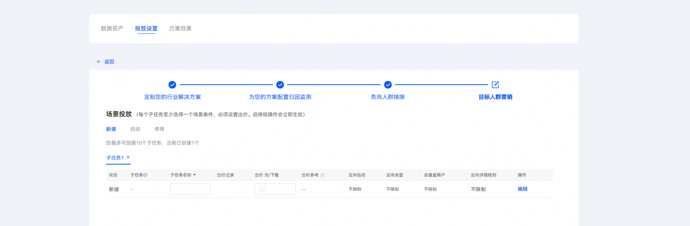
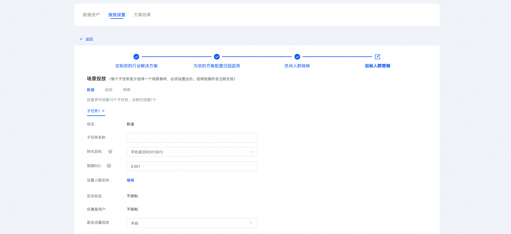
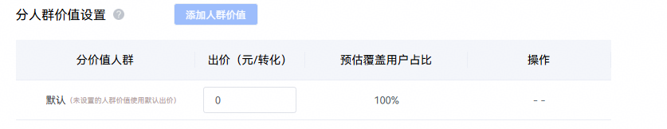
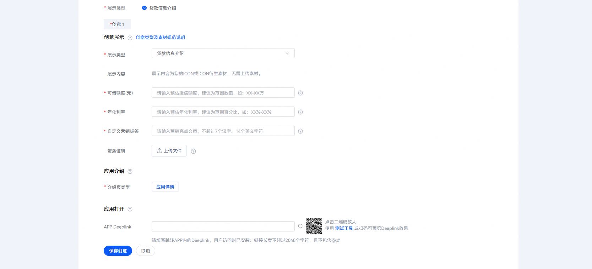

# 创建解决方案任务

## 新建贷款行业解决方案任务

1. 点击“投放设置”页签，选择“新建解决方案任务”，在“定制您的行业解决方案”环节，配置相关任务设置项。

   

   
2. “定制您的行业解决方案”区域填写说明。

| <strong>任务设置项</strong> | <strong>说明</strong> |
| --- | --- |
| 被推广应用 | 选择您需要推广的应用。 |
| 计费类型 | CPD：按下载完成次数计费。  oCPD：系统智能出价，按下载次数计费。（需要产生至少一个贷款行业解决方案的CPD任务转化后，才可选择oCPD计费类型）。  <strong>需选择oCPD计费类型，才能使用分层出价能力</strong>。 |
| 任务名称 | 填写任务名称，命名格式建议：任务类型+应用名称+时间信息，长度不超过50个字符。 |
| 每日预算 | 推广任务每日（自然日）目标消耗的金额，每天的实际消耗接近本预算时，系统会自动限制推广，第二天再启动推广。由于到达预算限额后，您的应用可能会因为之前的推广曝光产生后续下载，这部分下载量仍计费，故您的实际消耗有可能会超出设定的日预算。 |
| 投放日期 | 长期投放：该任务不限投放时间。  选定日期：设置任务执行的开始和结束时间。 |

## 选择归因监测方式

在“为您的方案配置归因监测”环节，配置相关任务设置项。

 

基于贷款行业解决方案新增的分价值人群出价能力，自定义监测链接新增了【\_\_GROUP\_LEVEL\_\_】宏参数，参数对应说明如下。

|  |  |
| --- | --- |
| <strong>参数</strong> | <strong>说明</strong> |
| \_\_GROUP\_LEVEL\_\_ | 仅贷款行业解决方案任务使用。  标记上报的事件属于贷款行业解决方案任务中哪类价值人群，枚举值为：1，2，3。枚举值对应的含义为：  1：默认价值  2：中价值  3：高价值 |

## 排除负向人群

在“负向人群排除”环节，配置相关任务设置项。

“负向人群排除”区域填写说明

| <strong>任务设置项</strong> | <strong>说明</strong> |
| --- | --- |
| 排除负向人群 | 根据您的需求选择“是”或“否”。  若选择“是”，可点击“文件上传负向样本人群”或“API上传负向样本人群”进行负向样本人群上传。 |
| 选择需要排除的负向样本人群 | 1. 下拉选择您已上传的负向人群包，选择后在投放时会排除过滤此部分人群。  2. 系统会同时根据您选择的负向样本人群进行算法模型分析，自动找到与样本人群具有相似特征的负向人群进行排除。 |
| 选择需要排除的行业通用负向人群 | 您可下拉选择当前行业通用负向人群包“贷款行业通用负向人群”。 |

## 配置投放场景

在“目标人群营销”环节“场景投放”设置模块，配置相关任务设置项，点击“新建”，可创建相关的子任务作为定向规则，目前最多可支持创建10个子任务。在“定制您的行业解决方案”环节，选择不同的计费类型，对应的投放场景界面不同。

1. 在“定制您的行业解决方案”环节，如果计费类型选择为CPD，可按实际投放需求配置子任务名称、出价及人群定向；

   
2. 在“定制您的行业解决方案”环节，如果计费类型选择为oCPD，则子任务设置【目标人群营销】页面的设置项调整为纵向排布，转化目标可按投放需求选择。
   - 若转化目标选择【平台首日ROI】，配置预期ROI即可。若转化目标为其他转化项，可选择不同的转化目标并设置对应的出价。

   

   - 也可通过设置不同维度对应的维度等级来创建“高价值”、“中价值”和“默认”价值人群，对不同价值人群设置不同的转化目标出价，配置方案如下：

     点击【添加人群价值】按钮，选择不同维度（信用度、用款意愿、资质等级中的1~3项）并设置对应维度的等级（高/中/低）来创建“高价值”、“中价值”和“默认”层级人群，在弹窗中点击【确定】，弹窗消失，分人群价值设置列表中将新增高价值/中价值出价列表，展示不同价值人群的用户占比，即可分别设置不同价值人群的转化目标出价。

     
   - 不同价值层级的人群可以重叠，重叠部分的用户按最高出价参与竞价。未被高价值和中价值覆盖的人群，则归为“默认”价值人群，支持设置默认转化出价。

## 配置推广创意

1. 在“推广创意”设置模块，配置相关任务设置项。

| <strong>任务设置项</strong> | <strong>说明</strong> |
| --- | --- |
| 展示类型 | 选择“贷款信息介绍”。 |
| 可借额度 | 输入预估授信额度，填写格式为：X万-XX万或最高XX万。  填写时请注意：  1.不允许英文字符，要用横杠；  2.不需要添加单位（元）。 |
| 年化利率 | 输入预估年化利率，建议为范围百分比，如xx%-xx%。  填写时请注意：   1. 请与端内产品实际利率保持一致，按上下架规范核实，若不一致审核会进行驳回; 2. 填写真实利率区间，不允许使用最低年利率XX% ; 3. 规范 X%-XX%，用横杠，不允许使用英文字符。 |
| 自定义营销标签 | 输入营销亮点文案，要求不超过7个汉字，或14个英文字符。 |
| 介绍页类型 | 选择“应用详情”。 |
| APP Deeplink | 若用户已安装您的应用，点击打开或素材，将会直接访问您配置的Deeplink页面和内容。  具体调测方法请参见[普通Deeplink调测流程](https://developer.huawei.com/consumer/cn/doc/promotion/bp-appendix-ordinary-deeplink-0000001350425029)。 |
| 创意名称 | 输入展示的创意名称，要求不超过50个字符。 |
