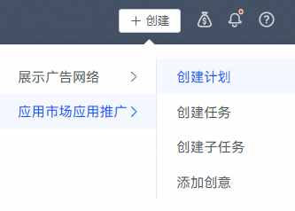
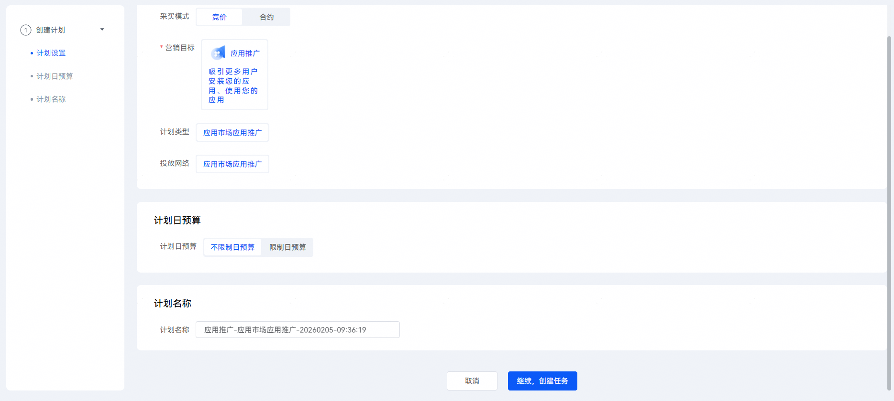
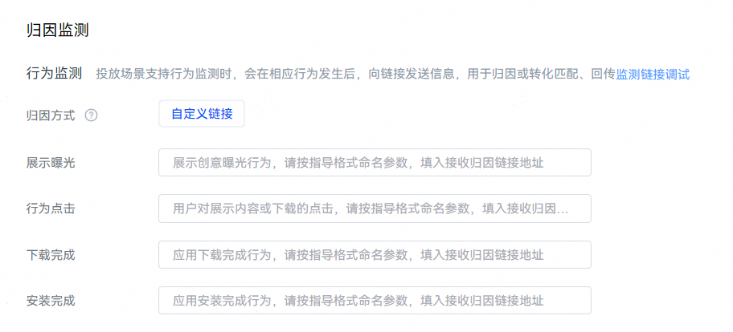
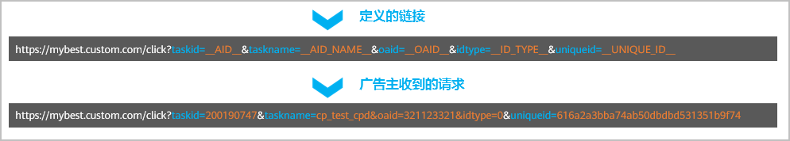

# 配置监测链接

## 操作步骤

1. 登录[华为应用市场应用推广平台](https://ads.huawei.com/cn/)，您可以从概览页右上角的创建入口，创建计划。

   
2. 点击“继续，创建任务”，进入“推广任务”页面，设置相关内容并填写监测链接。在“自定义监测”方式下可分别针对“展示曝光”、“行为点击”、“下载完成”、“安装完成”事件填写监测链接。

   

    

   您可以提前完成链接测试，详情请参见[链路测试](/docs/monetize/promotion/bp-functions-link-test-0000001352018577)。

   监测链接格式：**https://***xxx.xxx.xxx/xxx***?***key1=value1&key2=value2&...*
   - 监测链接必须为https格式（不支持使用IP地址作为监测链接域名），链接中支持大小写字母、数字以及下划线字符；当前仅支持JDK21的证书。
   - 域名和URL路径请根据您的服务器情况自定义，请求方式为GET方式。
   - Query参数中key需要您自定义，value为应用推广支持的宏参数，取值请参考[宏参数列表](#ZH-CN_TOPIC_0000001309549086__p063234162115)：
     - 宏参数格式中参数两边为双下划线，即参数左右两边均为两个连续的英文字符'\_'。
     - 如果宏参数添加的常量携带有特殊字符，请进行URL编码处理。
     - 链接上报参数中OAID必填，其余参数您可以根据自己的需要填写。
     - 监测链接中的参数**key**可以重复，**value**不可以重复。
   - 如果您的服务器对某些请求IP存在限制，需要开通IP允许清单，请联系运营提供。

   

**举例**：参数中的特殊字符和汉字会进行URLEncode。



 

在配置监测链接后，华为服务器在给开发者的请求中会将定义链接中的宏参数替换为实际的宏参数值。

**监测链接所支持的宏参数如下表所示。**

| 参数 | 说明 |
| --- | --- |
| \_\_AID\_\_ | 任务ID。 |
| \_\_AID\_NAME\_\_ | 任务名称。 |
| \_\_APP\_ID\_\_ | 投放应用ID。 |
| \_\_APP\_NAME\_\_ | 投放应用名称（默认语言）。 |
| \_\_CHANNEL\_NAME\_\_ | 智能分包名称。  若未开启智能分包直接返回空。 |
| \_\_CHANNEL\_ID\_\_ | 智能分包渠道号ID。  若未开启智能分包直接返回空。 |
| \_\_GROUP\_NAME\_\_ | 定向包名称。  若非定向任务直接返回空。 |
| \_\_GROUP\_ID\_\_ | 定向包ID。  若非定向任务直接返回空。 |
| \_\_OAID\_\_ | 客户端采集上报的OAID信息。  **该参数必选**。 |
| \_\_ID\_TYPE\_\_ | 唯一标识类型。  **该参数必选**。  取值范围：   - 0：表示系统低版本（安卓10版本以前）IMEI号作为唯一标识，MD5的32位小写加密。   注意：  获取用户设备识别号时，有OAID则回传OAID ，无OAID则回传IMEI（安卓10版本以前）。由于部分设备关闭广告，可能存在无OAID和IMEI的情况。  具体回传机制请参见[回传用户行为数据接口](/docs/monetize/promotion/bp-functions-ocpd-interface-return-0000001238484400)。 |
| \_\_UNIQUE\_ID\_\_ | 设备唯一标识的md5摘要。  **该参数必选。**  32位小写加密。  注意：  仅支持安卓低版本。 |
| \_\_ACTION\_TYPE\_\_ | 归因类型：   - IMP：对应精准曝光监测链接。 - CLICK：对应点击上报监测链接。 - DOWNLOAD：对应下载上报监测链接。 - INSTALL：对应安装上报监测链接。 - DEEPLINKCLICK：对应打开跳转deeplink上报监测链接。 |
| \_\_TS\_\_ | 以毫秒为单位时间戳（北京时间），例如：1625714142001。  不同事件TS对应的含义不同：   - 展示曝光：应用市场客户端推广位曝光时间。 - 行为点击：用户点击的时间。具体口径：   - 点击icon   - 图片   - 视频   - 热词   - 安装按钮   - 打开按钮 - 下载完成：应用下载完成时间。 - 安装完成：应用安装完成时间。 - 应用打开：应用点击“打开”按钮的时间。 |
| \_\_CALLBACK\_\_ | 推广请求时生成的归因标识ID用于进行转化数据回传。  若需要使用oCPD时，该数据回传是后续创建oCPD任务的前提，请务必添加这个宏。  参数示例：   ``` "callBack":"security:384330423431434635444431424135413031433739464631353338 4545413042:B4559624D440788AC9.....7D43E5DDCB68820" ``` |
| \_\_SUB\_TASKID\_\_ | 子任务ID。  若为定向字词子任务直接返回空。 |
| \_\_RTAID\_\_ | RTA ID。 |
| \_\_GROUP\_LEVEL\_\_ | 仅贷款行业解决方案任务使用。  标记上报的事件属于贷款行业解决方案任务中哪类价值人群，枚举值为：1，2，3。枚举值对应的含义为：  1：默认价值  2：中价值  3：高价值 |
