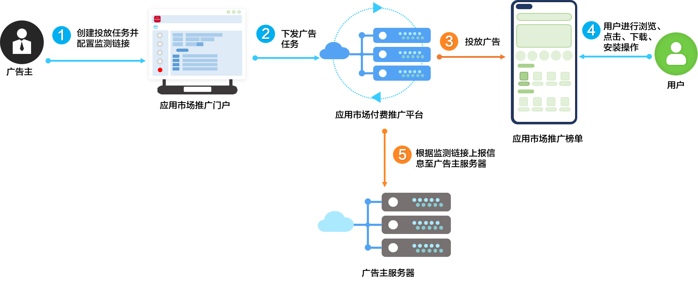

# 业务介绍

 

如您的产品使用信通院MSA SDK，请更新到1.0.26版本（2021年7月2日之后发布）及以上，以便能正常获取到Android版本用户设备的OAID。

具体信通院MSA SDK获取地址：``https://msa-alliance.cn/``。

监测链接发送服务是华为应用市场应用推广平台给开发者提供的针对推广行为的归因服务。开发者和推广平台之间通过服务端方式对接。开发者在创建推广任务时填写监测链接，推广任务正常投放后推广系统将展示曝光、行为点击、下载完成、安装完成事件明细发送到开发者服务器。开发者可针对四种事件分别配置不同的监测链接，未配置则不发送。

 

- 如果您想快速了解监测链接，可以观看[短视频](https://www.bilibili.com/video/BV1Xi4y117jQ?spm_id_from=333.999.0.0)。
- 监测链接的归因逻辑基于“主任务ID+子任务ID”组合。主任务ID是整体活动的核心标识，子任务ID用于细分策略。在特定场景下，子任务ID可能为空，因此需结合两者进行归因。

1. 开发者在华为应用市场应用推广门户新建投放任务，并在投放任务中配置不同的监测链接，详见[配置监测链接](https://developer.huawei.com/consumer/cn/doc/promotion/bp-functions-link-configure-0000001351658397)。
2. 推广任务会同步到华为应用市场应用推广平台。
3. 您的任务竞价成功后在应用市场客户端完成推广。
4. 终端用户在推广位进行了浏览、点击、下载、安装操作。
5. 应用市场应用推广平台根据监控链接上报信息至开发者服务器。

 

监测链接更多介绍请参见[视频课程](https://developer.huawei.com/consumer/cn/training/course/video/C101679626271812658)。
