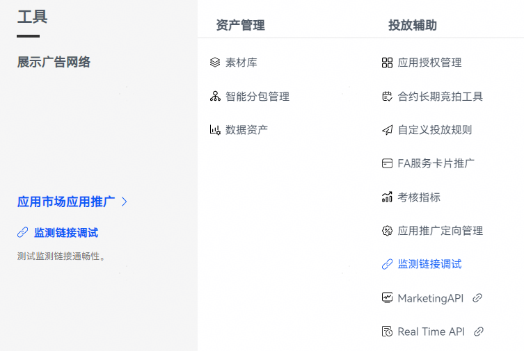
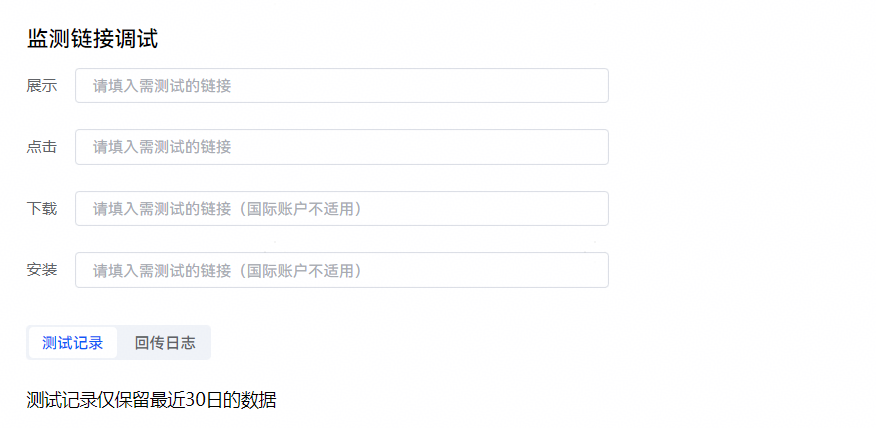
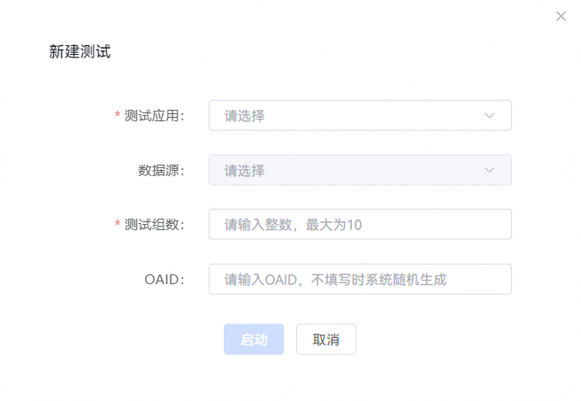
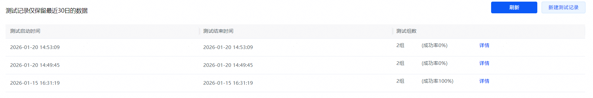
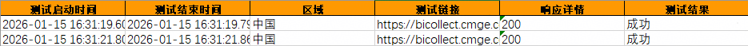

# 链路测试

通过链路测试，可以对监测链接、数据回传进行联调测试。

## 操作步骤

1. 登录[华为应用市场应用推广平台](https://ads.huawei.com/cn/)，点击“工具”页签，在“投放辅助”中选择“监测链接调试”，进入“监测链接调试”页面。

   
2. 按格式要求，填写一个或多个监测链接后，点击“新建测试记录”。

   
3. 进入“新建测试”页面，设置“测试应用”、“数据源”、“测试组数”和“OAID”，完成后，点击“启动”。

   

   | 任务设置项 | 说明 |
   | --- | --- |
   | 测试应用 | 选择您需要测试的应用。 |
   | 数据源 | 当测试应用名下无数据源时，此筛选框置灰，系统自动为应用创建临时数据源进行测试；当测试应用名下有数据源时，此筛选项可选，可选项为全部名下已建立的数据源。 |
   | 测试组数 | 设定下发的归因信息次数，比如填写2，则会向监测链接发两次信息。 |
   | OAID | 设定下发的设备OAID。可以填写开发者运营设备的OAID，测试该OAID发生转化后，开发者系统是否把转化回转到华为。如果正确回传，则在回传日志中可以看到数据回传量数据，并且会显示回传请求是否正确和匹配异常状态。  说明：  如您没有填写OAID，则转发默认值。 |
4. 测试记录保留最近30日的数据，可以查看测试的启动时间、结束时间、测试组数、测试成功率。

   点击“详情”，可以下载本次测试的详细记录，详细信息包括“测试启动时间”、“测试结束时间”、“测试链接”、“响应详情”、“测试结果”。

   

   
