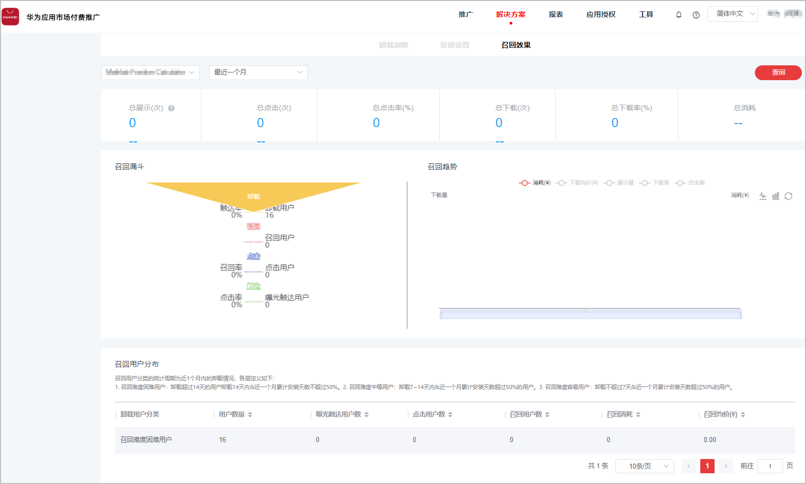

# 分析召回效果

1. 登录[华为应用市场应用推广平台](https://developer.huawei.com/consumer/cn/service/apcs/app/home.html)，点击右上角“管理中心”，进入“管理中心”页面。
2. 点击上侧“解决方案”页签，点击“卸载召回”，进入卸载召回页面。

   
3. 点击“召回效果”页签，在左上角选择对应的应用，以及查询时间段，点击右侧“查询”，即可查看到此应用的卸载用户各项数据。

   

   在“召回趋势”统计图区域，可以点击将展示图切换为折线图，点击将展示图切换为柱状图，点击将展示图还原清空。
