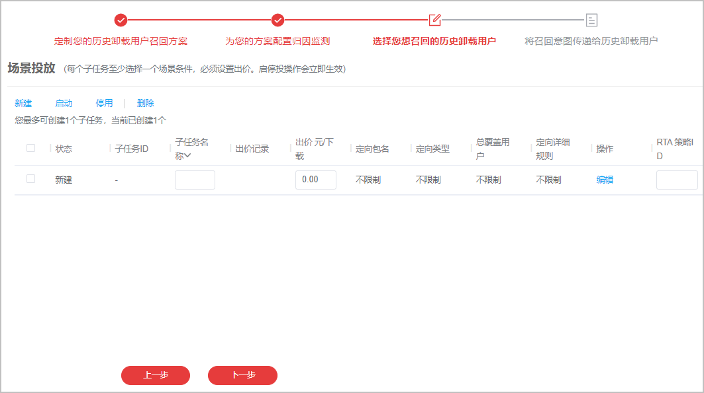

# 创建卸载召回任务

## 背景信息

卸载召回投放任务范围支持如下：

- 卸载召回-推荐-CPD，支持定向人群。
- 卸载召回-推荐-oCPD，支持定向人群/RTA。
- 卸载召回-搜索-CPD，支持系统卸载人群/关键词定向。
- 卸载召回-搜索-oCPD，支持系统卸载人群。

每个解决方案任务会自动圈定您的卸载人群，推荐任务可额外叠加其他定向人群。

## 操作步骤

1. 登录[华为应用市场应用推广平台](https://developer.huawei.com/consumer/cn/service/apcs/app/home.html)，点击右上角“管理中心”，进入“管理中心”页面。
2. 点击上侧“解决方案”页签，点击“卸载召回”，进入卸载召回页面。

   
3. 点击“投放设置”页签，点击“新建解决方案任务”。

   
4. 配置定制召回方案。

    

   具体任务设置项请参考[推荐任务](https://developer.huawei.com/consumer/cn/doc/promotion/bp-delivery-task-recommend-0000001337110797)或[搜索任务](https://developer.huawei.com/consumer/cn/doc/promotion/bp-delivery-task-search-0000001280324781)。如果选择oCPD计费类型，则请参考[oCPD任务](https://developer.huawei.com/consumer/cn/doc/promotion/bp-functions-ocpx-create-ocpd-0000001282723545)。

   
5. 配置归因监测。

    

   具体任务设置项的配置请参见[智能分包](https://developer.huawei.com/consumer/cn/doc/promotion/bp-functions-intelligent-subcontract-create-0000001337248557)或[监测链接](https://developer.huawei.com/consumer/cn/doc/promotion/bp-functions-link-configure-0000001351658397)。

   
6. 配置定向召回的历史卸载用户人群。

    

   具体任务设置项的配置请参见[人群定向任务](https://developer.huawei.com/consumer/cn/doc/promotion/bp-functions-target-create-0000001337388933)。

   
7. 配置召回创意。

    

   - 如果一个卸载召回任务需要配置多个创意，可以点击<strong>创意1x</strong>后的“添加”来配置。
   - 具体创意素材制作规范请参见[素材规范](https://developer.huawei.com/consumer/cn/doc/promotion/bp-functions-load-recall-specification-0000001417712349)。

   

   关键任务设置项说明如下：

    

   此处仅介绍关键任务设置项。如果对应的任务设置项比较简单，则此章节不做过多介绍，以界面配置要求为准。

   - “创意展示”区域

     | 任务设置项 | 说明 |
     | --- | --- |
     | 展示类型 | 选择您需要展示的创意类型。 |
     | 召回意图标签 | 召回创意时，展示的意图标签。  取值范围：  - 内容更新 - 全新改版 - 回归有礼 |
     | 召回文案 | 配置具体召回文案信息。  示例：老用户回归赠送定制限量版公仔。 |
     | 召回弹窗类型 | 点击召回创意的安装按钮后，弹出召回详情页。  取值范围：  - 召回详情页 |
     | 召回详情介绍 | 配置具体召回详情页中的详情介绍文案。  示例：还在犹豫用什么？快来得物看看最近大家都喜欢什么吧！带你足不出户享受购物的乐趣，快来挑选你的心仪好物吧！ |
   - “应用介绍”区域

     | 任务设置项 | 说明 |
     | --- | --- |
     | 介绍页类型 | 选择用户点击展示创意的方式。  <strong>保持默认值“应用详情”。</strong> |
   - “应用打开”区域

     | 任务设置项 | 说明 |
     | --- | --- |
     | APP Deeplink | 若用户已安装您的应用，点击打开或素材，将会直接访问您配置的Deeplink页面和内容。 |
   - “创意命名”区域

     | 任务设置项 | 说明 |
     | --- | --- |
     | 创意名称 | 输入展示的创意名称，要求不超过50个字符。 |
   - “创意展现模式”区域

     | 任务设置项 | 说明 |
     | --- | --- |
     | 创意展现模式 | 选择展示创意的模式。  - 优选模式：系统自动选择对该受众展示效果好的创意进行展示量倾斜。 - 轮播模式：系统将平分各创意展现机会，便于开发者比较各创意投放效果。 |
