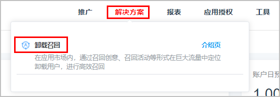

# 卸载洞察

1. 登录[华为应用市场应用推广平台](https://developer.huawei.com/consumer/cn/service/apcs/app/home.html)，点击右上角“管理中心”，进入“管理中心”页面。
2. 点击上侧“解决方案”页签，点击“卸载召回”，进入卸载召回页面。

   
3. 点击“卸载洞察”页签，在左上角选择对应的应用，以及查询时间段，点击右侧“查询”，即可查看到此应用的卸载用户各项数据。

   

   - 卸载用户大盘数据

     展示应用历史卸载状况，突出应用当前的卸载大盘，让开发者快速知道在该周期内用户的流失情况。

     
   - 卸载用户召回难易度分布

     根据不同周期和不同安装周期组合，描述已卸载用户的召回难易程度，开发者可根据难易程度和量级占比判断是否进行召回，未来也可直接通过圈选这部分用户进行投放。

     
   - 卸载用户画像分析

     展示该应用在开发者所选择周期内安装用户中性别、年龄分布占比情况，可分析对比卸载人群与安装人群的性别比例、年龄分布。

     
   - 卸载后同类型应用安装分布

     展示该应用在开发者所选择周期内发生卸载行为的用户中，在该应用卸载后至今的时间段内，安装的同品类应用次数汇总TOP10。

     
