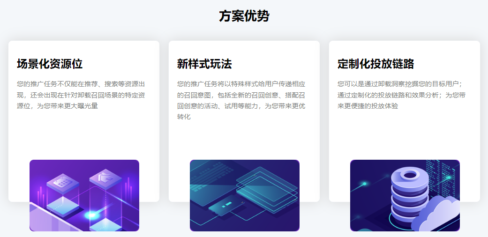
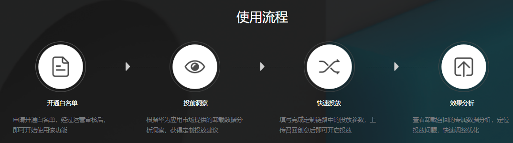
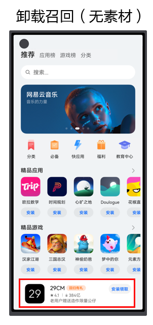

# 业务介绍

卸载召回解决方案是面向客户场景化营销的统一解决方案，相较于传统的投放方式有以下优势。

- 帮助开发者识别卸载召回场景的投放价值、提升投放效果。
- 简化开发者的投放流程，更聚焦投放场景，提升投放效果。
- 提供端到端的产品能力，在任务模型、流量样式上获得更优的投放效果。

## 方案优势

卸载召回的方案优势如下图所示。

## 使用流程

卸载召回的主要使用流程如下图所示。

## 资源位示例

卸载召回专区资源位示例如下图所示。

