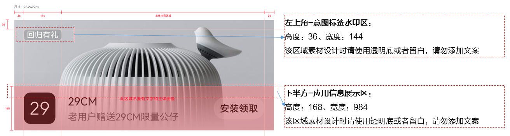

# 素材制作规范

卸载召回专区支持3个素材规格：图片、Gif、视频

具体素材要求如下表所示。

| 素材规格 | 支持格式 | 素材尺寸 | 素材大小 | 视频宽高比 | 闪动/视频时长 | 闪动面积 |
| --- | --- | --- | --- | --- | --- | --- |
| 图片 | JPG/PNG | 984\*422 | ＜400KB | - | - | - |
| GIF | GIF | 984\*422 | ＜4MB | - | 1.5秒-2秒 | 不超过50% |
| 视频 | MP4 | 984\*422 | ＜50MB | 建议21:9 | 15秒-120秒 | - |

素材设计规避区域说明如下图所示。

