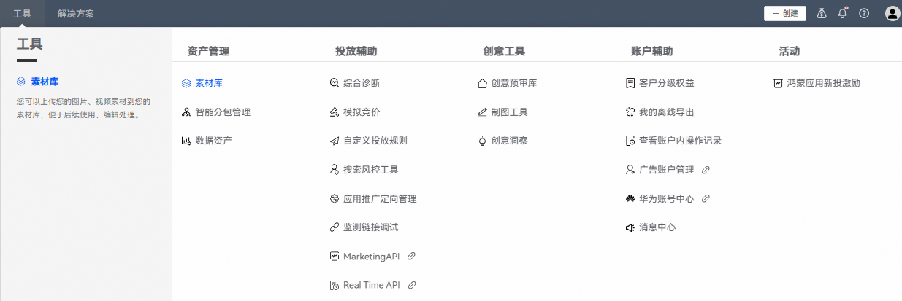
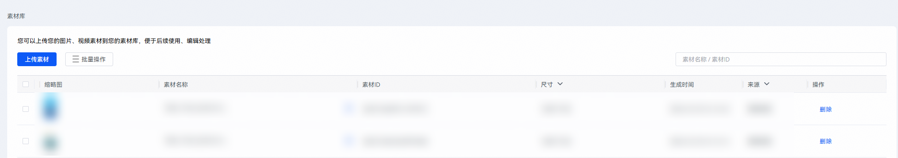
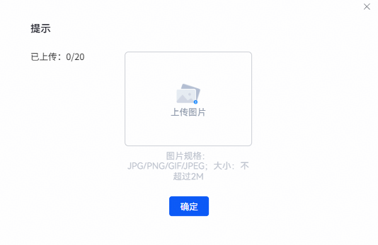

# 新建素材库内容

1. 登录[华为应用市场应用推广平台](https://ads.huawei.com/cn/)， 在顶部菜单栏点击【工具】页签，确认推广范围为“应用市场应用推广”。选择“资产管理”——“素材库”。

   
2. 在当前页面点击“上传素材”。

   
3. 在弹框中按照图片规格要求上传素材。完成后，点击“确定”。

    

   一次最多可上传20张图片。

   
