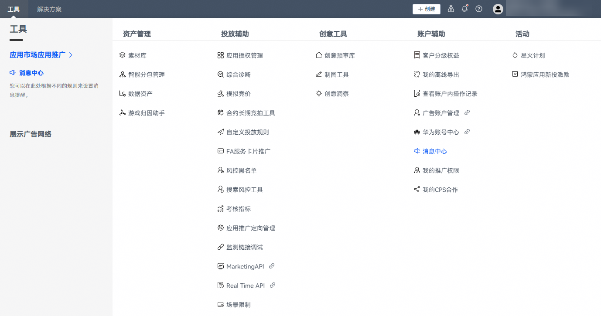
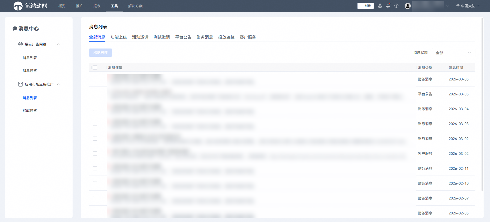
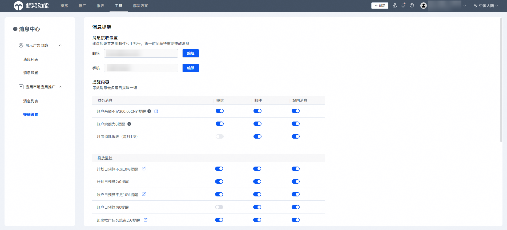

# 消息中心

1. 登录[华为应用市场应用推广平台](https://ads.huawei.com/cn/)，在顶部菜单栏点击【工具】页签，确认推广范围为“应用市场应用推广”。选择“账户辅助”—— “消息中心”。

   
2. 如果您的直客账户同时开通了应用市场应用推广和展示广告网络的推广范围，该入口将同时展示应用市场应用推广与展示广告网络的消息列表，您可选择对应范围的消息查看。

   
3. 点击“提醒设置”可以设置手机或者邮箱，接收财务消息相关提醒，投放预算监控，平台政策等通知。

   
