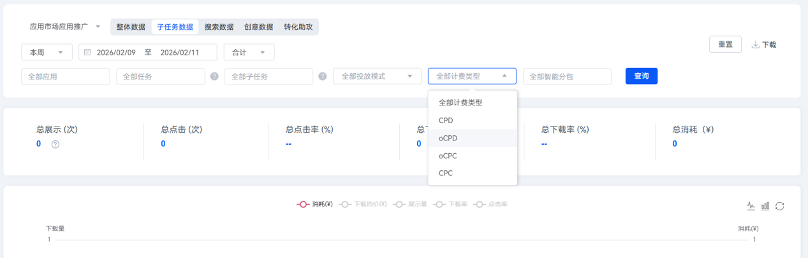

# 查询任务数据报表

1. 登录[华为应用市场应用推广平台](https://ads.huawei.com/cn/)，进入“概览”主页面。
2. 点击左上角“报表”，再点击“子任务数据”页签。

    

   oCPD任务属于子任务。
3. 在“全部计费类型”查询项中选择“OCPD”，点击“查询”，即可显示oCPD任务的报表数据。

   

    

   评估oCPD任务效果的时候，需要拆分oCPD子任务进行后端效果评估，区分CPD通投任务后端效果和oCPD子任务投放效果。建议按如下方式分析。

   | <strong>任务类型</strong> | <strong>消耗金额</strong> | <strong>下载量</strong> | 激活量 | <strong>激活率</strong> | 激活均价 | 注册量 | 注册率 | 注册均价 |
   | --- | --- | --- | --- | --- | --- | --- | --- | --- |
   | 通投任务 | - | - | - | - | - | - | - | - |
   | 子任务A | - | - | - | - | - | - | - | - |
   | 子任务B | - | - | - | - | - | - | - | - |
   | ... | - | - | - | - | - | - | - | - |
