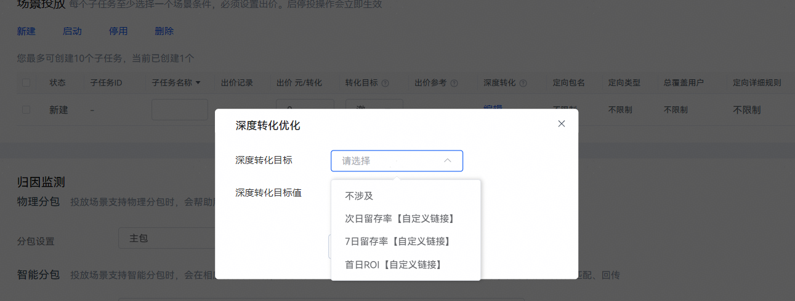
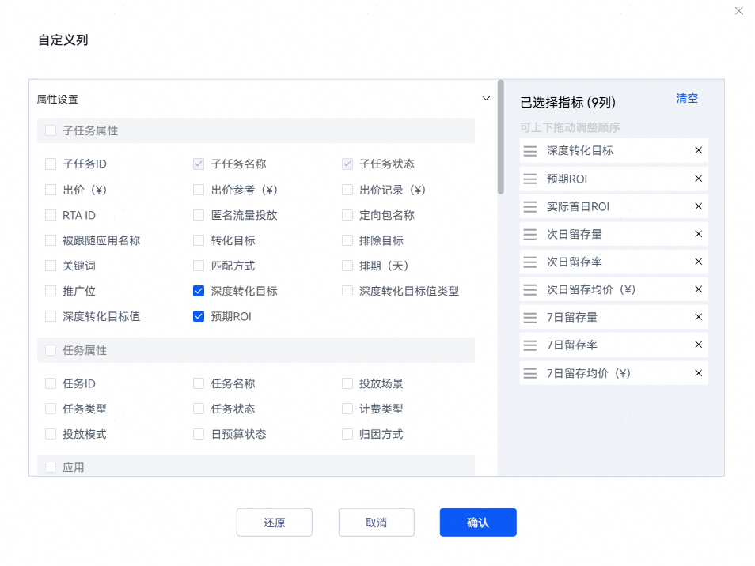

# 配置oCPD双目标出价

## oCPD双目标设置

1. 登录[华为应用市场应用推广平台](https://ads.huawei.com/cn/)，创建一个oCPD推广任务，先设置通投投放任务出价，然后在场景投放中新建oCPD子任务时，设置oCPD双目标出价。
   1. 新建子任务中“转化目标”设置项选择为“激活应用”，点击“深度转化”列蓝色字段“编辑”，界面弹出“深度转化优化”设置窗口。
   2. 在“深度转化优化”设置窗口中，选择“深度转化目标”设置项可选择“次日留存率”、“7日留存率”或“首日ROI”，并配置具体的oCPD深度转化目标值。

      

      具体设置项说明如下：

      | 任务设置项 | 说明 |
      | --- | --- |
      | 深度转化目标 | 客户期望达成的深度转化目标。  说明：  如果子任务中“转化目标”设置项不为“激活应用”，则此设置项会自动置为“不涉及”。即只有当浅层转化目标为激活应用时，才支持设置深度转化目标。  取值范围：  - 不涉及 - 次日留存率 - 7日留存率 - 首日ROI |
      | 深度转化目标值 | 首日ROI：新增用户注册首日内总付费金额/推广消耗。客户填写目标值，填写区间为0.001-1000。  次日留存率：次日留存量/激活量。客户填写目标值，填写区间为0.5%~100%。  7日留存率：7日留存量/激活量。客户填写目标值，区间为0.5%~100%。  说明：  - 部分存量子任务的深度转化目标值类型保留了“深度转化出价”选项，是由系统通过“激活出价/深度转化出价”计算预期“次日留存率”后进行投放。为方便观测数据，建议修改为“次日留存率。 - 如需查询历史修改记录，请通过“华为应用市场应用推广&gt;工具&gt;查看账户内操作记录”进行查询。 |
   3. oCPD双目标出价配置完成后，点击“创建”。

       

      当创建oCPD双目标出价配置后，再次点击“编辑”修改配置时，“深度转化目标”设置项不可再编辑，仅可以修改“深度转化目标值”设置项。
2. 在推广-子任务数据报表中查看oCPD双目标出价效果。

   查询子任务数据报表时，点击“自定义列”，勾选对应目标的任务设置值和实际达成值等指标。

   - ROI适合的指标有：深度转化目标、预期ROI、实际首日ROI、每次付费金额（¥）等。
   - 留存率适合的指标有：深度转化目标、深度转化目标值类型、深度转化目标值、次日留存率、7日留存率等。

   
